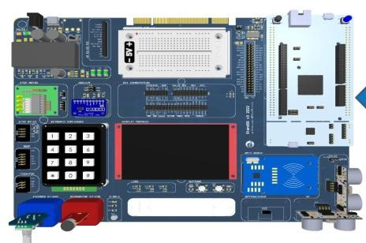
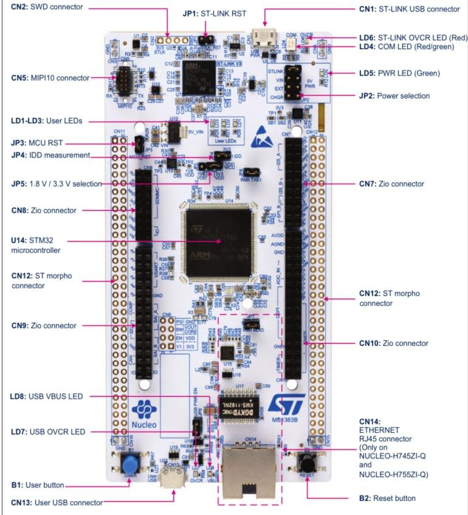

![[img/miet-logo.png|280]]

Методические пособия к лабораторным работам по дисциплине **«Микроконтроллеры и встраиваемые системы»**.

Передовая инженерная школа «Средства проектирования и производства электронной компонентной базы».
Магистерская программа «Вычислительные системы и ЭКБ».

Автор пособий — Симонов Сергей Борисович, доцент МПСУ МИЭТ, к.т.н.

## О чём курс

Основное назначение дисциплины «Микроконтроллеры и встраиваемые системы» — научить разрабатывать алгоритмы и программное обеспечение для встраиваемых систем и микроконтроллеров.

Основными целями и задачами преподавания дисциплины являются:

- ознакомить с архитектурой и возможностями современных микроконтроллеров и встраиваемых систем;
- научить проектировать, анализировать и модернизировать программное обеспечение встраиваемых систем;
- научить применять информационные ресурсы и технические средства для разработки и отладки программного обеспечения встраиваемых систем.

Темы, которые проходят через курс: язык C, технологии разработки ПО, библиотеки, загрузка, прерывания, таймеры, [[glossary/gpio\|GPIO]], [[glossary/usart\|UART]], RTOS.

## Стенд для лабораторных работ

Работы выполняются на учебном стенде с отладочной платой [[glossary/nucleo-h745\|ST Nucleo H745ZI-Q]].

*Учебный стенд для лабораторных работ.*

*Расположение элементов отладочной платы ST Nucleo H745ZI-Q.*

## Лабораторные работы

| № | Тема | Статус |
| --- | --- | --- |
| 01 | [[lab01/index\|Интегрированная среда разработки PlatformIO и Visual Studio Code]] | перенесена из PDF (r3) |
| 02 | [[lab02/index\|CMSIS. Семихостинг. Порты ввода-вывода общего назначения]] | перенесена из PDF (r1) |
| 03 | — | не перенесена |
| 04 | — | не перенесена |
| 05 | — | не перенесена |
| 06 | — | не перенесена |
| 07 | — | не перенесена |
| 08 | — | не перенесена |

> [!note] О переносе в Markdown
> Тексты пособий перенесены из исходных файлов Word/PDF без смысловых правок.
> В ЛР2 дополнительно выправлены опечатки, грамматика и пунктуация исходного текста.
> Замечания и предложения — через issue или pull request в репозитории.

## Требования к выполнению и защите ЛР

**Базовые требования к защите ЛР:**

- задание выполнено самостоятельно, обучающийся понимает представленный к защите код и алгоритм решения;
- на учебном стенде продемонстрировано функционирование программы в соответствии с заданием;
- оперативно устранены замечания преподавателя к программе или коду;
- студент изучил пособие по лабораторной работе и рекомендуемые для изучения материалы и подтверждает знание теоретических основ по теме лабораторной работы ответами на вопросы.

**Дополнительные баллы:**

- решение дополнительной задачи со звёздочкой, предложенной в лабораторном практикуме;
- решение дополнительной задачи, предложенной во время защиты;
- качество кода (масштабируемый, устойчивый к внесению изменений код, аккуратность);
- оригинальность и эффективность предложенного решения.

**Баллы могут быть снижены при следующих условиях:**

- плохо форматированный, избыточный, запутанный или неэффективный код;
- выполнение работы группой или с помощью сокурсника;
- защита лабораторной работы **с отставанием от графика**;
- нет конспекта, если требуется.

Итоговая оценка за работу складывается из трёх составляющих:

| Составляющая | Баллы |
| --- | --- |
| База | 6 |
| Доп | 0÷3 |
| Штраф | 0÷2 |

## Глоссарий

В [[glossary/index\|глоссарии]] собраны термины, инструменты и сокращения, которые встречаются в лабораторных работах. В текстах работ такие термины подчёркнуты пунктиром: наведите на них указатель мыши, чтобы увидеть пояснение, не покидая страницу.

## Документация

В разделе [[docs/index\|«Документация»]] собраны технические документы, с которыми ведётся работа: reference manual и даташит на микроконтроллер, программные модели ядер, руководство и электрические схемы отладочной платы. Все они открываются прямо на сайте, а ссылки в текстах работ ведут сразу на нужную страницу документа — искать раздел вручную не требуется.

## Обозначения

В настоящем пособии используются следующие обозначения.

> [!warning] Важная информация

> [!note] Важное примечание

> [!todo] Выполнить во время подготовки к лабораторной работе
> Может потребоваться сеть интернет.

> [!abstract] Сделать запись в конспект

> [!info] Изучить документ во время подготовки к лабораторной работе

> [!example] Текст программы рекомендуется перепечатать

> [!tip] Текст программы рекомендуется скопировать с помощью буфера обмена
> (CTRL+C копировать, CTRL+V - вставить). После вставки нажать ALT+SHIFT+F в VSCode для восстановления форматирования.

