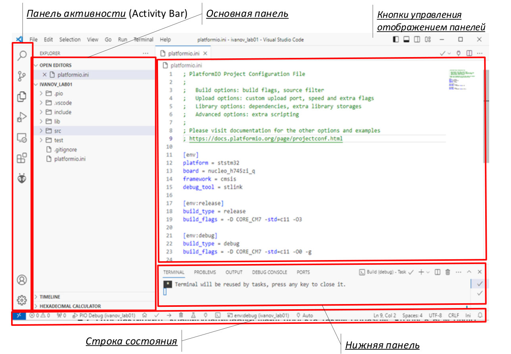
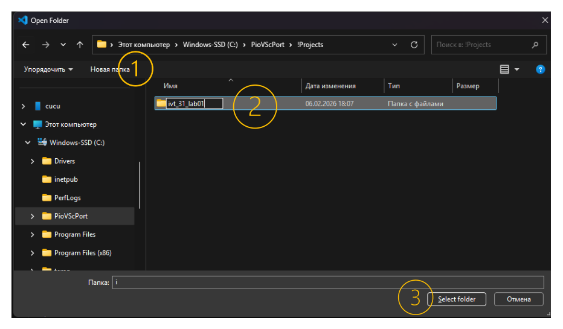
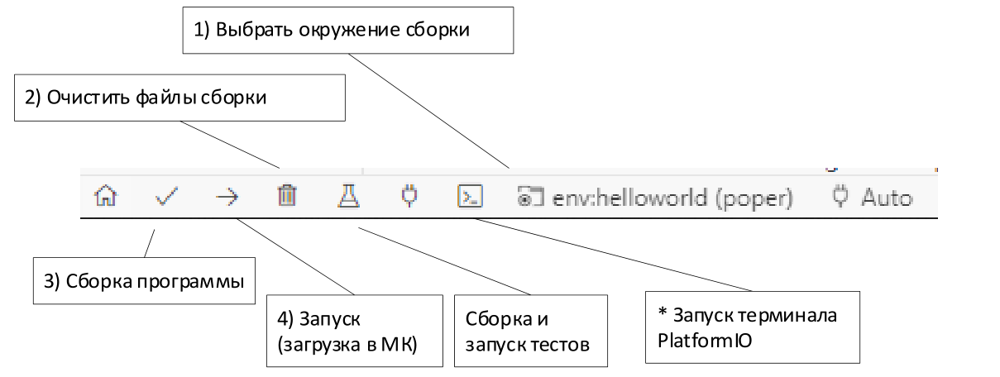
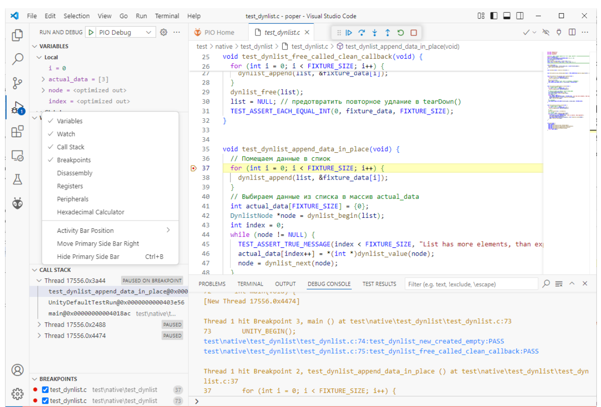

## Часть 1. Основные элементы редактора Visual Studio Code

1. Запустите Visual Studio Code:

   - используйте ярлык PioVSCode.

2. Рассмотрите основные элементы редактора VS Code на рисунке 1. По левой границе окна VS Code располагаются Панель выбора активности (Activity Bar) и Основная панель. Вдоль нижней границы окна находится Строка состояния. У правой границы отображается Вспомогательная панель. По верхней границе окна находятся системное Меню и кнопки управления отображением панелей.

3. С помощью кнопок управления отображением панелей скройте и отобразите нижнюю и основную панель.



*Рисунок 1 – Окно редактора VS Code после открытия проекта.*

4. Управление редактором осуществляется тремя способами:
   - с помощью мыши и графических элементов управления (меню, кнопок);
   - путем ввода команд в Палитру команд;
   - с помощью «горячих» клавиш.

   Последние два способа обеспечивают наиболее быструю и эффективную работу с редактором.

5. Для вызова Палитры команд нажмите клавиши CTRL+SHIFT+P или F1. Во время набора команды автоматически предлагаются подходящие варианты команд. Поэтому достаточно набрать ключевые слова, а затем выбрать и активировать необходимую команду с помощью клавиш со стрелками или мыши.

6. Основные компоненты PlatformIO, включающие весь необходимый инструментарий, образуют PlatformIO Core. Для работы с PlatformIO Core используются интерфейс командной строки (CLI) и специальные команды. Другая часть PlatformIO, называемая PlatformIO IDE, реализована в виде расширения (плагина) для редактора VS Code.

7. С помощью Палитры команд откройте перспективу PlatformIO, а затем выберите пункт «Miscellaneous -> New Terminal», чтобы открыть терминал PlatformIO. Таким образом, интерфейс командной строки (CLI) PlatformIO можно использовать непосредственно в редакторе VS Code.

> [!abstract] Сделать запись в конспект
> 8. Определите и запишите в конспект версию PlatformIO, используя терминал:
>
> > [!example] Ввести команду вручную
> > ```shell
> > pio system info
> > ```

9. Ознакомьтесь со списком установленных пакетов в PlatformIO:

> [!example] Ввести команду вручную
> ```shell
> pio pkg list -g
> ```

10. Выведите список плат, поддерживаемых установленными платформами:

> [!example] Ввести команду вручную
> ```shell
> pio boards --installed
> ```

## Часть 2. Создание проекта PlatformIO

1. Проектом называется набор исходных файлов, необходимых для создания одной или нескольких связанных между собой программ в среде разработки. В настоящем курсе мы будем создавать проект для каждой лабораторной работы.

2. Для редактора VS Code проектом является открытая папка.

3. Создайте и откройте новую папку с именем проекта:

   3.1. Выполните команду меню File -> Open Folder… (CTRL+K, O).

   3.2. В окне «Open Folder» выберите папку, в которой хранятся проекты, создайте новую папку (1), присвойте ей имя проекта (2) и выберите её (3).

> [!note] Важное примечание
> При выборе имени проекта рекомендуется использовать латинские символы и шаблон вида «группа_фамилия_работа». Например: `ivt31_ivanonv_lab01`.



*Рисунок 2 – Создание новой папки в VS Code.*

4. Для среды PlatformIO проектом является папка, в корне которой располагается файл проекта `platformio.ini`.

   4.1. Выполните команду в терминале PlatformIO:

> [!example] Ввести команду вручную
> ```shell
> pio project init
> ```

   4.2. Убедитесь во вкладке Explorer основной панели, что в корневой папке проекта создан файл `platformio.ini`.

5. После того как VS Code откроет папку и обнаружит в ней файл проекта `platformio.ini`, расширение PlatformIO будет активировано автоматически.

   Активируйте расширение PlatformIO:

   - **Способ 1:** Перезагрузите окно VS Code, выбрав в палитре команд пункт `Developer: Reload Window`.
   - **Способ 2:**
     - Закройте текущую папку с помощью File -> Close Folder.
     - Откройте папку с помощью меню File -> Open Folder или воспользуйтесь сочетанием клавиш CTRL+R, чтобы выбрать её из списка недавно открытых.

   Ход загрузки расширения PlatformIO можно отслеживать в строке состояния: в её левой части должны появиться соответствующие элементы. После этого можно приступать к дальнейшей работе над проектом.

## Часть 3. Файловая структура проекта PlatformIO

1. Откройте файловый обозреватель (CTRL+SHIFT+E) и познакомьтесь со структурой проекта.

   В корневой папке проекта находятся папки `src`, `lib`, `include`, `test`, `.pio` и `.vscode`.

   По умолчанию PlatformIO обрабатывает все файлы с расширениями `c` и `cpp`, которые находятся в папке `src`, и собирает из них исполняемый файл программы.

   В папку `include` помещают глобальные заголовочные файлы. Эта папка автоматически добавляется в список директорий поиска файлов, указанных в директивах `#include` компилятора.

   В папку `lib` помещают исходные коды библиотек. PlatformIO автоматически компилирует эти файлы, создаёт архивы библиотек и компонует их с программой.

   В директории `test` размещают тестовые программы, предназначенные для проверки программы и библиотек проекта.

   Директории `.pio` и `.vscode` создаются при инициализации проекта PlatformIO. В папку `.pio` помещаются объектные и исполняемые файлы, получаемые в результате сборки. Папка `.vscode` содержит конфигурационные файлы для работы редактора VS Code.

2. Каждый проект PlatformIO имеет собственный конфигурационный файл проекта `platformio.ini`, который находится в корневом каталоге проекта.

   Конфигурационный файл содержит раздел общих параметров `[platformio]`, раздел общих параметров окружения сборки `[env]` и один или несколько разделов рабочих окружений сборки `[env:name]`. Каждый раздел содержит набор параметров вида «ключ = значение». Разделы `[platformio]` и `[env]` не являются обязательными.

## Часть 4. Файл проекта platformio.ini

1. Конфигурационный файл `platformio.ini` представляет собой текстовый файл в формате INI и имеет следующий синтаксис.

   - Все символы в строке, которые следуют за знаком «;», являются комментариями.
   - Каждый раздел начинается с названия, заключенного в квадратные скобки.
   - Для ключа можно указать несколько значений двумя способами:
     - разделять значения с помощью «, » (запятая + пробел);
     - записывать очередное значение на новой строке, которая начинается как минимум с двух пробелов.

2. Добавьте в файл проекта `platformio.ini` окружение для сборки программы helloworld на компьютере (среда native). Отредактируйте файл `platformio.ini` в соответствии с листингом 1.

> [!example] Текст программы рекомендуется перепечатать
> **Листинг 1: platformio.ini**
>
> ```ini title="platformio.ini" showLineNumbers
> [platformio] ; глобальные параметры
> description = "Hello World Example"
>
> [env]
> platform = native ; ПО для хост-компьютера
> build_flags = -O0
>   -std=c11 ; стандарт С11
>   -Wall ; вывод всех предупреждений компилятора
>
> [env:helloworld] ; окружение для программы hello world
> build_type = debug ; включить символы отладки
> build_src_filter = +<helloworld/*.c> ; папка с исходными кодами /src/helloworld
> ```

3. Сохраните введённый в файл `platformio.ini` текст, нажав CTRL+S.

4. Раздел `[platformio]` содержит глобальные параметры, такие как `name` (название проекта), `description` (описание проекта) и `default_env` (список окружений сборки, которые используются по умолчанию, если не указано конкретное окружение). Этот раздел не является обязательным и может отсутствовать.

5. Раздел `[env]` содержит параметры общего окружения. Эти параметры наследуются всеми рабочими окружениями сборки и могут быть переопределены. Номенклатура допустимых параметров для общего и рабочих окружений сборки совпадает.

6. Рабочее окружение определяется с использованием синтаксиса `[env:NAME]`. В каждом проекте должно быть определено хотя бы одно рабочее окружение.

   Допустимо определять несколько рабочих окружений в одном проекте, используя уникальные имена. Имя рабочего окружения используется во многих командах утилиты `pio` и указывается с помощью флага `-e`.

   В рабочем окружении параметры можно разделить на категории: параметры платформы, сборки, загрузки, монитора, статического анализатора, отладчика и др. Выбранная платформа или фреймворк может расширять состав параметров. Описание всех параметров можно найти в документации [2].

   Основные параметры, которые определяются в окружениях сборки, приведены в таблице.

| Параметр | Значение | Пример |
| --- | --- | --- |
| `platform` | Платформа, которая определяет комплект средств разработки и доступные фреймворки и демонстрационные программы. | `platform = native`<br>— разработка ПО для хост-компьютера<br><br>`platform = ststm32`<br>— разработка ПО для микроконтроллеров STM32 |
| `framework` | Идентификатор фреймворка (набора программных библиотек), на базе которого будет разработана программа. | `framework = CMSIS`<br>`framework = stm32cube` |
| `board` | Идентификатор целевой отладочной платы. Определяет набор конфигурационных параметров для сборки, загрузки ПО и подключения отладчика к отладочной плате. | `board = nucleo_h745zi_q`<br>— ST Nucleo H745ZI-Q<br><br>`board = arduino_nano_esp32`<br>— Arduino Nano ESP32 |
| `board_build.ldscript` | Путь к скрипту компоновщика, который будет использоваться вместо варианта «по умолчанию». | `board_build.ldscript = $PROJECT_DIR/STM32H745ZITX_M7_FLASH.ld` |
| `board_build.system_file` | Путь к системному файлу, который будет использоваться в сборке вместо варианта «по умолчанию». | `board_build.system_file = $PROJECT_DIR/my_system_file.c` |
| `build_type` | Тип сборки | `build_type = release`<br>— не включать информацию для отладчика и оптимизировать по размеру и скорости<br><br>`build_type = debug`<br>— включить символы для отладчика и отключить оптимизацию<br><br>`build_type = test`<br>— добавить макроопределение `PIO_UNIT_TESTING` для работы приложения в режиме юнит-тестирования |
| `build_flags` | Установить флаги сборки для препроцессора, компилятора и компоновщика С и С++. | `build_flags = -D CORE_CM7 -std=c11`<br>— задать макроопределение `CORE_CM7` и использовать стандарт языка C11. |
| `build_src_flags` | То же, что и `build_flags`, но применяются только к исходным файлам в папке `src`. | `build_src_flags = -I /path/to/extra/dir`<br>— добавить папку `/path/to/extra/dir` в список поиска заголовочных файлов. |
| `build_unflags` | Отменить флаги сборки, которые были заданы платформой и глобальным окружением. | `build_unflags = -Os -std=gnu++11` |
| `build_src_filter` | Указать файлы с исходными кодами программы для сборки. | `+<*> -<.git/> -<.svn/>`<br>— значение по умолчанию (все файлы в директории `src`, кроме файлов `.git` и `.svn`)<br><br>`build_src_filter = +<**/*.c> +<**/*.cpp>`<br>— все файлы с расширениями `c` и `cpp` в директории `src` и всех её поддиректориях<br><br>`build_src_filter = +<$PROJECT_DIR/src_exp1/*.c> +<$PROJECT_DIR/src/*.c>`<br>— использовать все файлы с расширением `c` в папках `src` и `src_exp1` проекта. |
| `lib_deps` | Включить в сборку указанную программную библиотеку из реестра PlatformIO или из фреймворка. | `lib_deps = lvgl/lvgl`<br>— подключить библиотеку для создания встроенного графического интерфейса<br><br>`lib_deps = FooLib=symlink://../../shared-libs/FooLib`<br>— подключить библиотеку, расположенную по указанному пути |
| `check_tool` | Выбрать статический анализатор | `check_tool = pvs-studio` |
| `check_flags` | Указать флаги запуска для выбранного статического анализатора | `check_flags = pvs-studio: --analysis-mode=32 --errors-off=V532,V586 --lic-file=/path/to/file.lic`<br>— использовать анализатор PVS-Studio |
| `check_src_filters` | Указать путь к исходным кодам для анализа статическим анализатором. | `check_src_filters = +<src/helloworld/*.c> +<lib/dynlist/src/*.c>` |
| `test_filter` | Указать пути к тестам относительно папки `test`, которые будут запускаться для окружения. | `test_filter = test_common native/*`<br>— вызывать только `test_common` и все тесты в папке `test/native` и её поддиректориях |
| `test_ignore` | Указать пути к тестам относительно папки `test`, которые не будут запускаться для окружения. | `test_ignore = embedded/*`<br>— пропустить все тесты в папке `test/embedded` |
| `debug_test` | Путь к программе модульного тестирования, которая будет запускаться для отладки. | `debug_test = native/test_dynlist` |

## Часть 5. Создание и запуск приложения для Native-платформы

1. PlatformIO позволяет создавать приложения как для хост-компьютера, на котором выполняется процесс программирования, так и для выбранного микроконтроллера (целевой встраиваемой системы).

   Для разработки приложений для хост-компьютера предназначена платформа native.

   Интерфейс взаимодействия программиста с PlatformIO не зависит от выбранной платформы. Основу работы со средой разработки рассмотрим на примере создания приложения для Native-платформы. При этом не требуется подключение целевой встраиваемой системы.

   1.1. Создайте в папке `src` проекта директорию `helloworld` и файл `helloworld.c`.

   Для этого откройте вкладку Explorer с помощью соответствующей кнопки или сочетания клавиш CTRL+SHIFT+E, а затем используйте кнопки в верхней части вкладки.

   1.2. Введите текст программы, которая выводит приветствие.

> [!example] Текст программы рекомендуется перепечатать
> **Листинг 2: src/helloworld/helloworld.c**
>
> ```c title="src/helloworld/helloworld.c" showLineNumbers
> #include <stdio.h>
>
> int main() {
>     puts(u8"\nПривет МИЭТ!");
> }
> ```

2. Выполните сборку и запуск программы с помощью интерфейса командной строки PlatformIO.

   2.1. Откройте терминал PlatformIO для ввода команд.

   2.2. Введите команду `pio run -h` и ознакомьтесь со справкой.

   2.3. Для сборки программы введите команду: `pio run -e helloworld`

   2.4. Для очистки всех файлов сборки введите команду: `pio run -e helloworld -t clean`

   2.5. Выполните сборку в режиме подробного вывода: `pio run -e helloworld -v`

> [!todo] Выполнить во время подготовки к лабораторной работе
> > [!abstract] Сделать запись в конспект
> > Внимательно изучите информацию, выводимую в терминал. Проанализируйте, какие программы вызываются и с какими параметрами. Запишите в конспект названия и назначение программ, а также параметры, с которыми они запускаются. Для поиска информации о программах и ключах используйте ресурсы Интернета.

   2.6. Запустите программу:

> [!example] Ввести команду вручную
> ```shell
> pio run -e helloworld -t exec
> ```

   Убедитесь, что программа выводит строку приветствия.

   2.7. Ознакомьтесь с кнопками в строке состояния (см. рисунок 3) и выполните с их помощью: выбор окружения сборки helloworld (1), очистку (удаление артефактов) проекта (2), сборку программы (3) и запуск программы (4).



*Рисунок 3 – Назначение кнопок управления PlatformIO в строке состояния.*

> [!note] Важное примечание
> Обратите внимание на отсутствие кнопки для сборки в режиме подробного вывода (verbose mode). Если при сборке возникают ошибки, для анализа их причин может потребоваться выполнить сборку из консоли.

Среда VS Code + PlatformIO автоматически учитывает зависимости между операциями при использовании кнопок строки состояния или команд палитры. Например, если код программы или файл `platformio.ini` были изменены в редакторе, то перед выполнением команды «Запуск» (4) изменённые файлы будут сохранены, а программа — собрана.

## Часть 6. Создание и подключение библиотек

1. При разработке ПО распространена практика организации взаимозависимых компонентов в виде отдельных библиотек, которые можно многократно использовать в других проектах. Библиотеки также позволяют структурировать программный код и зависимости между отдельными компонентами, разделять ответственность при командной разработке и сокращать время сборки в больших проектах.

   Для организации библиотек предназначен каталог `lib`.

   Исходный код каждой библиотеки должен быть размещён в отдельной директории. Внутри этой директории допускается использовать вложенные папки `include` и `src` для размещения заголовочных файлов и файлов реализации соответственно.

   PlatformIO автоматически скомпилирует исходные файлы в этом каталоге в статические библиотеки и подключит их к основной программе.

   PlatformIO отслеживает зависимости библиотек. Например, если был изменён файл с исходным кодом библиотеки, используемой в программе, то при сборке программы эта библиотека будет автоматически пересобрана перед подключением.

   Кроме того, в директории библиотеки может находиться текстовый файл манифеста `library.json`, содержащий её описание: назначение, лицензию, сведения об авторах, версию и другую информацию. Файл манифеста позволяет опубликовать библиотеку в общедоступном реестре PlatformIO Registry.

2. Создайте библиотеку с реализацией односвязного динамического списка.

> [!note] Важное примечание
> Односвязный список – это базовая структура данных, состоящая из узлов; каждый узел содержит данные и ссылку на следующий узел [4].

   2.1. Создайте в папке `lib` директорию `dynlist` с файлами `dynlist.h` (заголовочный файл библиотеки) и `dynlist.c` (файл реализации), затем скопируйте в них приведённый ниже код.

> [!tip] Текст программы рекомендуется скопировать с помощью буфера обмена
> **Листинг 3: lib/dynlist/dynlist.h**
>
> ```c title="lib/dynlist/dynlist.h" showLineNumbers
> #pragma once
>
> #ifdef __cplusplus
> extern "C" {
> #endif
>
> typedef struct DynlistDescriptor DynlistDescriptor;
> typedef struct DynlistNode DynlistNode;
> typedef struct DynlistDescriptor *Dynlist;
> typedef void (*dynlist_pval_func_t)(void *val);
>
> __attribute__((warn_unused_result)) Dynlist dynlist_new(dynlist_pval_func_t clean_val_func);
> void dynlist_free(Dynlist plist);
> void dynlist_append(Dynlist list, void *value);
> void dynlist_prepend(Dynlist list, void *value);
> void dynlist_foreach(Dynlist list, dynlist_pval_func_t do_func);
> struct DynlistNode *dynlist_begin(Dynlist list);
> struct DynlistNode *dynlist_next(struct DynlistNode *node);
> void *dynlist_value(struct DynlistNode *node);
>
> #ifdef __cplusplus
> }
> #endif
> ```

> [!tip] Текст программы рекомендуется скопировать с помощью буфера обмена
> **Листинг 4: lib/dynlist/dynlist.c**
>
> ```c title="lib/dynlist/dynlist.c" showLineNumbers
> #include "dynlist.h"
> #include <stdlib.h>
>
> /* ======== Закрытые структуры и функции библиотеки ======================*/
>
> struct DynlistNode {
>     void *value;
>     DynlistNode *next;
> };
>
> struct DynlistDescriptor {
>     DynlistNode *head;
>     dynlist_pval_func_t clean_value_cb;
> };
>
> /**
>  * @brief Создать и вернуть узел списка
>  * @param val - указатель на элемент
>  * @return Указатель на узел списка или NULL (ошибка памяти) */
> static DynlistNode *make_new_node(void *val) {
>     DynlistNode *node = (DynlistNode *)malloc(sizeof(DynlistNode));
>     node->value = val;
>     node->next = NULL;
>     return node;
> }
>
> /**
>  * @brief Вставка цепочки узлов после узла @a pos
>  * @param pos - указатель на узел, после которого будет вставлена цепочка
>  * @param items - вставляемая цепочка узлов
>  * @note допускается указывать NULL для параметров pos и items
>  * @return первый узел полученной цепочки узлов */
> static DynlistNode *insert_nodes(DynlistNode *pos, DynlistNode *items) {
>     if (!items)
>         return pos;
>     if (!pos)
>         return items;
>     DynlistNode *tail = pos->next;
>     pos->next = items;
>     while (items->next) {
>         items = items->next;
>     }
>     items->next = tail;
>     return pos;
> }
>
> /* ======== Открытые функции библиотеки ==================================*/
>
> /**
>  * @brief Создать и вернуть новый пустой список
>  * @param free_val_func - указатель на функцию освобождения ресурсов элемента,
>  * может быть NULL
>  * @return Дескриптор списка или NULL (ошибка памяти)
>  * @note В списке хранятся указатели на элементы. Если передаётся ненулевой указатель на @a
>  free_val_func, то в @a dynlist_free освобождаются ресурсы хранимых элементов */
> Dynlist dynlist_new(dynlist_pval_func_t free_val_func) {
>     Dynlist list = (DynlistDescriptor *)calloc(1, sizeof(DynlistDescriptor));
>     if (list)
>         list->clean_value_cb = free_val_func;
>     return list;
>     list = NULL; // для демонстрации работы cppcheck
> }
>
> /**
>  * @brief Освободить ресурсы, занимаемые списком
>  * @param list - список */
> void dynlist_free(Dynlist list) {
>     if (list) {
>         DynlistNode *node = list->head;
>         while (node) {
>             DynlistNode *next = node->next;
>             if (list->clean_value_cb) {
>                 list->clean_value_cb(node->value);
>             }
>             free(node);
>             node = next;
>         }
>         free(list);
>     }
> }
>
> /**
>  * @brief Обойти список и применить функцию к каждому элементу
>  * @param list - указатель на список (начало)
>  * @param do_func - функция обработки */
> void dynlist_foreach(Dynlist list, dynlist_pval_func_t do_func) {
>     if (do_func && list && list->head) {
>         DynlistNode *node = list->head;
>         while (node) {
>             do_func(node->value);
>             node = node->next;
>         }
>     }
> }
>
> /**
>  * @brief Добавить элемент в конец списка
>  * @param list - список
>  * @param value - указатель на элемент */
> void dynlist_append(Dynlist list, void *value) {
>     if (!list)
>         return;
>     if (!list->head) {
>         list->head = insert_nodes(list->head, make_new_node(value));
>     } else {
>         DynlistNode *tail = list->head;
>         while (tail->next) {
>             tail = tail->next;
>         }
>         insert_nodes(tail, make_new_node(value));
>     }
> }
>
> /**
>  * @brief Добавить элемент в начало списка
>  * @param list - список
>  * @param value - указатель на элемент */
> void dynlist_prepend(Dynlist list, void *value) {
>     if (list) {
>         DynlistNode *new_head = make_new_node(value);
>         insert_nodes(new_head, list->head);
>         list->head = new_head;
>     }
> }
>
> /**
>  * @brief Получить указатель на первый узел (итератор) списка
>  * @return NULL, если список пустой или не существует, либо указатель на первый узел */
> struct DynlistNode *dynlist_begin(Dynlist list) { return list ? list->head : NULL; }
>
> /**
>  * @brief Получить указатель на следующий узел (итератор) списка
>  * @return NULL, если достигнут конец списка */
> struct DynlistNode *dynlist_next(struct DynlistNode *node) { return node?node->next:NULL;}
>
> /** @brief Получить указатель на значение, хранимое в узле списка */
> void *dynlist_value(struct DynlistNode *node) { return node ? node->value : NULL; }
> ```

   2.2. Измените файл `helloworld.c` таким образом, чтобы в нём использовалась библиотека динамического списка:

> [!example] Текст программы рекомендуется перепечатать
> **Листинг 5: src/helloworld/helloworld.c**
>
> ```c title="src/helloworld/helloworld.c" showLineNumbers
> #include <dynlist.h>
> #include <stdio.h>
>
> static void handle_item_puts(void *val) {
>     puts((const char *)val);
> }
>
> int main() {
>     Dynlist list = dynlist_new(NULL);
>     dynlist_append(list, u8"Привет МИЭТ!");
>     dynlist_prepend(list, u8"Сказал студент: ");
>     dynlist_foreach(list, handle_item_puts);
>     dynlist_free(list);
> }
> ```

   2.3. Выполните сборку программы helloworld в режиме подробного вывода (verbose mode). Убедитесь, что при этом компилируются файлы библиотеки dynlist.

> [!todo] Выполнить во время подготовки к лабораторной работе
> > [!abstract] Сделать запись в конспект
> > Внимательно изучите информацию, выводимую в терминал. Проанализируйте запускаемые программы и параметры (ключи), используемые при сборке и подключении библиотеки. Дополните конспект сведениями о названиях и назначении программ, а также о параметрах, с которыми они запускаются. Для поиска информации о программах и ключах используйте ресурсы Интернета.

## Часть 7. Основы навигации и анализа кода в редакторе VS Code

Выполните следующие упражнения для ознакомления с наиболее полезными операциями при работе с кодом:

1. Закройте все окна редактора файлов, используя сочетание клавиш CTRL+W.

2. Откройте файл `dynlist.h`:
   - **Способ 1:** Нажмите CTRL+P и введите имя файла.
   - **Способ 2:** Найдите файл во вкладке Explorer и выберите его мышью.

3. Наведите курсор мыши на объявление любой функции в файле `dynlist.h`. Должно появиться всплывающее окно с документацией на функцию.

> [!note] Важное примечание
> Если всплывающие окна с подсказками не появляются или срабатывают другие механизмы подсказок, следует выполнить команду «Reset IntelliSense Database», используя палитру команд.

4. Перейдите к определению функции `dynlist_new()`.
   - **Способ 1:** Установите курсор на название функции и нажмите F12.
   - **Способ 2:** Щёлкните правой кнопкой мыши по названию функции и выберите «Go To Definition».

5. Обратите внимание, каким образом документируются функции в коде. При использовании формата Doxygen [5] VS Code выводит справку по функциям во всплывающих окнах.

6. Для навигации по файлу большого размера удобно использовать окно Outline. В этом окне в сокращённом виде выводятся все определения, которые содержатся в активном файле редактора. Таким образом, получается «оглавление», которое можно использовать для быстрого перехода к определённому месту в файле.

   6.1. Откройте окно Outline.
   - **Способ 1:** Нажмите CTRL+P и введите «Explorer: Focus on Outline View».
   - **Способ 2:** Используйте меню «View -> Open View…».

   6.2. По умолчанию окно Outline находится на панели Explorer, которая перегружена другими представлениями. Если это так, то откройте правую панель (CTRL+ALT+B) и перетащите окно Outline на эту панель.

   6.3. Перейдите к определению функции `insert_nodes()`, нажав на её название в окне Outline.

7. Определите все места в программе, в которых используется функция `insert_nodes()`.
   - **Способ 1:** Установите курсор на название функции и нажмите Shift+F12.
   - **Способ 2:** Щёлкните правой кнопкой мыши по названию функции и выберите «Go To References».

> [!todo] Выполнить во время подготовки к лабораторной работе
> 8. Изучите код библиотеки dynlist (листинги 3 и 4) и самостоятельно повторите незнакомые вам конструкции и функции стандартной библиотеки языка С, используя документацию [5].
>
> 9. Повторите основы языка С и подготовьте ответы на следующие вопросы.
>    - Чем отличаются функции `calloc` и `malloc`?
>    - Зачем нужна конструкция `extern "C"` (строка 4 `dynlist.h`)?
>    - Для чего используется конструкция `#pragma once`?
>    - Для чего используется ключевое слово `static` в объявлениях функций?
>    - Как определить тип «указатель на функцию, которая возвращает логическое значение и принимает два целочисленных параметра»?

## Часть 8. Создание модульных тестов

1. Модульное тестирование, или юнит-тестирование (Unit testing), — это техника разработки ПО, при которой проверяется работа отдельных элементов (модулей) программы. Для каждой нетривиальной функции создаётся специальный тест. Это позволяет оперативно проверить, не привело ли очередное изменение кода к регрессии, то есть к появлению ошибок в уже разработанных частях программы. Упрощается обнаружение, локализация и устранение ошибок в процессе разработки ПО.

   Разработку модульных тестов лучше всего интегрировать в процесс разработки программы. Чем раньше будет написан тест, тем больше пользы он принесёт.

   При создании тестов следует придерживаться следующих принципов:
   1) Каждый тест должен проверять только один параметр, функцию или требование.
   2) Тест должен быть детерминированным. Например, не следует использовать в тесте генератор случайных чисел, так как результат такого теста может оказаться случайным.
   3) Тест должен быть простым, коротким и легко читаемым.
   4) Тесты должны быть организованы так, чтобы отражать структуру тестируемого кода.

2. Встроенная в PlatformIO поддержка среды модульного тестирования и системы запуска тестов позволяет создавать и запускать тесты без сложной предварительной настройки.

   PlatformIO изолирует тесты, запуская каждый из них как отдельную программу. Если отдельный тест не пройден, PlatformIO позволяет запустить его изолированно для быстрой отладки. Связывание исходного кода приложения с кодом теста приведёт к ошибке на этапе сборки (почему?). Поэтому по умолчанию код основной программы не включается в сборку программы-теста.

   Прежде чем писать тест, необходимо решить, где он будет выполняться: на хост-компьютере или на целевом устройстве.

   Тесты, написанные для целевого устройства, не могут работать на хост-компьютере из-за отсутствия ресурсов микроконтроллера. Для выполнения тестирования на целевом устройстве PlatformIO собирает программу с тестами на хост-компьютере, загружает её на целевое устройство и формирует отчёты по результатам тестирования. Окончательная информация будет показана на стороне хоста с информативным выводом и статистикой.

   Все тесты в PlatformIO помещаются в папку `test` проекта. Иерархия тестов организуется с помощью вложенных папок. Все файлы из папки активного теста и всех вышестоящих папок вплоть до корневой папки `test` компилируются и собираются вместе в исполняемый модуль теста. С помощью иерархии тестов мы можем организовывать тесты в группы, а затем запускать только необходимую группу тестов, используя параметры `test_filter` или `test_ignore` в файле конфигурации проекта.

   PlatformIO поддерживает интеграцию со специализированными библиотеками тестирования: GoogleTest, DocTest и Unity. Последняя библиотека позволяет создавать тесты на языке C как для хост-компьютера, так и для целевых платформ [9].

3. Создайте модульный тест с использованием фреймворка Unity для библиотеки dynlist.

   Так как тест будет выполняться на хост-компьютере, разместите исходный код теста (файл `test_dynlist.c`) в папке `test/native/test_dynlist`.

> [!tip] Текст программы рекомендуется скопировать с помощью буфера обмена
> **Листинг 6: test/native/test_dynlist/test_dynlist.c**
>
> ```c title="test/native/test_dynlist/test_dynlist.c" showLineNumbers
> #include <unity.h>
> #include <dynlist.h>
> #include <string.h>
>
> /*======= Фиксированные данные для тестирования (фиктуры) =========================*/
> #define FIXTURE_SIZE 3
> const int fixture_data_init[FIXTURE_SIZE] = {1, 2, 3};
> int fixture_data[FIXTURE_SIZE];
> Dynlist list;
> void clean_func(void *val) { *(int *)val = 0; }
> static void incrementor(void *val) { *(int *)val += 1; }
> /*===================================================================================*/
>
> void setUp(void) {
>     memcpy(fixture_data, fixture_data_init, sizeof(fixture_data));
>     list = dynlist_new(clean_func);
> }
>
> void tearDown(void) { dynlist_free(list); }
>
> void test_dynlist_new_created_empty(void) { TEST_ASSERT_NULL(dynlist_begin(list)); }
>
> void test_dynlist_free_called_clean_callback(void) {
>     for (int i = 0; i < FIXTURE_SIZE; i++) {
>         dynlist_append(list, &fixture_data[i]);
>     }
>     dynlist_free(list);
>     list = NULL; // предотвратить повторное удаление в tearDown()
>     TEST_ASSERT_EACH_EQUAL_INT(0, fixture_data, FIXTURE_SIZE);
> }
>
> void test_dynlist_append_data_in_place(void) {
>     // Помещаем данные в список
>     for (int i = 0; i < FIXTURE_SIZE; i++) {
>         dynlist_append(list, &fixture_data[i]);
>     }
>     // Выбираем данные из списка в массив actual_data
>     int actual_data[FIXTURE_SIZE] = {0};
>     DynlistNode *node = dynlist_begin(list);
>     int index = 0;
>     while (node != NULL) {
>         TEST_ASSERT_TRUE_MESSAGE(index < FIXTURE_SIZE, "List has more elements, than expected");
>         actual_data[index++] = *(int *)dynlist_value(node);
>         node = dynlist_next(node);
>     }
>     // Сравниваем
>     TEST_ASSERT_EQUAL_INT_ARRAY(fixture_data, actual_data, FIXTURE_SIZE);
> }
>
> void test_dynlist_foreach_called(void) {
>     // Помещаем данные в список
>     for (int i = 0; i < FIXTURE_SIZE; i++) {
>         dynlist_append(list, &fixture_data[i]);
>     }
>     // Вызов
>     dynlist_foreach(list, incrementor);
>     // Проверка
>     DynlistNode *node = dynlist_begin(list);
>     for (int i = 0; i < FIXTURE_SIZE; i++) {
>         TEST_ASSERT_NOT_NULL_MESSAGE(node, "List is shorter, than expected");
>         incrementor(&fixture_data[i]);
>         TEST_ASSERT_EQUAL_INT(fixture_data[i], *(int *)dynlist_value(node));
>         node = dynlist_next(node);
>     }
> }
>
> int main(void) {
>     UNITY_BEGIN();
>     RUN_TEST(test_dynlist_new_created_empty);
>     RUN_TEST(test_dynlist_free_called_clean_callback);
>     RUN_TEST(test_dynlist_append_data_in_place);
>     RUN_TEST(test_dynlist_foreach_called);
>     return UNITY_END();
> }
> ```

> [!note] Важное примечание
> Обратите внимание, что имена файлов с исходными кодами тестов могут быть произвольными, однако должны начинаться с префикса «test_».

4. Все тестовые файлы имеют следующую структуру.

   4.1. В файл теста необходимо подключить заголовочный файл фреймворка Unity `unity.h`.

   4.2. Далее в файле теста определяются функции `setUp()` и `tearDown()`. Функция `setUp()` вызывается перед вызовом каждой тестирующей функции, а функция `tearDown()` – после неё. Эти функции могут быть пустыми или содержать код для инициализации и освобождения необходимых ресурсов.

   4.3. Далее определяются функции тестирования. Функция тестирования не принимает входных параметров и не возвращает значение. Название функции должно отражать суть теста. При именовании функции тестирования принято использовать префикс «test_». Каждая функция тестирования представляет собой отдельный тест.

   4.4. Внутри функции тестирования для проверки работы модуля должны вызываться специальные макросы утверждений `TEST_ASSERT…`. Если условие утверждения не выполняется, функция тестирования завершается, а в отчёт выводится соответствующее сообщение о том, что проверка и тест не пройдены.

   Фреймворк Unity предлагает большое количество макросов утверждений для различных типов сравниваемых объектов. Все макросы утверждений соответствуют шаблону:

> [!note] Шаблон макроса утверждения
> ```c
> TEST_ASSERT_...( {modifiers}, {expected}, actual, {size/count})
> ```

   Параметры в фигурных скобках могут отсутствовать. Назначение параметров:

   - `actual` – проверяемое (фактическое) значение;
   - `modifiers` – модификаторы (битовые маски или флаги, диапазоны);
   - `expected` – ожидаемое значение, которое сравнивается с фактическим значением;
   - `size/count` – длина строк или количество элементов в массиве.

   4.5. В функции `main()` должны присутствовать вызовы макросов `UNITY_BEGIN()` и `UNITY_END()`, между которыми помещаются вызовы функций тестирования:

> [!note] Шаблон вызова теста
> ```c
> RUN_TEST(имя_функции_теста)
> ```

5. Откройте заголовочный файл `unity.h` (установите курсор на название файла и нажмите F12) и ознакомьтесь с номенклатурой макросов утверждений.

## Часть 9. Запуск модульных тестов

1. По умолчанию при запуске теста PlatformIO пытается загрузить и установить библиотеку Unity для каждого окружения, в котором запускается тест. Часто такое поведение нежелательно, например при отсутствии доступа к Интернету. Для решения этой проблемы:

   Добавьте в конфигурацию окружения параметр `test_framework = custom`. Затем в папке `test` проекта создайте файл с именем `test_custom_runner.py` и вставьте в него следующие строки:

> [!tip] Текст программы рекомендуется скопировать с помощью буфера обмена
> **Листинг 7: test/test_custom_runner.py**
>
> ```python title="test/test_custom_runner.py" showLineNumbers
> from platformio.public import UnityTestRunner
>
> class CustomTestRunner(UnityTestRunner):
>     EXTRA_LIB_DEPS = None  # Ignore "throwtheswitch/Unity" package
> ```

2. Запустите тест для окружения helloworld и просмотрите отчет:

   - **Способ 1:** Нажмите кнопку в строке состояния.
   - **Способ 2:** Выполните команду в консоли PlatformIO: `pio test -e helloworld`.
   - **Способ 3:** Откройте перспективу Testing на панели активности и нажмите кнопку ▷ напротив названия теста.

## Часть 10. Основы работы с отладчиком в графическом режиме

1. Отладчик – это инструмент, который позволяет отслеживать выполнение программы «по шагам» и её состояние на каждом шаге: значения переменных, содержимое памяти, стека и регистров. Пользователь может изменять переменные программы и даже вызывать функции во время приостановки отладки.

2. Обычно отладчик используется для поиска причин ошибок, когда работа программы не соответствует ожидаемому результату. Кроме того, отладчик применяют для анализа и контроля работы реализованных алгоритмов и программ.

3. По умолчанию PlatformIO запускает отладку основной программы выбранного окружения сборки. Чтобы запустить отладку тестовой программы, необходимо указать её в параметре `debug_test`.

   Добавьте в окружение `[env:helloworld]` параметр:

> [!example] Перепечатать параметры конфигурации
> ```ini
> debug_test = native/test_dynlist
> ```

4. Нажмите F5 для запуска отладчика. В соответствии с параметрами выбранного окружения сборки PlatformIO выполнит сборку программы с отладочными символами, загрузит программу на целевое устройство и запустит программу и средства отладки.

5. В режиме отладки в интерфейсе VS Code появляются специальные окна (рисунок 4): Variables (значения переменных), Watch (значения выражений, введенных пользователем), Call Stack (стек вызовов функций), Breakpoints (список всех точек останова).

   Окна Disassembly (включение отладки на уровне команд ассемблера), Registers (регистры процессора) и Peripherals (регистры периферийных блоков микроконтроллера) полезны при отладке приложения на микроконтроллере. Для отладки native-приложения рекомендуется скрыть эти окна, так как они могут работать некорректно и приводить к сбою в работе расширения PlatformIO для VS Code.



*Рисунок 4 – Редактор VS Code в режиме отладки.*

   Чтобы скрыть или отобразить какое-либо окно отладки, вызовите контекстное меню, щёлкнув правой кнопкой мыши по заголовку любого другого окна отладки, и выберите соответствующую команду.

6. PlatformIO использует отладчик GDB. Для работы с отладчиком в текстовом режиме используется вкладка Debug Console, расположенная на нижней панели. Однако работа с GDB в этом режиме требует знания системы команд. PlatformIO и VS Code предоставляют удобный графический интерфейс для отладки, который не требует ввода команд в консоль отладчика.

   При работе с отладчиком лучше всего использовать горячие клавиши:

   - **F10** – Step Over – выполнить операцию (шаг) без захода в вызываемые функции;
   - **F11** – Step Into – выполнить шаг с заходом в вызываемую функцию;
   - **Shift+F11** – Step Out – перейти к точке вызова текущей функции;
   - **F5** – продолжить выполнение до следующей точки останова;
   - **Shift+F5** – завершить отладку.

7. Выполните следующее упражнение.

   7.1. Установите точку останова в начале функции `test_dynlist_append_data_in_place()`. Для этого щёлкните левой кнопкой мыши слева от номера строки с определением функции. Точка останова отобразится красным кругом и появится в окне Breakpoints.

   7.2. Запустите выполнение программы до установленной точки останова (F5). Когда выполнение дойдёт до точки останова, программа прервётся, а соответствующая строка будет выделена жёлтой линией.

   7.3. Нажмите на кнопку «+» в окне Watch и введите название переменной: `list`. В окне Watch должна появиться переменная `list`. Щёлкните по символу «>» рядом с именем переменной, чтобы раскрыть содержимое структуры.

   7.4. Наведите курсор на переменную `list` в тексте программы. Во всплывающем окне появится её текущее значение. Убедитесь, что это значение совпадает со значением в окне Watch.

   7.5. Нажмите клавишу F10, чтобы сделать шаг и перейти внутрь цикла на строку:

> [!note] Строка для просмотра в отладчике
> ```c
> dynlist_append(list, &fixture_data[i]);
> ```

   7.6. Нажмите F11 для перехода внутрь функции `dynlist_append()`. Обратите внимание на изменение содержимого окна Call Stack.

   7.7. Нажмите SHIFT+F11 для запуска выполнения программы до момента завершения работы функции `dynlist_append()`.

   7.8. Последовательно нажимая F11, пройдите цикл заполнения списка данными и наблюдайте, как изменяются значения в окнах Variables и Watch.

8. Выполните следующее упражнение:

   8.1. Отобразите окно Memory (меню View -> Open View… -> Memory).

   8.2. Определите адрес начала массива `fixture_data` (например, с помощью окна Watch).

   8.3. Нажмите кнопку «+» в заголовке окна Memory и введите сначала найденный адрес начала массива `fixture_data`, а затем размер области памяти – 32. После этого появится окно с содержимым памяти в заданной области.

   8.4. Убедитесь, что в памяти содержатся значения массива `fixture_data`.

> [!abstract] Сделать запись в конспект
> 8.5. По содержимому памяти определите и запишите в конспект размер, занимаемый целым числом в памяти компьютера, и формат его хранения – little endian или big-endian.

   8.6. Поставьте точку останова на вызове функции `incrementor` в тесте `test_dynlist_foreach_called()`. Пройдя цикл (F10), убедитесь, что функция `incrementor()` изменяет данные в области памяти, отображаемой в окне Memory.

9. Завершите отладку, нажав клавиши SHIFT+F5.

## Часть 11. Стандарт MISRA-C

1. Ошибки в ПО встраиваемых систем могут приводить к огромному ущербу. Поэтому безопасности ПО уделяется повышенное внимание, а к самому ПО часто предъявляются строгие требования. Для разработки безопасных программ могут применяться более строгие отраслевые стандарты и рекомендации, например MISRA С:2012 [7] или AUTOSAR.

2. Язык С остается самым распространённым языком для встраиваемых систем. Однако при программировании на языке C даже синтаксически верный код может приводить к ошибкам:

> [!abstract] Сделать запись в конспект
> **«Зависимое от реализации поведение» (Implementation-defined behavior)** – поведение кода зависит от реализации компилятора или среды исполнения, но это поведение задокументировано. Например, размер в байтах указателя или типа int зависит от конкретной реализации компилятора.
>
> **«Незадокументированное поведение» (Unspecified behavior)** – поведение кода не определено стандартом, зависит от реализации и не документировано. Например, порядок вычисления значений аргументов функции определяется компилятором, причём он может выбрать любой допустимый порядок.
>
> **«Неопределённое поведение» (Undefined Behavior, UB).** При возникновении UB корректное выполнение текущей и всех последующих инструкций не гарантируется, а последствия могут быть произвольными. Такие ошибки могут оставаться незамеченными до наступления аварийной ситуации.

> [!abstract] Сделать запись в конспект
> Найдите примеры ошибок UB и запишите в конспект пример кода (несколько строк), который приводит к UB.

3. MISRA C — признанный промышленный стандарт для разработки критичного ПО на C. Он не устраняет все риски языка C, но в рамках документированного процесса разработки с обоснованными отклонениями позволяет значительно снизить вероятность ошибок безопасности и надёжности. Стандарт рекомендован или предписан всеми основными отраслевыми стандартами: ISO 26262 (автомобили), IEC 61508 (промышленность), DO-178C (авиация), EN 50128 (железные дороги).

4. Стандарт MISRA C определяет подмножество языка C с целью повысить надёжность программного кода:

   - запрещено критичное неопределённое поведение;
   - ограничено использование зависящего от реализации поведения;
   - исключены или ограничены трудные для понимания конструкции языка.

5. В стандарте MISRA C определяются директивы и правила, соблюдение которых должно предотвратить появление ошибок. Директивы и правила делятся на три основных категории: Mandatory, Required и Advisory.

   Правила Mandatory являются обязательными. Правила Required допускают возможность отклонения, если эти отклонения документируются и обосновываются. Правила категории Advisory имеют рекомендательный характер.

> [!abstract] Сделать запись в конспект
> Найдите в [9] и запишите в конспект 3 правила MISRA, по одному из каждой категории. Запишите в конспект пример кода из нескольких строк на языке С, который приводит к UB.

## Часть 12. Анализ кода

1. Требования к разработке безопасного ПО определены в ГОСТ Р 56939. В число мероприятий по разработке безопасного ПО входит применение статических анализаторов кода, а общие требования к статическим анализаторам установлены в ГОСТ Р 71207–2024.

2. Статический анализ кода позволяет выявлять потенциальные ошибки, уязвимости и угрозы безопасности на уровне исходного кода без необходимости запуска программы. Статические анализаторы также применяются для обеспечения соответствия внутренним или отраслевым стандартам кодирования.

3. PlatformIO поддерживает работу со статическими анализаторами cppcheck, clang-tidy и pvs-studio. Каждый из них имеет свои особенности и поддерживает анализ тех или иных стандартов безопасности или стилей кодирования. Так, анализатор PVS-Studio соответствует требованиям ГОСТ Р 71207–2024 к статическим анализаторам. Анализаторы cppcheck и clang-tidy не требуют покупки лицензий. PVS-Studio и cppcheck поддерживают проверку соответствия стандарту MISRA C.

   Статические анализаторы могут применяться совместно, дополняя друг друга. В то же время замечания и рекомендации статических анализаторов следует рассматривать критично и корректировать код только тогда, когда это оправдано.

4. Подключите анализатор cppcheck к проекту.

   4.1. Добавьте в файл проекта `platformio.ini` следующие параметры к окружению `[helloworld]`:

> [!example] Перепечатать параметры конфигурации
> ```ini title="platformio.ini"
> check_tool = cppcheck
> check_flags = cppcheck:--enable=all
>   --suppress=missingIncludeSystem
> check_severity = low, medium, high
> check_src_filters =
>   +<src/helloworld/*.c>
>   +<lib/dynlist/*.c>
> ```

   С помощью ключа `check_src_filters` задаётся список файлов с исходными кодами, которые должны быть проанализированы. С помощью ключа `check_flags` параметры передаются утилите cppcheck. Описание возможных параметров конфигурации cppcheck приведено в документации [8].

   4.2. Запустите статический анализатор. Для этого в консоль PlatformIO введите команду:

> [!example] Ввести команду вручную
> ```shell
> pio check -e helloworld
> ```

   4.3. Результат анализа выводится в терминал. Исправьте проблемы, найденные статическим анализатором.

5. Современные компиляторы также анализируют код и способны выдавать предупреждения. Очень часто предупреждение указывает на ошибку в программе. Поэтому хорошей практикой является сборка программ с флагами `-Wall -Wextra`, при которых компилятор GCC обеспечивает наиболее полный анализ кода.

   Ошибки компиляции и предупреждения выводятся на вкладку Problems в нижней панели. Чтобы перейти к ней, используйте сочетание клавиш CTRL+SHIFT+M.

> [!note] Важное примечание
> Особенность среды PlatformIO + VS Code состоит в том, что после повторной сборки проекта сообщения с предупреждениями исчезают из окна Problems, если исходный файл не нуждался в перекомпиляции. Поэтому для контрольной проверки программы на наличие предупреждений необходимо выполнить очистку проекта с помощью кнопки Clean в строке состояния или команды `pio run -t clean`. Затем выполните сборку проекта.

6. Статические анализаторы могут проверять не только правила и ограничения, связанные с конструкциями языка, но и правила форматирования. Известно, что хорошо отформатированный код, выдержанный в едином стиле, повышает читабельность и сокращает количество ошибок.

   В современных средах разработки применяются средства автоматического форматирования кода, которые не только обнаруживают несоответствия правилам стиля кодирования, но и автоматически исправляют код.

7. Откройте файл `dynlist.c` и запустите автоматическое форматирование, нажав клавиши ALT+SHIFT+F.
