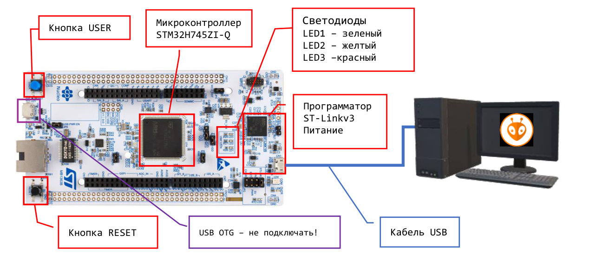
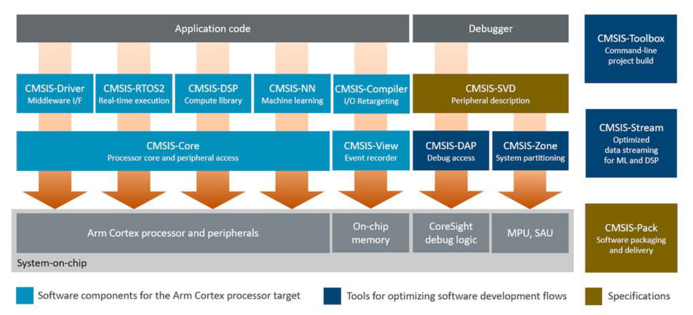
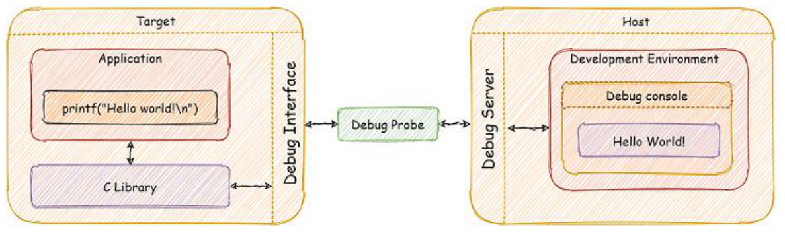
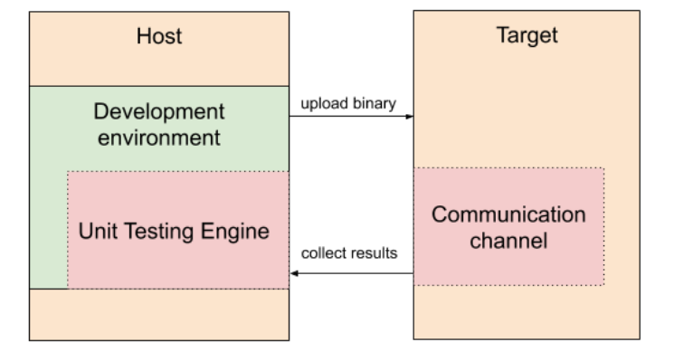
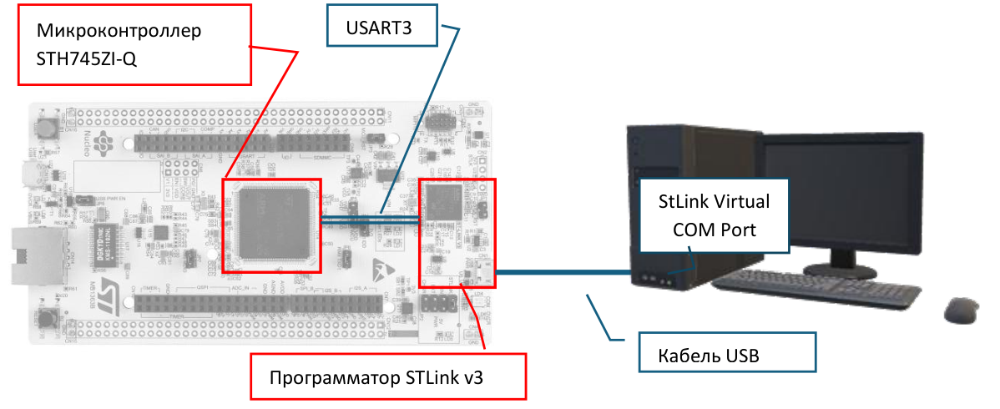

## Работа с учебным стендом

Учебный стенд состоит из материнской платы, в которую установлена отладочная плата ST-Nucleo-H745ZI-Q (или аналог). Схема подключения отладочной платы к компьютеру представлена на рисунке 1.

> [!warning] Важная информация
> Запрещается прикасаться к элементам отладочной платы, за исключением кнопок. Брать и удерживать плату следует только за её края (рёбра).
>
> Перед началом работы со стендом необходимо коснуться рукой железного основания стола.

*Рисунок 1 – Подключение отладочной платы ST-Nucleo к компьютеру.*

## Документация разработчика

Чтобы создать функциональное программное решение встраиваемой системы, разработчику необходимо располагать информацией о компонентах системы и о внешних (сопрягаемых) объектах. Структурно обобщённая модель встраиваемой системы состоит из следующих ключевых компонентов:

- процессор (процессорное ядро);
- внешние по отношению к процессору устройства, расположенные внутри микроконтроллера, — например SRAM-память, таймеры и другие периферийные блоки;
- внешние по отношению к микроконтроллеру устройства — например светодиоды или внешние резонаторы.

В таблице ниже приведены общепринятые названия (виды) документов, к которым следует обращаться для поиска соответствующей информации.

| Вид документа | Содержание | Документ (файл) для ST NUCLEO-H745ZI-Q |
| --- | --- | --- |
| Program Manual (PM) | Программная модель и периферия процессорного ядра. | `PM025-cortexm7.pdf` `PM0214-cortexm4.pdf` |
| Datasheet (DS) | Спецификация МК: структура; контакты; размеры; допустимые уровни напряжений, токов, температур и т. п. | `DS - stm32h745zi.pdf` |
| Reference Manual (RM) | Архитектура МК, структура памяти, описание периферийных блоков и регистров МК. | `RM0399 - stm32h745.pdf` |
| Application Notes (AN), Technical Notes (TN) | Рекомендации и указания по решению отдельных задач. Детализированное описание. | Например, `AN4899 - gpio-and-lowpower.pdf` |
| Application Examples | Демонстрационные программы от производителя микроконтроллера. | https://github.com/STMicroelectronics/STM32CubeH7/tree/master/Projects |
| Errata Sheets (ES) | Документ с описанием аппаратных ошибок в МК и рекомендаций по их обходу. | `ES0445-stm32h757xi.pdf` |
| Board User Manual (UM) | Общее описание изделия (отладочной платы) и инструкция по работе с ним. | `UM2408 - nucleo-h745.pdf` |
| Board Schematic, Board Manual (MB) | Электрическая схема изделия. | `MB1363-stm32h745zi.pdf` `standos_sch.pdf` |

> [!note] Важное примечание
> Основные документы для отладочных плат, используемых в лабораторных работах, находятся в папке DOCS материалов к настоящему курсу.

## Стандарт и библиотека CMSIS

CMSIS (Cortex Microcontroller Software Interface Standard) — это стандарт программного интерфейса для микроконтроллеров с процессорным ядром Cortex-M(A), разработанный компанией ARM.

Стандарт CMSIS определяет унифицированный программный интерфейс для работы с ядром и периферийными блоками. Это обеспечивает бесшовное объединение ПО из разных источников, упрощает повторное использование кода и его переносимость между различными микроконтроллерами и средами разработки. Библиотека CMSIS совместима со стандартом MISRA C.

Компания ARM взаимодействует с производителями микроконтроллеров и инструментальных средств разработки для поддержки CMSIS в их продукции. Как правило, производитель микроконтроллеров с ядром Cortex-M разрабатывает и предоставляет библиотеку CMSIS, которая учитывает все архитектурные особенности конкретной модели МК.

Центральный компонент библиотеки — CMSIS-CORE — предоставляет механизм доступа к регистрам микроконтроллера, функции управления прерываниями, системным таймером и памятью, а также функции инициализации процессора.

CMSIS содержит и другие полезные компоненты, например:

- **CMSIS-RTOS** — программный интерфейс (API) для взаимодействия с операционными системами реального времени;
- **CMSIS-DSP** — высокоэффективные функции обработки сигналов, такие как фильтрация и преобразование Фурье, а также SIMD-инструкции;
- **CMSIS-NN** — высокоэффективные функции для реализации нейронных сетей.

*Рисунок 2 – Структура CMSIS.*

## Семихостинг

Важным инструментом для разработки ПО является отладчик, с помощью которого можно отслеживать состояние МК и ход выполнения программы «по шагам». Другой полезный инструмент — трассировка событий, которые передаются в виде сообщений от устройства (микроконтроллера) на хост-компьютер (компьютер разработчика). Трассировка позволяет отслеживать поведение программы, не прерывая поток её выполнения.

Семихостинг — это технология, которая даёт возможность использовать в коде программы функции стандартного вывода (например, `printf`) для печати текста непосредственно в консоли отладчика хост-компьютера (рисунок 3). При этом каких-либо специальных устройств, за исключением программатора (Debug Probe), не требуется.

*Рисунок 3 – Технология ARM Semihosting.*

Кроме трассировки событий, семихостинг позволяет делегировать хост-компьютеру некоторые функции встраиваемой системы, например вывод результатов работы на экран или в файл. В частности, таким образом организуется модульное тестирование программы на целевой машине: модульный тест загружается и выполняется на МК, а данные, необходимые для отчёта о выполнении теста, передаются и обрабатываются на хост-компьютере (рисунок 4).

*Рисунок 4 – Модульное тестирование встраиваемой системы.*

В ряде случаев целесообразно обеспечить не только вывод, но и ввод сообщений из консоли хост-компьютера в приложение микроконтроллера. Это даёт возможность делегировать хост-компьютеру функции, связанные с подготовкой или выборкой входных данных, например ввод команд оператором.

Существует несколько технологий организации ввода-вывода между целевой машиной и хост-компьютером:

- **ARM Semihosting** — передача сообщений в консоль отладчика с помощью программатора;
- **Serial Wire View (SWV)** — технология, обеспечивающая быструю однонаправленную передачу данных по линии SWO интерфейса отладки SWD;
- ряд коммерческих решений, например **Real Time Transfer (RTT)**, работающих со специализированным программатором компании SEGGER;
- передача данных через интерфейс **UART** или **USB CDC**.

В настоящей работе мы обеспечим ввод и вывод между отладочной платой STM32H745ZI-Q и компьютером с помощью виртуального COM-порта, встроенного в программатор ST-Link V3. Этот способ сопряжения не требует дополнительного оборудования или кабелей (рисунок 5).

*Рисунок 5 – Схема организации ввода-вывода.*

## Порты ввода-вывода общего назначения (GPIO)

Выводы, или так называемые «пины», микроконтроллера распределены по портам ввода-вывода, которые именуются буквами: GPIOA, GPIOB и т. д. Каждый порт содержит 16 выводов с номерами от 0 до 15. Конкретный вывод принято обозначать записью «PXY», где X — порт, а Y — номер пина. Например, PA2 — пин 2 порта GPIOA.

Каждый вывод может быть сконфигурирован для выдачи логических уровней напряжения (цифровой выход) либо для считывания логического состояния (цифровой вход). Также существует режим «альтернативная функция», который позволяет связать вывод с определённым периферийным блоком микроконтроллера, например с цифро-аналоговым преобразователем (ЦАП). В этом режиме управление выводом берёт на себя соответствующий периферийный блок.

Порты ввода-вывода являются периферийными устройствами МК, регистры которых отображены на адресное пространство статической памяти. Управление работой GPIO осуществляется путём чтения и записи значений в соответствующие регистры.

> [!todo] Выполнить во время подготовки к лабораторной работе
> > [!abstract] Сделать запись в конспект
> > Ознакомьтесь с разделом «12 General-purpose I/Os (GPIO)» документа RM0399. Заполните в конспекте следующую таблицу для различных регистров GPIO (одна строка уже заполнена для примера).

| Регистр | Назначение | Варианты конфигурации для отдельного вывода |
| --- | --- | --- |
| `GPIO_OTYPER` | Конфигурирует тип цифрового вывода | «Push Pull» (= 0) или «Open Drain» (= 1) |
| … | … | … |
