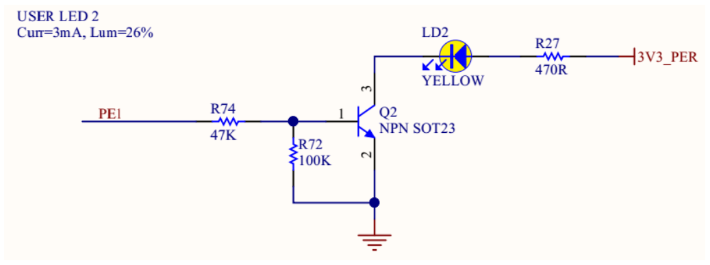

## Часть 1. Создание проекта CMSIS

1. В среде PlatformIO + VS Code создайте проект для отладочной платы [[glossary/nucleo-h745\|ST Nucleo H745ZI-Q]] и [[glossary/framework\|фреймворка]] CMSIS. Для этого можно воспользоваться командой:

> [!example] Ввести команду вручную
> ```shell
> pio project init -b nucleo_h745zi_q
> ```

   После создания проекта может потребоваться активация расширения [[glossary/platformio\|PlatformIO]]. Для этого можно использовать команду `Developer: Restart Window`.

2. В состав проекта CMSIS входят три обязательных файла: [[glossary/startup-file\|startup-файл]], [[glossary/system-file\|system-файл]] и [[glossary/linker-script\|скрипт компоновщика]]. По умолчанию PlatformIO автоматически включает в сборку указанные файлы из пакета CMSIS для целевого микроконтроллера. Однако эти системные файлы являются неотъемлемой частью кодовой базы, могут модифицироваться и понадобятся нам для работы. Поэтому настроим проект таким образом, чтобы системные файлы хранились в папке `system`.

   2.1. В папке проекта создайте папку `system`, скопируйте в неё системные файлы [[glossary/cmsis\|CMSIS]] для микроконтроллера [[glossary/stm32h745\|STM32H745ZI-Q]] и задайте им простые имена в соответствии с таблицей.

| Расположение файла | Новое имя файла | Примечание |
| --- | --- | --- |
| `C:\PioVScPort\platformio\packages\framework-cmsis-stm32h7\Source\Templates\gcc\startup_stm32h745xx.S` | `startup.s` | Startup-файл |
| `C:\PioVScPort\platformio\packages\framework-cmsis-stm32h7\Source\Templates\system_stm32h7xx_dualcore_bootcm7_cm4gated.c` | `system.c` | System-файл |
| `C:\PioVScPort\platformio\packages\framework-cmsis-stm32h7\Source\Templates\gcc\linker\stm32h745xx_flash_CM7.ld` | `h745cm7_flash.ld` | Скрипт компоновщика (linker script) |

> [!note] Важное примечание
> Пути указаны для портативной установки PlatformIO (`C:\PioVScPort\platformio`), которая используется в лабораторных работах. При другой установке среды подставьте соответствующий ей каталог `packages`.

> [!note] Важное примечание
> Редактор [[glossary/vscode\|VS Code]] позволяет копировать файлы путём перетаскивания мышью из Проводника во вкладку File Explorer.

   2.2. Включите в сборку проекта скопированные системные файлы вместо «автоматического» набора. Для этого в файле проекта `platformio.ini` создайте общее окружение `[env]` и определите в нём специальные параметры. Также добавьте частное окружение для программы мигания светодиодом, которая будет состоять из одного файла `hello_led.c` (см. листинг 1).

> [!example] Текст программы рекомендуется перепечатать
> **Листинг 1: platformio.ini**
>
> ```ini title="platformio.ini" showLineNumbers
> [env]
> platform = ststm32
> board = nucleo_h745zi_q
> framework = cmsis
> build_flags = -std=c11 -Wall -Wextra -D CORE_CM7
> board_build.ldscript = $PROJECT_DIR/system/h745cm7_flash.ld
> board_build.cmsis.startup_file = broken_path
> board_build.cmsis.system_file = broken_path
>
> [env:hello_led]
> build_type = debug
> build_src_filter = +<$PROJECT_DIR/system/*.c>
>                    +<$PROJECT_DIR/system/*.s>
>                    +<*>
> ```

3. Создайте в папке `src` файл `hello_led.c` и введите текст программы, которая мигает жёлтым светодиодом отладочной платы. Светодиод подключён к выводу PE1.

> [!example] Текст программы рекомендуется перепечатать
> **Листинг 2: src/hello_led.c**
>
> ```c title="src/hello_led.c" showLineNumbers
> #include <stm32h7xx.h>  // основной заголовочный файл CMSIS для МК серии H7
> #include <myled.h>
>
> // директива отключает оптимизацию кода компилятором для этой функции
> __attribute__((optimize("-O0")))
> static void delay(int ms) {
>     volatile int counter = SystemCoreClock / 1000 / 6 * ms ;
>     while (counter > 0) counter -= 1;
> }
>
> int main() {
>     myled_enable();     // инициализация вывода светодиода
>     while(1){
>         myled_toggle(); // переключение «вкл <-> откл»
>         delay(500);     // пауза между переключениями
>     };
> }
> ```

4. Используемые в программе функции `myled_enable()` и `myled_toggle()` реализованы в виде библиотеки. Добавьте файлы `myled.h` и `myled.c` в папку `lib/myled`.

> [!tip] Текст программы рекомендуется скопировать с помощью буфера обмена
> **Листинг 3: lib/myled/myled.h**
>
> ```c title="lib/myled/myled.h" showLineNumbers
> #pragma once
> void myled_enable();
> void myled_toggle();
> void myled_disable();
> ```

> [!tip] Текст программы рекомендуется скопировать с помощью буфера обмена
> **Листинг 4: lib/myled/myled.c**
>
> ```c title="lib/myled/myled.c" showLineNumbers
> #include "myled.h"
> #include <stm32h7xx.h>
>
> void myled_enable() {
>     RCC->AHB4ENR |= RCC_AHB4ENR_GPIOEEN;    // включаем тактирование GPIOE
>     GPIOE->MODER &= ~GPIO_MODER_MODE1_Msk;  // включаем режим "output" ...
>     GPIOE->MODER |= GPIO_MODER_MODE1_0;     // ... для pin 1
> }
>
> void myled_toggle() {
>     GPIOE->ODR ^= 2; // "исключающее или" с единицей меняет 0->1 и 1->0
> }
>
> void myled_disable() {
>     GPIOE->MODER &= ~GPIO_MODER_MODE1_Msk;  // включаем режим "analog" ...
>     GPIOE->MODER |= GPIO_MODER_MODE1_0 | GPIO_MODER_MODE1_1;  // ... для pin 1
> }
> ```

## Часть 2. Анализ программы

1. Откройте и изучите [[glossary/linker-script\|скрипт компоновщика]] `h745cm7_flash.ld`.

   Скрипт компоновщика содержит правила, по которым [[glossary/linker\|компоновщик]] создаёт исполняемый [[glossary/elf\|ELF-файл]].

   Язык скрипта компоновщика описан в документации [5]. Скрипт начинается с команды `ENTRY`, указывающей функцию, с которой начинается выполнение программы. Эта информация нужна компоновщику для оптимизации размера исполняемой программы: неиспользуемые функции и переменные не будут включены в создаваемый ELF-файл. Обратите внимание, что выполнение программы начинается не с функции `main()`.

   Следом идёт определение ряда констант и команда `MEMORY`, в которой определяются доступные области памяти, их размер и атрибуты.

   Далее следует большая команда `SECTIONS`, в которой определяются содержимое [[glossary/sections\|секций]] и их расположение в памяти МК.

   После включения питания и (или) сброса процессора [[glossary/isr-vector\|таблица векторов прерываний]] находится по адресу ноль. Заметим, что секция с названием `.isr_vector` описана первой и будет размещена в начале FLASH-памяти, а значит, будет доступна для чтения и выполнения по нулевому адресу. После сброса процессор находит по адресу 0 первый вектор таблицы прерываний для инициализации указателя стека SP, а следующий вектор — для определения адреса функции обработчика.

   Также во флеш-памяти размещены секция `.text`, которая содержит основные инструкции программы (функции в языке C), и секция `.rodata` для хранения константных данных.

   Секция `.data` предназначена для хранения инициализированных данных. Обратите внимание на строку `>RAM AT> FLASH`, которая сообщает компоновщику, что значения данных будут записаны во флеш-память, но обращение к ним будет происходить по адресам, расположенным в памяти RAM. Ответственность за копирование инициализированных значений из FLASH в RAM до первого обращения к переменным этой секции по имени лежит на программе (выполняется в стартовом коде).

   Также в скрипте компоновщика определены специальные секции:

   - `.ARM.extab` и `.ARM.exidx` — секции, необходимые для реализации двоичного интерфейса обработки программных исключений (ARM EHABI — Exception Handling Application Binary Interface), который нужен для поддержки механизма исключений в языке C++;
   - `.preinit_array` и `.init_array` содержат массивы указателей на функции, которые должны быть вызваны до и во время инициализации программы, а секция `.fini_array` — во время завершения программы. Этот механизм используется для вызова конструкторов статических объектов C++;
   - `.ARM.attributes` используется для хранения метаданных, которые описывают различные атрибуты и характеристики программы или библиотеки. Эти атрибуты содержат информацию о версии компилятора, используемых опциях компиляции, поддерживаемых архитектурных особенностях и т. п. Секция `.ARM.attributes` используется отладчиком или другими инструментами для получения сведений об исполняемом файле.

   Директива `/DISCARD/` применяется для исключения определённых объектов из ELF-файла и содержит библиотеки `libc.a`, `libm.a` и `libgcc.a`. Во встраиваемых системах вместо этих библиотек используются специальные библиотеки, такие как [[glossary/newlib\|Newlib]] или Newlib-nano, которые позволяют адаптировать работу функций стандартной библиотеки.

   Удалите из скрипта компоновщика атрибут `(READONLY)` при определении секций. Это необходимо, поскольку используемая по умолчанию версия компилятора gcc 7.2.1 не поддерживает этот атрибут.

> [!note] Важное примечание
> Редактор VS Code позволяет автоматизированно заменить один текст другим. Нажмите CTRL+F и замените строку `(READONLY)` на пустую строку.

2. [[glossary/startup-file\|Startup-файл]] отвечает за первичную конфигурацию микроконтроллера после сброса. Откройте файл `system/startup.s` и изучите стартовый код.

   2.1. Найдите секцию `.isr_vector` и ознакомьтесь с таблицей векторов прерываний.

> [!abstract] Сделать запись в конспект
> 2.2. Найдите определение функции `ResetHandler` в секции `.text`. Попытайтесь составить обобщённый алгоритм функции `ResetHandler` и запишите его в конспект.

   2.3. Найдите в коде реализацию обработчика «по умолчанию» `DefaultHandler`.

> [!note] Важное примечание
> Краткая справка по некоторым директивам языка ассемблера:
>
> - `b` или `bx` — безусловный переход на указанный адрес;
> - `bl` — безусловный переход с возвратом;
> - `ldr` — загрузка в регистр. Например, инструкция `ldr r3, [r3, r1]` загружает значение из памяти по адресу, который получается сложением значений регистров `r3` и `r1`, и сохраняет это значение в регистр `r3`;
> - `str` — выгрузка из регистра;
> - `cmp` и `bcc` — сравнение и условный переход, если результат сравнения «больше или равно».

3. Откройте файл `system/system.c` и изучите код системного файла.

   3.1. Обратите внимание на макросы `HSE_VALUE`, `CSI_VALUE`, `HSI_VALUE`, которые соответствуют частотам внешнего и внутренних генераторов тактовых импульсов МК, а также на макросы `CORE_CM7` и `CORE_CM4`. Значения этих макросов можно установить (переопределить) в параметре `build_flags` файла проекта или изменить непосредственно в файле `system.c`.

   Проверьте с помощью документа UM2408 (раздел [6.9 OSC clock](docs/um2408-nucleo-h745.pdf#page=28)) значение частоты внешнего генератора [[glossary/hse\|HSE]], используемое по умолчанию. При необходимости переопределите макрос, указав правильное значение.

   3.2. Работа функции `ExitRun0Mode` также зависит от макросов.

   Определите схему питания отладочной платы, которая используется «по умолчанию» (раздел [6.4.8](docs/um2408-nucleo-h745.pdf#page=23) документа UM2408), и добавьте соответствующий макрос в сборку проекта.

   3.3. Согласно стандарту [[glossary/cmsis\|CMSIS]] определяются глобальная переменная `SystemCoreClock` для хранения значения частоты системного тактового сигнала и функция `SystemCoreClockUpdate()` для вычисления (обновления) значения этой переменной по состоянию регистров МК.

4. Откройте файл `src/hello_led.c` и изучите код программы.

   Обратите внимание на то, что функция `main()` содержит цикл, который никогда не завершается ([[glossary/superloop\|суперцикл]]). Большинство программ микроконтроллера работают до выключения питания (сброса) и содержат такой суперцикл.

   Светодиоды отладочной платы подключены к выводам через токоограничивающие резисторы. Например, жёлтый светодиод подключён к выводу PE1.



*Схема подключения жёлтого светодиода (USER LED2) к выводу PE1.*

   Следовательно, для управления светодиодом необходимо сконфигурировать вывод в режим выхода Output [[glossary/push-pull\|Push-Pull]] и установить на выходе высокий (зажечь) или низкий (погасить) логический уровень.

   Прежде чем работать с регистрами периферийного блока, необходимо включить тактирование этого блока. За тактирование периферийных блоков в МК отвечает специальный блок [[glossary/rcc\|RCC]]. Функция `myled_enable()` включает тактирование порта GPIOE.

   Ознакомьтесь с разделом [9.7.42 «RCC AHB4 clock register (RCC_AHB4ENR)»](docs/rm0399-stm32h745.pdf#page=492) документа RM0399. Обратите внимание на назначение битовых полей регистра. Сопоставьте описание регистра `RCC_AHB4ENR` с кодом функции `myled_enable()`.

5. Ознакомьтесь с основными структурами и макросами, определёнными в CMSIS-CORE.

   5.1. Изучите определение объектов `RCC` и `GPIOE`, а также соответствующих структур в файле `stm32h745xx.h`. Обратите внимание на то, каким образом в библиотеке CMSIS реализован доступ к регистрам аппаратных блоков (RCC, [[glossary/gpio\|GPIO]]).

> [!note] Важное примечание
> Для перехода к определению объекта (например, к `RCC` или к файлу, указанному в директиве `include`) наведите курсор мыши на его имя и щёлкните по нему, удерживая клавишу CTRL.
>
> Ещё один способ — установить текстовый курсор на имя объекта и нажать клавишу F12.
>
> Чтобы вернуться к предыдущему месту работы с кодом, используйте комбинации клавиш ALT+ВЛЕВО и ALT+ВПРАВО.

   5.2. Чтобы использовать драйвер CMSIS, достаточно подключить заголовочный файл `stm32h7xx.h`. С включения этого файла начинается программа `hello_led.c`.

   Откройте файл `stm32h7xx.h` и ознакомьтесь с определением специальных макросов CMSIS для работы с регистрами: `SET_BIT`, `CLEAR_BIT`, `READ_BIT`, `CLEAR_REG`, `WRITE_REG`, `READ_REG`, `MODIFY_REG`. Определите назначение остальных макросов.

   Макрос `POSITION_VAL` используется для определения позиции первого установленного бита (единицы) в значении. В макросе выполняются две операции: `__RBIT(VAL)` инвертирует порядок битов в значении `VAL`, а `__CLZ(VAL)` возвращает количество ведущих нулей в значении `VAL`.

   В каких местах библиотеки `myled` можно применить эти макросы?

> [!abstract] Сделать запись в конспект
> 5.3. Выясните, какие ещё заголовочные файлы подключаются в файле `stm32h7xx.h`. Запомните или запишите в конспект основные макроопределения, от которых зависит конфигурация библиотеки CMSIS.

## Часть 3. Сборка, загрузка в МК и отладка программы

1. Выполните сборку программы в [[glossary/verbose\|режиме подробного вывода]].

   Код программы преобразуется в объектный файл. Затем создаётся файл в формате [[glossary/elf\|ELF]] (Executable and Linkable Format), а на заключительном этапе — файл прошивки `firmware.bin`, предназначенный для программирования микроконтроллера.

> [!todo] Выполнить во время подготовки к лабораторной работе
> > [!abstract] Сделать запись в конспект
> > Изучите сообщения, выводимые в терминал в процессе сборки. Проанализируйте, какие программы и с какими параметрами вызываются. Запишите названия и назначение программ, а также параметров, с которыми они запускаются. Для поиска информации о программах и ключах используйте ресурсы Интернета.

2. Выполните загрузку программы в память МК.

   2.1. Подключите отладочную плату к компьютеру согласно рисунку 1.

   2.2. Выполните загрузку (прошивку) бинарного файла программы.

   - Способ 1: нажать ALT+CTRL+U.
   - Способ 2: нажать кнопку Upload (→) в [[glossary/status-bar\|Строке состояния]].
   - Способ 3: ввести команду в терминал PIO: `pio run -t upload -e hello_led -v`

3. После загрузки программы наблюдайте мигание светодиода.

4. Проведите исследование работы программы с помощью отладчика.

   4.1. Поставьте [[glossary/breakpoint\|точку останова]] на 13-й строке файла `hello_led.c` и запустите программу в режиме отладки (F5).

   Будет выполнена компиляция версии программы с включённой отладочной информацией, загрузка во флеш-память МК и запуск отладчика.

   4.2. В окне Peripherals откройте для просмотра состояние регистров блока `GPIOE->ODR`.

   4.3. Проведите анализ изменения регистров [[glossary/gpio\|GPIO]], выполняя программу по шагам (F11, F10).

> [!abstract] Сделать запись в конспект
> 4.4. Приостановите выполнение программы в функции `delay()`. Далее в окне Disassembly нажмите на строку «Switch to code». Выполняя программу по шагам, определите, сколько инструкций занимает один цикл в функции `delay()`. Запишите это число в конспект.

   4.5. Завершите работу отладчика.

## Часть 4. Библиотека для реализации двунаправленного семихостинга

1. Библиотека `vterm` позволяет программе, работающей на отладочной плате [[glossary/nucleo-h745\|ST NUCLEO-H745ZI-Q]], выводить символы на терминал [[glossary/host-target\|хост-компьютера]] и считывать их оттуда с помощью функций стандартного ввода-вывода. Библиотека устроена следующим образом. Функция `vterm_init()` инициализирует блок [[glossary/usart\|USART3]] микроконтроллера. Также в файле `vterm.c` переопределяются «слабые» функции библиотеки Newlib для записи и чтения таким образом, чтобы передавать и принимать данные через USART3 [6].

2. Перед использованием функций библиотеки [`vterm`](../glossary/vterm) или функций ввода-вывода стандартной библиотеки необходимо подключить заголовочный файл (`#include <vterm.h>`) и вызвать функцию `vterm_init()`, указав скорость передачи данных, например 115 200 бит/с.

3. Добавьте библиотеку `vterm` в проект (см. папку Resources). Библиотека состоит из файлов `vterm.h` и `vterm.c`, которые следует разместить в папке `lib/vterm`. Листинги файлов можно найти в приложении или в папке Resources.

4. Откройте файл `vterm.h` и ознакомьтесь с функциями, которые предоставляет библиотека.

5. Измените программу `hello_led.c`, чтобы проверить работу библиотеки.

   5.1. Подключите заголовочные файлы:

> [!example] Текст программы рекомендуется перепечатать
> ```c
> #include <stdio.h>
> #include <vterm.h>
> ```

   5.2. Добавьте следующие строки в основной цикл программы:

> [!example] Текст программы рекомендуется перепечатать
> ```c
> static int counter = 0;
> printf("\r%s %d %s", "Светодиод был переключен", counter++, "раз(а)");
> ```

   А перед основным циклом добавьте вызов функции инициализации:

> [!example] Текст программы рекомендуется перепечатать
> ```c
> vterm_init(115200);
> ```

6. Выполните сборку программы. Убедитесь в отсутствии ошибок. Загрузите программу в МК.

7. Для сопряжения с целевым устройством на хост-компьютере можно использовать любую программу-терминал, например Tera Term. В лабораторных работах предлагается использовать встроенный терминал PlatformIO, называемый [[glossary/serial-monitor\|Serial Monitor]], или просто монитор. Параметры его работы можно установить в файле проекта `platformio.ini`.

   Добавьте в общее окружение `[env]` параметры с указанием скорости приёма данных хост-компьютером:

> [!example] Перепечатать параметры конфигурации
> ```ini title="platformio.ini"
> monitor_speed = 115200
> test_speed = 115200
> ```

8. Запустите Serial Monitor.

   - Способ 1: нажать кнопку Serial Monitor в [[glossary/status-bar\|Строке состояния]].
   - Способ 2: нажать CTRL+ALT+S.
   - Способ 3: ввести в [[glossary/command-palette\|Палитру команд]] (CTRL+SHIFT+P) команду `PlatformIO: Serial Monitor`.
   - Способ 4: ввести команду в терминал PIO: `pio device monitor -e hello_led`

9. После запуска в нижней панели появится новое окно терминала «Monitor Task». В терминале должна отображаться строка с увеличивающимся счётчиком.

> [!note] Важное примечание
> В один момент времени может работать только один Serial Monitor. Повторный запуск монитора приведёт к ошибке.

## Часть 5. Выполнение юнит-тестирования на микроконтроллере

1. Для конфигурации библиотеки [[glossary/unity\|Unity]] используются два файла — `unity_config.h` и `unity_config.c`, — которые необходимо включить в иерархию тестов. Для всех нижестоящих тестов будет выполнена сборка фреймворка Unity с этими конфигурационными файлами.

   Создайте в папке `test` директорию `target` и поместите в неё файлы конфигурации Unity.

> [!tip] Текст программы рекомендуется скопировать с помощью буфера обмена
> **Листинг 5: test/target/unity_config.h**
>
> ```c title="test/target/unity_config.h" showLineNumbers
> #ifndef UNITY_CONFIG_H
> #define UNITY_CONFIG_H
> #ifdef __cplusplus
> extern "C" {
> #endif
>
> void unity_output_start();
> void unity_output_char(char);
>
> #define UNITY_OUTPUT_CHAR(a) unity_output_char(a)
> #define UNITY_OUTPUT_START() unity_output_start()
>
> // Другие макроопределения, которые можно изменить при необходимости
> // #define UNITY_OUTPUT_CHAR_HEADER_DECLARATION
> // #define UNITY_OUTPUT_FLUSH()
> // #define UNITY_OUTPUT_FLUSH_HEADER_DECLARATION
> // #define UNITY_OUTPUT_COMPLETE()
>
> #ifdef __cplusplus
> }
> #endif /* extern "C" */
> #endif /* UNITY_CONFIG_H */
> ```

> [!tip] Текст программы рекомендуется скопировать с помощью буфера обмена
> **Листинг 6: test/target/unity_config.c**
>
> ```c title="test/target/unity_config.c" showLineNumbers
> #include "unity_config.h"
> #include <stdio.h>
> #include <stm32h7xx.h>
> #include <vterm.h>
>
> // Блокирующая задержка с помощью счётчика DWT (Data Watchpoint and Trace unit)
> static void delay(int ms) {
>   uint32_t cycles = SystemCoreClock / 1000 * ms;
>   DWT->CTRL |= 1;
>   DWT->CYCCNT = 0;
>   while (DWT->CYCCNT < cycles)
>     __asm("nop");
> }
>
> void unity_output_start() {
>   vterm_init(115200);
>   delay(1000); // задержка для подготовки к приёму данных хост-компьютером
> }
>
> void unity_output_char(char ch) { putchar(ch); }
> ```

2. Проанализируйте код конфигурационных файлов.

   2.1. Ряд специальных макросов позволяет настроить функцию вывода фреймворка Unity. В файле `unity_config.h` определены макрос `UNITY_OUTPUT_START()`, который однократно вызывается перед началом работы фреймворка, и макрос `UNITY_OUTPUT_CHAR(a)`, задача которого — вывести один символ сообщения. Как видно из листингов 5 и 6, макросы определяют вызов функций `unity_output_start()` и `unity_output_char()`, которые, в свою очередь, инициализируют библиотеку [`vterm`](../glossary/vterm) и используют функцию `putchar` стандартной библиотеки для вывода символа.

   2.2. В функцию `unity_output_start()` добавлена задержка для того, чтобы среда разработки PlatformIO на хост-компьютере успела запустить терминал для приёма сообщений после того, как программа теста будет загружена в МК и начнёт своё выполнение.

   2.3. Код функции задержки `delay()` отличается от аналогичной функции в программе `hello_led.c`. Процессорные ядра [[glossary/cortex-m\|Cortex-M]] имеют опциональный блок отладки, называемый [[glossary/dwt\|Data Watchpoint and Tracing]] (DWT), который предоставляет [[glossary/breakpoint\|точки останова]], трассировку данных и системное профилирование для процессора. Регистр `CYCCNT` этого блока содержит счётчик циклов, выполненных процессором. Использование этого счётчика позволяет не делать предположений о количестве операций, затрачиваемых циклом проверки.

3. Создайте тест для функции смены состояния светодиода `myled_toggle()`. Для этого создайте файл теста и вставьте в него код приведённого ниже листинга. Выполните анализ вставленного кода тестовой программы.

> [!tip] Текст программы рекомендуется скопировать с помощью буфера обмена
> **Листинг 7: test/target/test_myled/myled_toggle.c**
>
> ```c title="test/target/test_myled/myled_toggle.c" showLineNumbers
> #include <stm32h7xx.h>
> #include <myled.h>
> #include <unity.h>
>
> void setUp() {
>     myled_enable();
> }
>
> void tearDown() {
>     myled_disable();
> }
>
> void test_myled_toggle() {
>   uint32_t state[3] = {0};
>   state[0]  = GPIOE->ODR & GPIO_ODR_OD1;
>   myled_toggle();
>   state[1] = GPIOE->ODR & GPIO_ODR_OD1;
>   TEST_ASSERT_NOT_EQUAL_UINT32_MESSAGE(state[0], state[1],
>                             "led state not changed after toggle once");
>   myled_toggle();
>   state[2] = GPIOE->ODR & GPIO_ODR_OD1;
>   TEST_ASSERT_EQUAL_UINT32_MESSAGE(state[0], state[2],
>                             "led state changed after toggle twice");
> }
>
> int main() {
>   UNITY_BEGIN();
>   RUN_TEST(test_myled_toggle);
>   return UNITY_END();
> }
> ```

4. Перед запуском теста:

   4.1. Добавьте в файл проекта параметр:

> [!example] Перепечатать параметры конфигурации
> ```ini title="platformio.ini"
> test_framework = custom
> ```

   4.2. Поместите файл `test_custom_runner.py` в папку `test`.

   4.3. Скопируйте файлы `startup.s` и `system.c` в папку `test/target`.

5. Запустите тест и убедитесь в получении отчёта об успешном прохождении теста.
