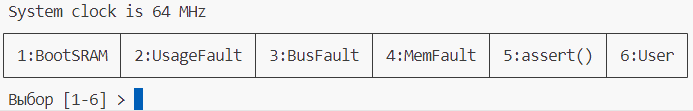

## Часть 1. Создание и загрузка программы, которая выполняется из памяти SRAM

1. Создайте проект [[glossary/platformio\|PlatformIO]] на базе [[glossary/framework\|фреймворка]] [[glossary/cmsis\|CMSIS]] для отладочной платы [[glossary/nucleo-h745\|ST Nucleo H745ZI-Q]] и процессора Cortex-M7.

> [!note] Важное примечание
> Создание проекта с библиотекой [[glossary/vterm\|vterm]] рассмотрено в [[lab02/index\|лабораторной работе №2]]. Допускается взять за основу копию проекта ЛР2, но в этом случае до защиты работы из проекта следует удалить весь невостребованный код и лишние параметры.

2. Добавьте в проект библиотеку `vterm` и разработанную ранее библиотеку управления светодиодами (см. [[lab02/index\|ЛР2]]).

3. Создайте программу `blinker`, которая мигает жёлтым или зелёным светодиодом. Исходные коды программы разместите в папке `src/blinker`.

4. Для размещения и выполнения программы в блоке памяти [[glossary/axi-sram\|AXI-SRAM]] воспользуйтесь [[glossary/linker-script\|скриптом компоновщика]] `stm32h745xx_sram1_CM7.ld`. Его можно найти в папке `C:\PlatformIO\packages\framework-cmsis-stm32h7\Source\Templates\gcc\linker\`.

   Скопируйте этот файл в проект, в папку `system`, и подключите его к сборке программы `blinker`.

5. Откройте и изучите файл `stm32h745xx_sram1_CM7.ld`. Таблица векторов прерываний будет размещена по начальному адресу памяти AXI-SRAM. Следовательно, чтобы программа выполнялась, процессору нужно указать этот адрес ТВП вместо адреса `0x00000000`, который он использует после сброса.

   Откройте [[glossary/system-file\|system-файл]] и разберитесь, как макроопределение `VECT_TAB_SRAM` влияет на работу функции `SystemInit()`. Добавьте это макроопределение в сборку программы `blinker` с помощью флага компилятора [[glossary/gcc\|GCC]].

6. Для успешной сборки программы не забудьте удалить из скрипта компоновщика все вхождения `(READONLY)`. Убедитесь, что программа собирается.

7. Операция Upload не подходит для записи программы в оперативную память, поскольку предназначена для записи во FLASH. Поэтому загрузим программу в память AXI-SRAM с помощью отладчика — для этого добавьте в файл проекта параметр `debug_init_cmds`:

<div class="mkvs-retype">

```ini
debug_init_cmds = target extended-remote $DEBUG_PORT
                  $LOAD_CMDS
                  $INIT_BREAK
```

</div>

8. В результате выполнения первой части должен получиться следующий файл проекта.

**Листинг 1: platformio.ini**

<div class="mkvs-retype">

```ini title="platformio.ini" showLineNumbers
[platformio]
description = "пример выполнения из flash и из sram"

[env]
platform = ststm32
board = nucleo_h745zi_q
framework = cmsis
build_flags = -std=c11 -Wall -Wextra -D CORE_CM7 -DPWR_DIRECT_SMPS_SUPPLY
board_build.cmsis.startup_file = broken_path
board_build.cmsis.system_file = broken_path
monitor_speed = 115200
test_speed = 115200
test_framework = custom ; использовать test_custom_runner.py в папке test
build_type = debug
debug_init_cmds = target extended-remote $DEBUG_PORT
                  $LOAD_CMDS
                  $INIT_BREAK

[env:blinker_flash]
build_src_filter = +<$PROJECT_DIR/system/*>
                   +<blinker/*.c>
board_build.ldscript = $PROJECT_DIR/system/h745cm7_flash.ld

[env:blinker_ram]
build_flags = ${env.build_flags} -DVECT_TAB_SRAM
board_build.ldscript = $PROJECT_DIR/system/stm32h745xx_sram1_CM7.ld
build_src_filter = +<blinker/*.c>
                   +<$PROJECT_DIR/system/*>
```

</div>

9. Нажмите клавишу F5, чтобы записать программу в AXI-SRAM и запустить её в режиме отладки. Убедитесь в том, что программа выполняется.

## Часть 2. Создание программы-загрузчика

Создадим программу `bootloader`, которая выводит меню и обрабатывает различные команды, в том числе команду запуска приложения из памяти AXI-SRAM.

1. Создайте файл `src/bootloader/main.c` с приведённым ниже листингом.

**Листинг 2: src/bootloader/main.c**

```c title="src/bootloader/main.c" showLineNumbers
#include <stm32h7xx.h>
#include <assert.h>
#include <stdio.h>
#include <vterm.h>

#define APP_SRAM_OFFSET 0x24000000
#define NUM_COMMANDS 6
#if NUM_COMMANDS > 9
#error NUM_COMMANDS must be less than 10 or change read_handler_index()
#endif

extern void HardFault_Handler();
uint32_t bootloader_SP = 0;

static const char *gc_help_msg =
    u8"\n\r┌────────────┬──────────────┬────────────┬────────────┬────────────┬────────┐"
    u8"\n\r│ 1:BootSRAM │ 2:UsageFault │ 3:BusFault │ 4:MemFault │ 5:assert() │ 6:User │"
    u8"\n\r└────────────┴──────────────┴────────────┴────────────┴────────────┴────────┘"
    u8"\n\r Выбор [1-6] > ";

static void do_BootSRAM();
static void do_UsageFault();
static void do_MemFault();
static void do_BusFault();
static void do_Assert();
static void do_User();

typedef void (*handler_func_t)();

handler_func_t handlers[NUM_COMMANDS] = {do_BootSRAM, do_UsageFault, do_BusFault,
                                         do_MemFault, do_Assert,     do_User};

uint8_t read_handler_index() {
  while (vterm_keypressed() != 0)
    ;
  char str[2];
  int sz = vterm_gets(str, sizeof(str), 1);
  if (sz < 1)
    return UINT8_MAX;
  return str[0] >= '1' ? str[0] - '1' : UINT8_MAX;
}

void enable_fault_handlers() {
  // Включить генерацию исключений для UsageFault; см. PM0253, п. 4.3.7 на стр. 200
  // SCB->CCR ....
  // Разрешить генерацию исключений; см. PM0253, п. 4.3.9 на
  // стр. 204 SCB->SHCSR ...
}

int main() {
  vterm_init(115200);
  enable_fault_handlers();
  for (;;) {
    printf("\r\n System clock is %ld MHz %s", SystemCoreClock / 1000000, gc_help_msg);
    uint8_t handler_index = read_handler_index();
    if (handler_index < NUM_COMMANDS) {
      handlers[handler_index]();
    }
  }
  return 0;
}

/***************************** Обработчики команд ************************************/

void do_BootSRAM() {

  printf("\nJumping to SRAM app at %08lx....\n", (unsigned long)APP_SRAM_OFFSET);

  // 1) Определить ТВП приложения, адреса начала стека и точки входа приложения
  const uint32_t *app_IV = (uint32_t *)(APP_SRAM_OFFSET);
  uint32_t app_end_stack = (*((uint32_t *)(app_IV)));
  void *app_entry = (void *)(*((uint32_t *)(APP_SRAM_OFFSET + 4)));

  // Доп. 1) Признак того, что был запуск приложения: bootloader_SP != 0
  bootloader_SP = __get_MSP();

  // 2) Отключить все прерывания
  __disable_irq();

  // 3) Заменить текущий адрес стека на начальный адрес стека приложения
  __set_MSP(app_end_stack);

  // 4) Задать новый адрес таблицы векторов прерываний
  SCB->VTOR = (uint32_t)app_IV;

  // Доп. 2) Заменяем обработчик HardFault в ТВП на собственный
  NVIC_SetVector(HardFault_IRQn, (uint32_t)HardFault_Handler);

  // Инвалидация кеша инструкций у ядра Cortex-M7
  SCB_InvalidateICache();

  // 5) Безусловный переход к точке входа
  __ASM volatile("bx %0" ::"r"(app_entry));
}

void do_UsageFault() {
  // Отслеживаемые ошибки задаются в SCB->UFSR (PM0253.rev5, стр. 209)
  // Например, деление на ноль, обращение к невыровненным данным
}

void do_MemFault() {
  // Нарушение атрибутов памяти,
  // например, попытка выполнения кода из области памяти периферийных устройств
  void *ptr = (void *)0x40000000;
  goto *ptr;
}

void do_BusFault() {
  // Ошибка доступа к памяти по шине
  // Например, попытка чтения из отсутствующей внешней памяти (0x60000000)
}

void do_Assert() { assert(!"Assertion example"); }

void do_User() { puts(u8"\r\nВнезапно выпал снег\n"); }
```

2. Внимательно изучите код программы и попытайтесь предсказать её поведение.

3. Добавьте в файл проекта окружение `[env:bootloader]` и включите в сборку C-файлы из папки `src/bootloader` и скрипт компоновщика `stm32h745xx_flash_CM7.ld`.

4. Соберите программу `bootloader` и запишите её во флеш-память микроконтроллера.

5. Запустите [[glossary/serial-monitor\|Serial Monitor]]. В окне монитора нажмите пробел — на экран будут выведены меню и приглашение ввести команду (рисунок 1).



*Рисунок 1 – Меню загрузчика в окне Serial Monitor.*

6. Нажмите клавишу с цифрой 6, чтобы выполнить тестовый пункт меню.

7. Нажмите клавишу с цифрой 1, чтобы запустить программу `blinker`, загруженную ранее с помощью отладчика.

## Часть 3. Реализация обработчиков исключений

1. Создайте файл `src/bootloader/fault_handlers.c` и поместите в него функции обработчиков исключений `MemManageFault` и `HardFault`.

**Листинг 3: src/bootloader/fault_handlers.c**

```c title="src/bootloader/fault_handlers.c" showLineNumbers
#include "stm32h7xx.h"
#include <stdio.h>
#include <vterm.h>

extern uint32_t bootloader_SP;

void MemManage_Handler() {
  puts("\r\nMemory Management Fault exception!");
  uint32_t mmfsr = (SCB->CFSR) & SCB_CFSR_MEMFAULTSR_Msk;
  printf("MMFSR = 0x%02lx\n\r", mmfsr);
  if (mmfsr & 0x01) {
    puts("The processor attempted an instruction fetch from a location that "
         "does not permit execution");
  }
  if (mmfsr & 0x80)
    printf("MMFAR = 0x%lx\n\r", (SCB->MMFAR));
  NVIC_SystemReset();
}

void HardFault_Handler() {
  if (bootloader_SP) {
    __set_MSP(bootloader_SP);
    bootloader_SP = 0;
    vterm_init(115200);
    puts("\r\nApplication HardFault exception\r\n");
  } else {
    puts("\r\nBootloader HardFault exception\r\n");
  }
  NVIC_SystemReset();
}
```

2. Проанализируйте код реализации обработчиков.

   2.1. Имена функций-обработчиков совпадают с именами функций ТВП в [[glossary/startup-file\|startup-файле]].

   2.2. Переопределён обработчик исключения `MemManageFault`. Новый [[glossary/isr\|ISR]] сообщает о своём вызове и о причине возникновения исключения, а в завершение вызывает функцию перезагрузки микроконтроллера.

   2.3. В функции запуска приложения `do_BootSRAM()` вектор исключения `HardFault` заменяется на ISR загрузчика. Поэтому при возникновении этого исключения во время выполнения приложения `blinker` будет вызван обработчик, определённый в файле `fault_handlers.c`.

   2.4. Обработчик исключения `HardFault` использует переменную `bootloader_SP`, чтобы определить, в какой программе возникло исключение. При запуске загрузчика `bootloader_SP` равна нулю, а перед запуском приложения в неё записывается указатель стека загрузчика.

   Если исключение `HardFault` произошло при выполнении кода приложения, обработчик восстановит свой указатель стека и заново инициализирует свои ресурсы — библиотеку `vterm`.

   В завершение обработчик `HardFault` вызывает функцию перезагрузки микроконтроллера.
