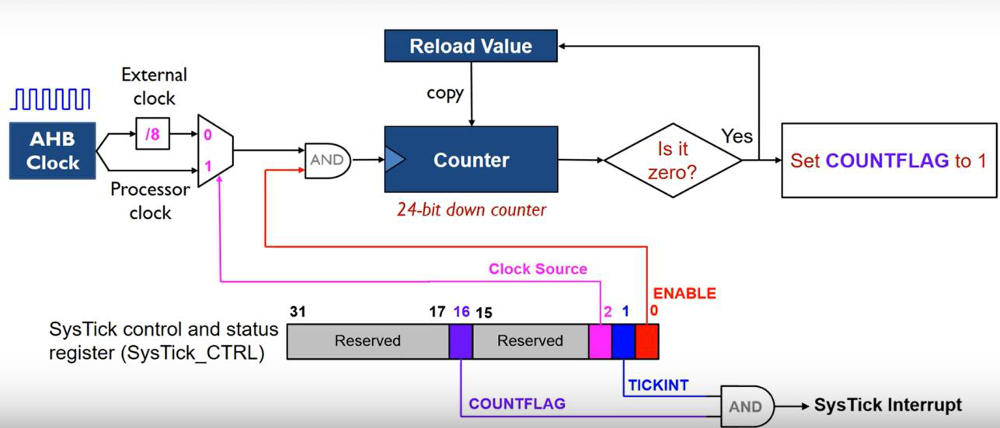

## Системный таймер SysTick

Чтобы отсчитывать время, процессорам Cortex-M не нужна внешняя периферия: подходящий таймер встроен прямо в ядро.

![[glossary/systick#^def-systick]]

Многие операционные системы задействуют его для периодической активации планировщика задач. Программы, работающие без операционной системы, тоже используют `SysTick` для получения временных отсчётов.

Документация на системный таймер приведена в [1]. Для конфигурации таймера служит регистр управления `SYST_CSR`, текущее значение счётчика находится в регистре `SYST_CVR`, а значение для перезагрузки — в регистре `SYST_RVR`.

Работает системный таймер так. С каждым тактом значение счётчика `SYST_CVR` уменьшается на единицу. Когда счётчик достигает нуля, в `SYST_CVR` загружается значение регистра `SYST_RVR`, устанавливается флаг `SYST_CSR->COUNTFLAG` и, если установлен флаг `SYST_CSR->TICKINT`, генерируется [[glossary/exception\|исключение]] с номером 15 (`SysTick`).

Структурная схема таймера приведена на рисунке 1.



*Рисунок 1 – Структурная схема системного таймера SysTick.*

Назначение битов регистра управления и состояния `SYST_CSR`:

| Бит | Имя | Назначение |
| --- | --- | --- |
| 0 | `ENABLE` | Если 1, таймер загружает в счётный регистр `SYST_CVR` значение из регистра `SYST_RVR` и начинает уменьшать его с каждым тактом. |
| 1 | `TICKINT` | Если 1, при обнулении счётчика `SYST_CVR` генерируется исключение 15. |
| 2 | `CLKSOURCE` | Источник тактирования: 0 — внешний (`HCLK/8`), 1 — внутренний (`HCLK`). |
| 16 | `COUNTFLAG` | При чтении регистра флаг установлен, если с момента предыдущего чтения счётчик достигал нуля. |

Библиотека [[glossary/cmsis\|CMSIS]] предоставляет для инициализации системного таймера отдельную функцию:

```c
uint32_t SysTick_Config(uint32_t ticks);
```

Она записывает в регистр перезагрузки `SYST_RVR` значение `ticks - 1` — счёт идёт до нуля включительно, поэтому период получается ровно `ticks` тактов — и включает системный таймер с генерацией исключений.

С помощью системного таймера несложно организовать блокирующее ожидание. Для этого нужно рассчитать значение счётчика по требуемому времени задержки и частоте тактирования таймера, записать это число в регистр `SYST_RVR`, включить таймер и в цикле ожидания проверять флаг `SYST_CSR->COUNTFLAG`.

Однако при большой задержке расчётное значение `SYST_RVR` окажется слишком велико, чтобы поместиться в 24-разрядное поле регистра. В таком случае общее время задержки разбивают на несколько небольших периодов: например, ожидание 3,2 с раскладывается на три периода по одной секунде и дополнительную задержку 200 мс.

Ещё одна задача, где нужен точный отсчёт времени, — профилирование.

![[glossary/profiling#^def-profiling]]

Системный таймер подходит и для неё. Время выполнения «быстрых» функций измеряют так: перед вызовом функции в `SYST_RVR` записывают максимальное значение и включают таймер, а после её завершения считывают `SYST_CVR` и вычисляют прошедшее время. Наибольшая измеримая таким способом задержка обратно пропорциональна частоте тактирования таймера: при работе процессора на частоте 64 МГц таймер перезагружается каждые 262 мс.

Чтобы снять ограничение, связанное с разрядностью счётчика, заводят отдельную переменную — счётчик тиков. В ней хранится количество квантов времени, прошедших с момента запуска системного таймера. За квант берут фиксированный период, например 1 мс: при инициализации в регистр `SYST_RVR` записывают значение, соответствующее генерации исключений с этим периодом, а [[glossary/isr\|обработчик исключения]] увеличивает счётчик тиков на единицу. Остальные функции программы строят свою логику уже на значении этой переменной.

## Библиотеки HAL и LL

Многие производители микроконтроллеров поставляют набор программных библиотек для разработки программ. Такие средства называют SDK (Software Development Kit) или «системными» библиотеками.

![[glossary/hal-ll#^def-hal-ll]]

Обе библиотеки используют драйвер [[glossary/cmsis\|CMSIS]] и соответствуют стандарту [[glossary/misra-c\|MISRA C]]:2012. Библиотека LL не зависит от HAL, но применять их одновременно допускается; при этом HAL может вызывать функции LL.

Библиотека HAL предоставляет высокоуровневый функционально-ориентированный программный интерфейс (API). Он скрывает подробности работы микроконтроллера и обеспечивает переносимость кода между микроконтроллерами STM32 разных серий (STM32F4, STM32H7 и т. д.).

Библиотека LL предоставляет низкоуровневый API, близкий к регистрам периферийных устройств: код получается лучше оптимизированным, но менее переносимым. Применение LL требует хорошего знания микроконтроллера. Драйверы LL построены на отдельных функциях периферийных устройств и точно отражают отдельные операции в соответствии с моделью программирования этих устройств. В отличие от HAL, сервисы LL не требуют дополнительной памяти для хранения состояний: все операции выполняются изменением содержимого соответствующих регистров периферии.

В частности, библиотека LL включает в себя:

- функции инициализации периферийных устройств для работы в основных режимах в соответствии с параметрами, указанными в структурах инициализации, а также функции деинициализации (регистры периферийного устройства восстанавливаются до значений по умолчанию);
- вспомогательные функции для заполнения структур инициализации значениями по умолчанию;
- набор функций для прямого и атомарного доступа к регистрам.

Библиотека LL состоит из следующих файлов.

| Файл | Назначение |
| --- | --- |
| `stm32h7xx_ll_bus.h` | Функции для управления шинами и включения тактирования. |
| `stm32h7xx_ll_cortex.h` | Функции для работы с периферией процессора, в том числе с системным таймером. |
| `stm32h7xx_ll_utils.h` | Функции общего назначения, в том числе для создания задержек. |
| `stm32h7xx_ll_system.h` | Общесистемные операции. |
| `stm32_assert.h`<br>(создаётся из `stm32_assert_template.h`) | Проверка параметров, передаваемых в функции библиотеки LL. В этом файле определяется макрос `assert_param(expr)`, который сообщает об ошибке. |
| Драйверы устройств:<br>`stm32h7xx_ll_ppp.h`<br>`stm32h7xx_ll_ppp.c` | Вместо `ppp` подставляется сокращённое имя устройства микроконтроллера. Для каждого устройства своя пара файлов; драйвер некоторых устройств состоит только из заголовочного файла. |

Документация на библиотеки HAL и LL приведена в [2], а также в самих заголовочных файлах — в виде комментариев. При работе с файлами этих библиотек удобно пользоваться окном Outline: по нему легко окинуть взглядом содержимое файла и перейти к нужной функции.
