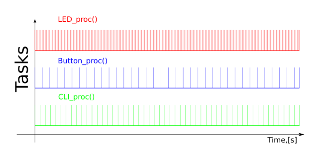
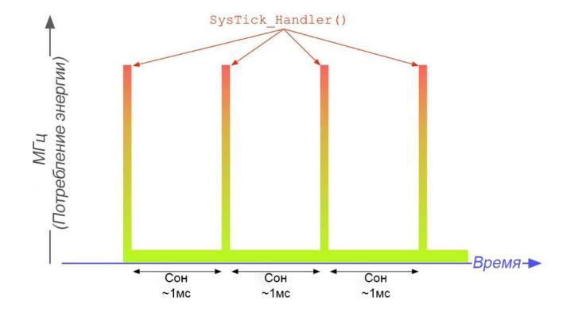

## Часть 1. Создание проекта из шаблона

1. Шаблон проекта `template_project_cmsis` лежит в архиве с файлами работы. Он содержит готовую конфигурацию и потому заметно ускоряет создание проекта. В шаблон уже включены библиотеки [[glossary/vterm\|vterm]] и `led`, а также три окружения сборки:

   - `bootloader` — [[glossary/bootloader\|загрузчик]], который умеет запускать программу из памяти SRAM;
   - `app_in_ram` — рабочее приложение с запуском из памяти SRAM;
   - `app_in_flash` — рабочее приложение с запуском из FLASH-памяти (вместо загрузчика).

2. Скопируйте шаблон проекта `template_project_cmsis` в папку, где хранятся ваши проекты [[glossary/platformio\|PlatformIO]].

3. Переименуйте скопированную папку в соответствии с именем проекта; рекомендуется схема наименования «группа_фамилия_работа».

> [!warning] Важная информация
> Имя папки проекта и путь, по которому она размещается, должны состоять только из латинских символов и не содержать пробелов. Иначе некоторые функции PlatformIO и компилятора работать не будут.

4. Скопируйте в папку `lib` библиотеки, разработанные в предыдущих лабораторных работах. Библиотеки `vterm` и `led` уже лежат в шаблоне — свои версии положите на их место.

5. Запустите [[glossary/vscode\|VS Code]] и откройте папку проекта через меню **File → Open Folder…**

6. В файле `platformio.ini` измените описание проекта, указав свою группу, фамилию и номер лабораторной работы.

7. Пустой проект готов к работе. Файлы рабочего приложения размещайте в папке `src/app`.

8. Перед началом работы соберите загрузчик `bootloader` и запишите его в микроконтроллер.

## Часть 2. Подключение библиотеки LL

1. Библиотеку [[glossary/hal-ll\|LL]] можно подключить двумя способами.

   В первом случае к проекту подключается весь пакет STM32Cube — параметром `framework = stm32cube`. В сборку автоматически попадают файлы драйверов библиотек HAL и LL из состава пакета. Недостатки у такого подхода следующие: приходится дополнительно настраивать библиотеку HAL, растёт время сборки (компилируются все файлы HAL и LL), а сами используемые файлы в папке проекта не видны — зависимость получается скрытой.

   Во втором случае в проект копируют только те файлы и компоненты библиотеки LL, которые нужны программе. Файлы библиотеки LL имеют префикс `stm32h7xx_ll`. Например, модуль для управления блоком [[glossary/rcc\|RCC]] состоит из файлов `stm32h7xx_ll_rcc.h` и `stm32h7xx_ll_rcc.c`.

   Драйверы LL в целом не зависят друг от друга, однако могут использовать общесистемные компоненты LL/BUS, LL/CORTEX, LL/SYSTEM, а также драйверы LL/RCC и LL/PWR. Такая зависимость легко отслеживается по директивам `#include` в заголовочном файле компонента; можно и просто добавить в проект все перечисленные выше компоненты.

2. Создайте папку `lib\LL` и скопируйте в неё основные компоненты библиотеки согласно таблице. Файлы библиотек HAL и LL находятся в каталоге `C:\PlatformIO\packages\framework-stm32cubeh7\Drivers\STM32H7xx_HAL_Driver` (корень пути зависит от того, куда установлен PlatformIO).

| Драйвер | C-файл | Заголовочный H-файл |
| --- | --- | --- |
| LL/BUS | — | `stm32h7xx_ll_bus.h` |
| LL/CORTEX | — | `stm32h7xx_ll_cortex.h` |
| LL/GPIO | `stm32h7xx_ll_gpio.c` | `stm32h7xx_ll_gpio.h` |

3. Чтобы задействовать все возможности драйверов LL, включая функции и структуры инициализации, необходимо задать макроопределение `USE_FULL_LL_DRIVER`. Добавьте в окружение сборки соответствующий флаг компиляции:

<div class="mkvs-retype">

```ini
-D USE_FULL_LL_DRIVER
```

</div>

4. Подключите проверку параметров функций библиотеки LL.

   4.1. Добавьте в окружение сборки соответствующий флаг компиляции:

<div class="mkvs-retype">

```ini
-D USE_FULL_ASSERT
```

</div>

   4.2. Настройте макрос проверки параметров так, чтобы он вызывал стандартный макрос `assert()` из библиотеки компилятора. Для этого создайте файл `lib\LL\stm32_assert.h`.

**Листинг 1: lib/LL/stm32_assert.h**

```c title="lib/LL/stm32_assert.h" showLineNumbers
#ifndef __STM32_ASSERT_H
#define __STM32_ASSERT_H

#ifdef __cplusplus
extern "C" {
#endif

#ifdef USE_FULL_ASSERT
#include <assert.h>
#define assert_param(expr) \
  ((expr) ? (void)0U : __assert_func(__FILE__, __LINE__, __ASSERT_FUNC, #expr))
#else
#define assert_param(expr) ((void)0U)
#endif /* USE_FULL_ASSERT */

#ifdef __cplusplus
}
#endif

#endif /* __STM32_ASSERT_H */
```

## Часть 3. Функции библиотеки LL

1. Откройте файл `stm32h7xx_ll_cortex.h` и ознакомьтесь с функциями для работы с системным таймером — их имена начинаются с `LL_SYSTICK_`. Изучите реализацию этих функций.

2. Откройте файл `stm32h7xx_ll_utils.c` и ознакомьтесь с кодом функций:

```c
void LL_Init1msTick(uint32_t CPU_Frequency);
void LL_mDelay(uint32_t Delay);
```

3. Ознакомьтесь с программным интерфейсом драйвера LL/GPIO: изучите раздел [110 LL GPIO Generic Driver](docs/um2217-stm32h7-ll-drivers.pdf#page=2712) документа UM2217 [2] и (или) разберите файл `stm32h7xx_ll_gpio.h`. Обратите внимание на следующие моменты.

   3.1. Драйвер LL/GPIO не управляет тактированием периферийных блоков [[glossary/gpio\|GPIO]]. В микроконтроллерах STM32H7 порты GPIO подключены к шине AHB4, поэтому перед работой с портом нужно самостоятельно включить его тактирование — например функцией драйвера LL/BUS:

   ```c
   LL_AHB4_GRP1_EnableClock(LL_AHB4_GRP1_PERIPH_GPIOC);
   ```

   3.2. Перед работой вывод (пин) необходимо инициализировать. Для этого создаётся структура типа `LL_GPIO_InitTypeDef`, поля которой заполняются нужными значениями. Заполнить их значениями по умолчанию помогает вспомогательная функция `LL_GPIO_StructInit()`. Подготовленная структура передаётся функции `LL_GPIO_Init()` вместе с нужным портом. Например, следующий код настраивает вывод PC9 как цифровой вход:

   ```c
   LL_GPIO_InitTypeDef but_pin_init_struct;
   LL_GPIO_StructInit(&but_pin_init_struct);  // значения по умолчанию
   but_pin_init_struct.Mode = LL_GPIO_MODE_INPUT;
   but_pin_init_struct.Pin = LL_GPIO_PIN_9;
   LL_GPIO_Init(GPIOC, &but_pin_init_struct);
   ```

   3.3. Имена функций управления выводом отражают выполняемое действие. Аргументами задаются порт (макрос из [[glossary/cmsis\|CMSIS]]) и номер вывода — константой `LL_GPIO_PIN_x`. Например, следующий вызов считывает состояние входа PC9:

   ```c
   uint32_t state = LL_GPIO_IsInputPinSet(GPIOC, LL_GPIO_PIN_9);
   ```

4. Как видно из примеров, по уровню абстракции код на LL близок к коду на CMSIS. Однако функции LL делают код читаемее — особенно для коллег, которые уже работали с этой библиотекой.

## Часть 4. Программные таймеры

1. Основное назначение системного таймера — вести глобальный счётчик временных интервалов (тиков), который непрерывно увеличивается с заданной частотой.

2. На базе одного счётчика тиков можно построить сколько угодно программных таймеров с минимальным набором операций: «запустить измерение» и «узнать время, прошедшее с момента запуска». Более развитые варианты программных таймеров умеют и больше — например приостанавливать и продолжать измерение.

![[glossary/software-timer#^def-software-timer]]

3. Создайте файл `lib/systim/systim.h` с интерфейсом библиотеки системного таймера.

**Листинг 2: lib/systim/systim.h**

```c title="lib/systim/systim.h" showLineNumbers
#pragma once
#include <stdint.h>

#ifdef __cplusplus
extern "C" {
#endif

/** Инициализация системного таймера с периодом 1 мс
 *  @param mcu_clock — тактовая частота процессора */
void systim_init(uint32_t mcu_clock);

/** Обработчик исключения SysTick
 *  @note В приложении определить обработчик:
 *        void SysTick_Handler(void) { systim_isr(); } */
void systim_isr(void);

/** Возвращает счётчик миллисекунд с момента инициализации */
uint32_t systim_current_ms(void);

/** Возвращает количество миллисекунд, прошедших с момента FROM
 *  @param from — значение systim_current_ms() в момент FROM */
uint32_t systim_elapsed_ms(uint32_t from);

/** Активное ожидание не менее ms миллисекунд */
void systim_delay_ms(uint32_t ms);

/** Активное ожидание не менее mcs микросекунд
 *  @param mcs — задержка в диапазоне от 0 до 1000 мкс */
void systim_delay_mcs(uint32_t mcs);

#ifdef __cplusplus
}
#endif
```

4. Создайте файл `lib/systim/systim.c` с функциями-заглушками. Сами функции библиотеки предстоит реализовать в рамках задания 1.

**Листинг 3: lib/systim/systim.c**

```c title="lib/systim/systim.c" showLineNumbers
#include "systim.h"
#include <stm32h7xx.h>

static volatile uint32_t g_sys_counter_ms = 0;
static uint32_t g_ticks_in_mcs = 0;

void systim_isr(void) {
    g_sys_counter_ms += 1;
}

uint32_t systim_current_ms(void) {
    return g_sys_counter_ms;
}

void systim_init(uint32_t mcu_clock) {
    g_ticks_in_mcs = mcu_clock / 1000000U;
    // PM0253, раздел 4.4, с. 212.
    // TODO: запустить SysTick
}

uint32_t systim_elapsed_ms(uint32_t from) {
    (void)from;  // TODO
    return 0;
}

void systim_delay_ms(uint32_t ms) {
    (void)ms;  // TODO
}

void systim_delay_mcs(uint32_t mcs) {
    (void)mcs;  // TODO
}
```

> [!note] Важное примечание
> Заглушки написаны так, чтобы проект собирался без предупреждений: пока не используемые параметры погашены приведением к `void`, а функции с возвращаемым значением возвращают нуль. По мере реализации эти строки убираются.

5. Создайте файл `lib/mytimer/mytimer.h` с интерфейсом библиотеки программных таймеров.

**Листинг 4: lib/mytimer/mytimer.h**

```c title="lib/mytimer/mytimer.h" showLineNumbers
#pragma once
#include <stdbool.h>
#include <stdint.h>

#ifdef __cplusplus
extern "C" {
#endif

/****************************** Программные таймеры ******************************/

/* Перед использованием библиотеки необходимо однократно вызвать systim_init() */

typedef struct MyTimer_Struct {
    uint32_t start_tick, period_ms;
} MyTimer;

/** Создаёт и запускает таймер */
MyTimer mytimer_create(uint32_t period_ms);

/** Перезапускает таймер (начинает измерение заново) */
void mytimer_restart(MyTimer *timer);

/** Перезапускает таймер и переустанавливает отслеживаемый период */
void mytimer_reset(MyTimer *timer, uint32_t period);

/** Проверяет, прошёл ли с момента запуска таймера заданный период */
bool mytimer_is_ready(MyTimer *timer);

/** Возвращает число миллисекунд, прошедших с момента запуска таймера */
uint32_t mytimer_elapsed_ms(MyTimer *timer);

#ifdef __cplusplus
}
#endif
```

6. Программные таймеры опираются на глобальный счётчик системного таймера. Таймер запоминает момент запуска (начало отсчёта) и по нему вычисляет время, прошедшее с этого момента. Кроме того, таймер хранит заданный период, а функция `mytimer_is_ready()` сообщает, истёк ли он.

7. Создайте файл `lib/mytimer/mytimer.c` с функциями-заглушками. Сами функции библиотеки предстоит реализовать в рамках задания 1.

**Листинг 5: lib/mytimer/mytimer.c**

```c title="lib/mytimer/mytimer.c" showLineNumbers
#include "mytimer.h"
#include "systim.h"

MyTimer mytimer_create(uint32_t period_ms) {
    MyTimer t = {systim_current_ms(), period_ms};
    return t;
}

void mytimer_restart(MyTimer *timer) {
    (void)timer;  // TODO
}

void mytimer_reset(MyTimer *timer, uint32_t period) {
    (void)timer;  // TODO
    (void)period;
}

bool mytimer_is_ready(MyTimer *timer) {
    (void)timer;  // TODO
    return false;
}

uint32_t mytimer_elapsed_ms(MyTimer *timer) {
    (void)timer;  // TODO
    return 0;
}
```

## Часть 5. Архитектура программы на основе программных таймеров (кооперативный планировщик)

1. Программе встраиваемой системы часто приходится решать несколько задач одновременно: следить за состоянием кнопки, показывать состояние светодиодами и так далее. В простых программах многозадачность организуют без операционной системы — с помощью кооперативного планировщика.

   ![[glossary/cooperative-scheduler#^def-cooperative-scheduler]]

   В отличие от кооперативного планировщика, большинство операционных систем реализуют вытесняющую многозадачность: там смена выполняемой задачи происходит независимо от алгоритма её работы.

   Кооперативный планировщик можно построить на программных таймерах. Работа программы разбивается на ряд задач, и работу каждой задачи алгоритмически выстраивают вокруг циклического вызова функции-обработчика. Обработчик задачи выполняет определённое действие, опираясь на глобальный контекст, но обязательно завершается, освобождая процессор для других задач. У каждой задачи может быть своя частота вызова обработчика.



*Рисунок 2 – Вызовы обработчиков трёх задач с разной частотой.*

2. В главном цикле программы ([[glossary/superloop\|суперцикле]]) обработчики задач вызываются с заданной частотой. В свободное от обработки время процессор переходит в режим пониженного энергопотребления.

   ![[glossary/sleep-mode#^def-sleep-mode]]



*Рисунок 3 – Потребление энергии программой, которая большую часть времени спит.*

> [!abstract] Сделать запись в конспект
> Изучите режимы энергопотребления процессорного ядра Cortex-M7 — раздел [2.6 Power management](docs/pm0253-cortex-m7.pdf#page=50) документа PM0253 [6], а также режимы сна микроконтроллера — раздел [7 Power control (PWR)](docs/rm0399-stm32h745.pdf#page=268) документа RM0399. Запишите режимы в конспект.

3. Создайте файл `src/app/main.c` с программой, которая одновременно обслуживает меню и мигает светодиодом, меняя цвет мигающего светодиода каждые 3 секунды.

**Листинг 6: src/app/main.c**

```c title="src/app/main.c" showLineNumbers
#include <stdio.h>
#include "led.h"
#include "systim.h"
#include "mytimer.h"
#include "stm32h7xx.h"
#include "stm32h7xx_ll_bus.h"
#include "stm32h7xx_ll_gpio.h"
#include "vterm.h"

/*******************************************************************************
 *                              Программное меню                               *
 *******************************************************************************/

#define NUM_COMMANDS 5

static void menu_show_tick(void) {
    uint32_t tick = systim_current_ms();
    if (tick) {
        printf(u8"\n Время работы %lu.%03lu секунд", tick / 1000, tick % 1000);
    } else {
        printf(u8"\n Системный таймер не был настроен должным образом.");
    }
}

static void menu_show_title(void) {
    printf(u8"\r\n Меню приложения                    System clock is %lu MHz %s",
           SystemCoreClock / 1000000,
           u8"\n\r┌────────────┬────────────┬───────────┬────────────┬──────────┐"
           u8"\n\r│ 1:ShowTick │ 2:         │ 3:        │ 4:         │ 5: Reset │"
           u8"\n\r└────────────┴────────────┴───────────┴────────────┴──────────┘"
           u8"\n\r Выбор [1-5] > ");
}

typedef void (*handler_func_t)(void);

static handler_func_t handlers[NUM_COMMANDS] = {menu_show_tick, NULL, NULL, NULL,
                                                NVIC_SystemReset};

/*******************************************************************************
 *                        Обработчики таймеров и задач                         *
 *******************************************************************************/

static led_t current_led = led_green;

static void heart_rate_handler(MyTimer *timer) {
    mytimer_restart(timer);
    led_toggle(current_led);
}

static void change_led_handler(MyTimer *timer) {
    mytimer_restart(timer);
    led_off(current_led);
    current_led = current_led == led_green ? led_yellow : led_green;
}

static void menu_handler(MyTimer *timer) {
    mytimer_restart(timer);
    uint8_t ch = vterm_keypressed();
    if (ch > 0) {
        putchar(ch);  // эхо
        uint8_t idx = ch - '1';
        if (idx < NUM_COMMANDS && handlers[idx]) {
            handlers[idx]();
        }
        menu_show_title();
    }
}

/*******************************************************************************
 *                            Защита от засыпания                              *
 *******************************************************************************/

static void wait_for_blue_button_release(void) {
    led_enable(led_all);
    LL_AHB4_GRP1_EnableClock(LL_AHB4_GRP1_PERIPH_GPIOC);
    LL_GPIO_InitTypeDef but_pin_init_struct;
    LL_GPIO_StructInit(&but_pin_init_struct);  // значения по умолчанию
    but_pin_init_struct.Mode = LL_GPIO_MODE_INPUT;
    but_pin_init_struct.Pin = LL_GPIO_PIN_13;
    LL_GPIO_Init(GPIOC, &but_pin_init_struct);
    while (LL_GPIO_IsInputPinSet(GPIOC, LL_GPIO_PIN_13)) {
        led_on(led_all);
    }
    led_off(led_all);
}

/*******************************************************************************
 *                               SysTick_Handler                               *
 *******************************************************************************/

void SysTick_Handler(void) {
    systim_isr();
}

/*******************************************************************************
 *                                  Суперцикл                                  *
 *******************************************************************************/

int main(void) {
    // Защита нужна, если далее используются __WFI() или __WFE()
    wait_for_blue_button_release();

    vterm_init(115200);
    systim_init(SystemCoreClock);
    led_enable(led_all);
    menu_show_title();

    MyTimer heart_rate_timer = mytimer_create(500);
    MyTimer change_led_timer = mytimer_create(3000);
    MyTimer menu_timer = mytimer_create(10);

    while (1) {
        // Задача Heart-Led: мигаем текущим светодиодом
        if (mytimer_is_ready(&heart_rate_timer)) {
            heart_rate_handler(&heart_rate_timer);
        }

        // Задача смены цвета: выбираем светодиод для Heart-Led
        if (mytimer_is_ready(&change_led_timer)) {
            change_led_handler(&change_led_timer);
        }

        // Задача обработки меню
        if (mytimer_is_ready(&menu_timer)) {
            menu_handler(&menu_timer);
        }

        // Сон
        __WFE();
    }
}
```

4. Изучите код программы.

   4.1. Программа использует библиотеку программных таймеров `mytimer`, которую предстоит реализовать в задании 1. Пока её функции остаются заглушками, программа собирается и запускается, но полезной работы не выполняет.

   4.2. В терминал выводится заготовка меню. Первая команда меню должна показывать время работы программы с момента запуска, последняя — выполнять сброс микроконтроллера.

   4.3. Обратите внимание на инструкцию `__WFE()` в основном цикле: благодаря ей процессор большую часть времени проводит в режиме сна.

   4.4. Работая с режимами пониженного энергопотребления, стоит предусмотреть защиту от ситуации, когда процессор засыпает сразу после сброса — например из-за ошибки в программе. Вывести процессор из этого режима умеет не всякий программатор.

   Способы защиты бывают разные; здесь это функция `wait_for_blue_button_release()`. Если нажать RESET и удерживать кнопку USER, программа не дойдёт до суперцикла.
