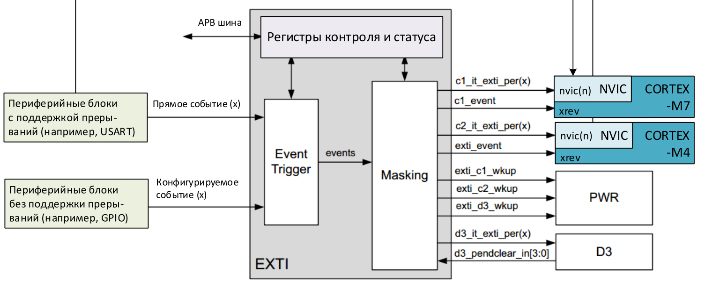
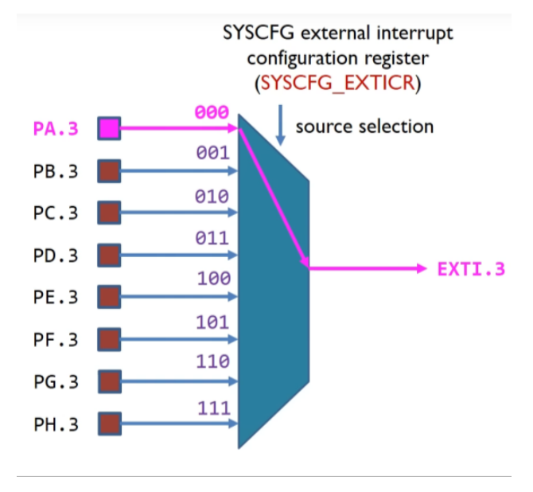
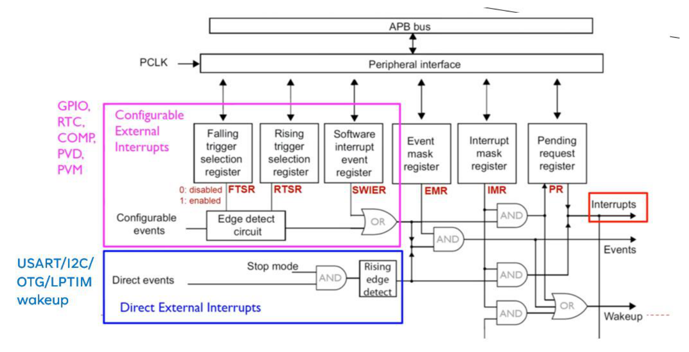
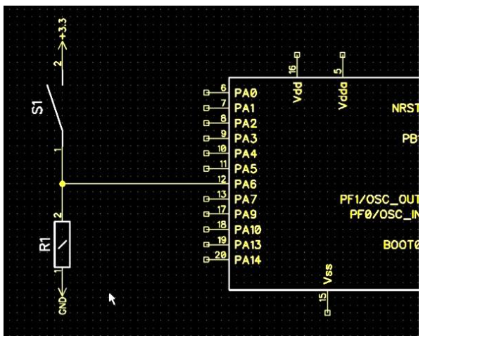
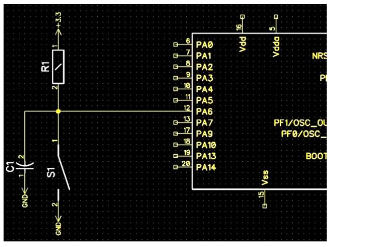
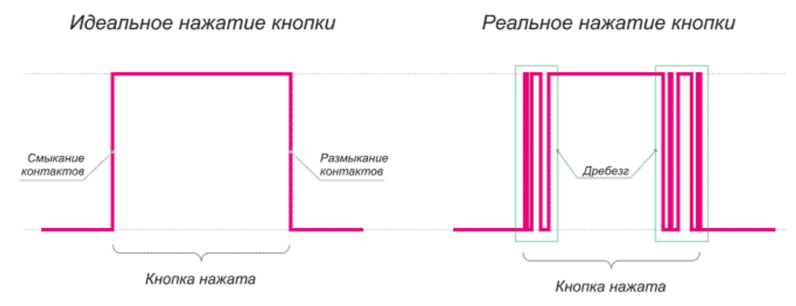
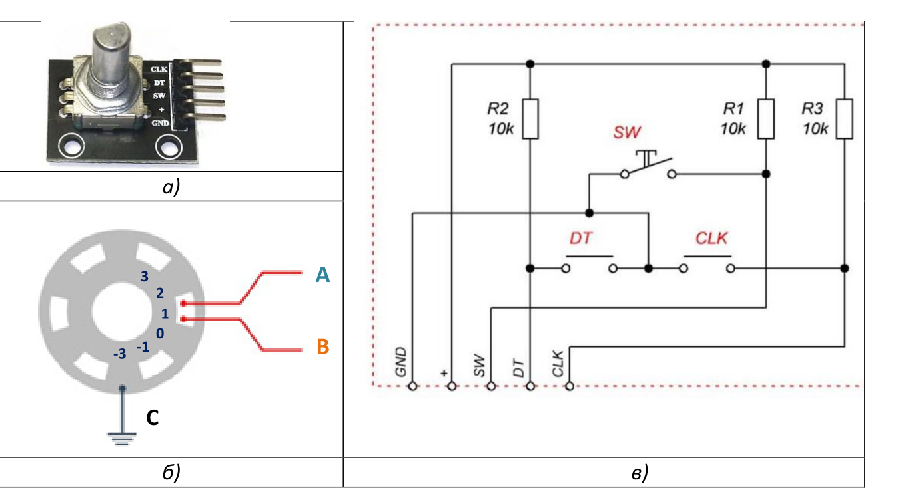
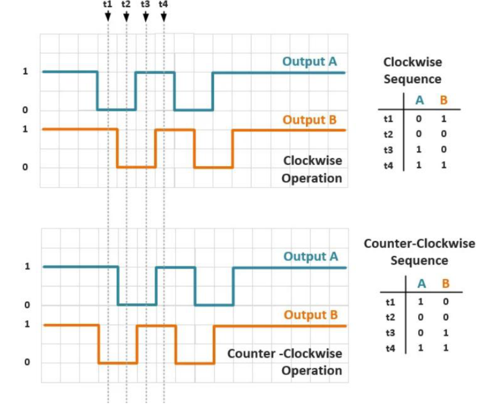

## Контроллер прерываний NVIC

Обработкой прерываний управляет контроллер, встроенный прямо в процессорное ядро.

![[glossary/nvic#^def-nvic]]

Каждому прерыванию соответствует:

- номер исключения;
- функция обработки прерывания ([[glossary/isr\|ISR]]), адрес которой хранится в [[glossary/isr-vector\|таблице векторов прерываний]];
- бит разрешения прерывания (enable bit);
- бит ожидания обработки (pending bit);
- бит активности (active bit);
- приоритет прерывания.

Контроллер NVIC микроконтроллера [[glossary/stm32h745\|STM32H745]] поддерживает до 16 уровней приоритета. Это число делится на вытесняемые (групповые) приоритеты и субприоритеты — приоритеты внутри группы.

![[glossary/priority-grouping#^def-priority-grouping]]

Группировка по умолчанию соответствует 16 вытесняемым приоритетам: субприоритеты отсутствуют.

Для управления контроллером NVIC библиотека [[glossary/cmsis\|CMSIS]] предоставляет следующие функции.

| Функция CMSIS | Назначение |
| --- | --- |
| `void NVIC_SetPriorityGrouping(uint32_t PriorityGroup)` | Задаёт группировку приоритетов: значение 7 — одна группа, 6 — две группы и так далее. |
| `void NVIC_EnableIRQ(IRQn_Type IRQn)` | Разрешает прерывание. |
| `void NVIC_DisableIRQ(IRQn_Type IRQn)` | Запрещает прерывание. |
| `uint32_t NVIC_GetPendingIRQ(IRQn_Type IRQn)` | Возвращает 1, если прерывание ожидает обработки (установлен pending flag). |
| `void NVIC_SetPendingIRQ(IRQn_Type IRQn)` | Устанавливает флаг ожидания обработки прерывания. |
| `void NVIC_ClearPendingIRQ(IRQn_Type IRQn)` | Сбрасывает флаг ожидания обработки прерывания. |
| `uint32_t NVIC_GetActive(IRQn_Type IRQn)` | Возвращает 1, если прерывание находится в активном состоянии (обрабатывается). |
| `void NVIC_SetPriority(IRQn_Type IRQn, uint32_t priority)` | Задаёт приоритет прерывания или исключения. |
| `uint32_t NVIC_GetPriority(IRQn_Type IRQn)` | Возвращает приоритет прерывания или исключения. |
| `uint32_t NVIC_EncodePriority(uint32_t PriorityGroup, uint32_t PreemptPriority, uint32_t SubPriority)` | Собирает код приоритета из номера группы и номера подгруппы. |
| `void NVIC_DecodePriority(uint32_t Priority, uint32_t PriorityGroup, uint32_t *const pPreemptPriority, uint32_t *const pSubPriority)` | Раскладывает код приоритета на номер группы и номер подгруппы. |

## Контроллер внешних прерываний EXTI

![[glossary/exti#^def-exti]]

Диаграмма EXTI показана на рисунке 1. На контроллер поступают события от периферийных устройств в виде сигналов, а регистры EXTI задают логику их обработки: событие можно проигнорировать, превратить в прерывание либо в событие пробуждения микроконтроллера и (или) процессора.

Процессорное ядро имеет вход внешних событий `RXEV` (External Event Input). Сигнал на этом входе выводит процессор из сна, если тот был «усыплён» инструкцией `WFE` (Wait For Event). Сигнал прерывания, если оно не замаскировано в NVIC, выводит процессор из сна по `WFI` или `WFE` и запускает обработчик прерывания.

Конфигурируемые события приходят от периферийных устройств, не имеющих собственных линий прерываний, — например от [[glossary/gpio\|GPIO]]. Для них контроллер EXTI создаёт триггеры, по которым генерируются сигналы прерывания и (или) сигналы пробуждения.

Прямые события приходят от периферийных устройств, которые умеют запрашивать прерывание самостоятельно. Для них EXTI формирует только сигналы пробуждения микроконтроллера и (или) процессора.

*Рисунок 1 – Диаграмма контроллера EXTI.*

Сигналы от портов ввода-вывода могут быть подключены к первым шестнадцати линиям контроллера EXTI с помощью регистров `SYSCFG_EXTICR1`…`SYSCFG_EXTICR4`. В каждом из этих четырёх регистров по четыре четырёхразрядных поля — всего шестнадцать полей, по одному на каждую из первых шестнадцати линий EXTI. Порядковый номер поля соответствует номеру линии, а значение поля определяет порт (A, B … K), который служит для этой линии источником сигнала.

Номер вывода (пина) порта GPIO строго соответствует номеру линии EXTI. Например, к третьей линии EXTI может быть подключён один из входов PA3, PB3 … PH3, как показано на рисунке 2.

*Рисунок 2 – Установка соответствия вывода GPIO и линии контроллера EXTI.*

Логическая схема EXTI представлена на рисунке 3. Для управления прерываниями в EXTI предусмотрены следующие регистры:

- `FTSR` — включение и отключение обработки по спадающему фронту сигнала;
- `RTSR` — включение и отключение обработки по нарастающему фронту сигнала;
- `SWIER` — программная генерация прерывания;
- `EMR` — разрешение генерации события;
- `IMR` — разрешение прерывания;
- `PR` — регистр ожидания обработки внешнего прерывания.

*Рисунок 3 – Логическая схема контроллера EXTI.*

В зависимости от настройки этих регистров при поступлении входного сигнала контроллер EXTI генерирует прерывание соответствующей линии: `EXTI0_IRQ`, `EXTI1_IRQ`, `EXTI2_IRQ`, `EXTI3_IRQ`, `EXTI4_IRQ`, `EXTI9_5_IRQ` или `EXTI15_10_IRQ`. У первых пяти линий собственные векторы, а линии с 5-й по 9-ю и с 10-й по 15-ю объединены в два общих прерывания — их обработчику приходится самому определять, какая именно линия сработала.

Чтобы настроить прерывание по входному сигналу на выводе микроконтроллера, необходимо выполнить следующие действия.

1) Проанализировать входную схему и определить порт и вывод цифрового входа. Сконфигурировать этот вывод в режим входа, при необходимости включив подтягивающий резистор.
2) Включить тактирование банка регистров `SYSCFG`.
3) Установить соответствие порта цифрового входа и линии EXTI в регистре `SYSCFG->EXTICR[x]`. Номер вывода соответствует номеру линии EXTI.
4) Задать триггеры срабатывания прерывания в регистрах `EXTI->FTSR` и `EXTI->RTSR`.
5) Демаскировать прерывание линии в регистре `EXTI->IMR`.
6) Сбросить бит ожидания обработки прерывания в регистре `EXTI->PR`.
7) Разрешить прерывание соответствующей линии EXTI в контроллере NVIC — например функцией `NVIC_EnableIRQ()`.

В обработчике прерывания линии EXTI следует выполнить следующие действия.

а) Проверить источник прерывания в регистре `EXTI->PR`.

б) Сбросить флаг ожидания обработки, записав единицу в соответствующий бит регистра `EXTI->PR`.

в) Выполнить операции, ради которых прерывание и настраивалось.

## Механическая кнопка

Обычная механическая кнопка представляет собой замыкающий контакт. Типовые схемы подключения кнопки к цифровому входу микроконтроллера показаны на рисунке 4.

*а) резистор R1 подтягивает вход к земле, нажатой кнопке соответствует логическая единица.*

*б) резистор R1 подтягивает вход к питанию, нажатой кнопке соответствует логический ноль; конденсатор C1 подавляет дребезг.*

*Рисунок 4 – Типовые схемы подключения кнопки к цифровому входу микроконтроллера.*

При анализе схемы следует обратить внимание на уровень сигнала, соответствующий нажатому состоянию кнопки: в схеме *а)* это логическая единица, в схеме *б)* — логический ноль.

Также следует отметить наличие подтягивающего резистора (на рисунке — R1), который обеспечивает стабильное состояние сигнала, когда кнопка не нажата. Если такого резистора в схеме нет, нужно включить подтяжку внутри GPIO с помощью регистра `GPIO_PUPDR`.

Наконец, следует обратить внимание на наличие схемы защиты от дребезга контакта — на рисунке 4, *б)* это конденсатор C1.

![[glossary/debounce#^def-debounce]]

В результате дребезга однократное нажатие может быть ошибочно обработано как несколько нажатий и отпусканий подряд (рисунок 5).

*Рисунок 5 – Логический сигнал цифрового входа при дребезге контактов.*

Если схемотехнического решения нет, защиту от дребезга реализуют программно — например одним из следующих способов:

- задержать чтение сигнала после смены фронта на время, в течение которого вероятен дребезг;
- многократно считывать сигнал на фиксированном временном интервале (обычно от 10 до 200 мс); цепь считается замкнутой (разомкнутой), если в течение всего интервала состояние остаётся неизменным.

## Поворотный инкрементальный энкодер

![[glossary/rotary-encoder#^def-rotary-encoder]]

В настоящей работе используется поворотный инкрементальный энкодер KY-040 с 20 шагами на оборот. Дополнительно ручка энкодера может выполнять функцию кнопки.

*Рисунок 6 – Поворотный энкодер с кнопкой KY-040: а) внешний вид; б) механическая модель; в) электрическая схема.*

При повороте на один шаг выводы A и B (на схеме — «DT» и «CLK») размыкаются или замыкаются. Механически это устроено так, что замыкание и размыкание выводов происходят не одновременно, а со сдвигом во времени. Логический сигнал, получаемый при повороте по часовой стрелке и против неё (без учёта дребезга контактов), показан на рисунке 7.

*Рисунок 7 – Выходной сигнал поворотного энкодера.*

Задача обработки сигнала энкодера сводится к тому, чтобы обнаружить поворот на один шаг и определить его направление.

Как видно из рисунка 7, при повороте по часовой стрелке сразу после смены фронта сигнала A сигнал B имеет противоположное логическое значение, а при повороте против часовой стрелки — такое же. Поэтому простейший способ обработки энкодера состоит в том, чтобы отслеживать смену фронта сигнала A и определять направление поворота по значению сигнала B.
