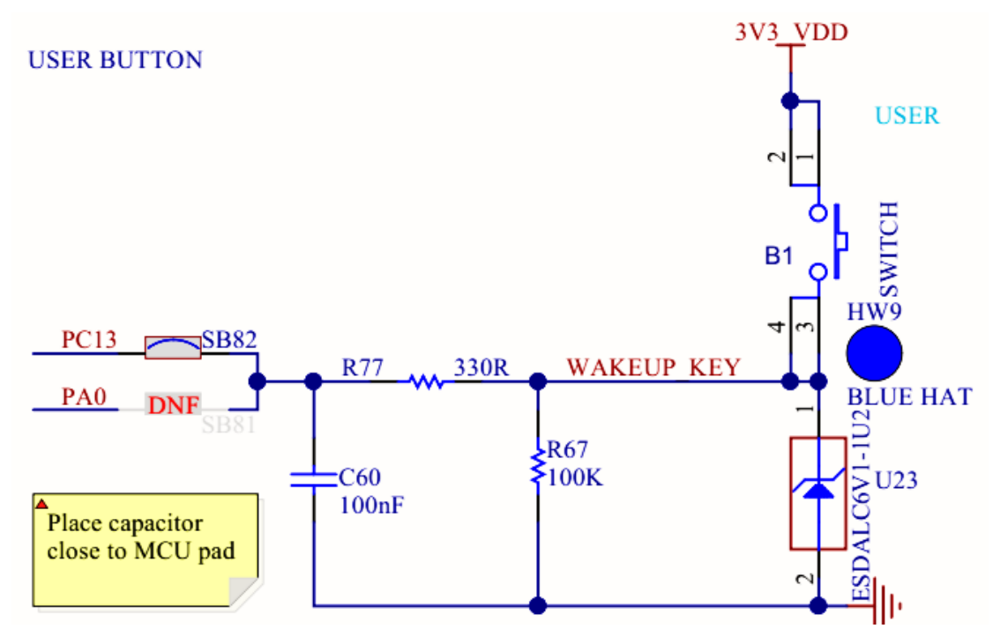

## Часть 1. Обработка нажатия кнопки USER по прерыванию

Создадим программу, которая переключает светодиоды по нажатию синей кнопки USER на отладочной плате. Кнопка обрабатывается по прерыванию.

1. Ознакомьтесь со схемой подключения кнопки на рисунке 8 и убедитесь, что:

   - кнопка подключена к выводу PC13;
   - при нажатии формируется логическая единица, при отпускании — ноль;
   - подтягивающий резистор не требуется;
   - защита от дребезга уже есть в схеме (конденсатор C60).



*Рисунок 8 – Схема подключения кнопки USER на отладочной плате ST Nucleo H745ZI-Q.*

2. Создайте проект для платформы `ststm32`, платы `nucleo_h745zi_q`, фреймворка `cmsis` и процессора Cortex-M7.

   За основу возьмите проект предыдущей лабораторной работы, в котором уже есть библиотеки [[glossary/vterm\|vterm]] и `led`, либо шаблон проекта `template_project_LL` из архива к работе.

3. Добавьте в проект файл `src/app/main.c` (существующий замените) и поместите в него код демонстрационной программы.

**Листинг 1: src/app/main.c**

```c title="src/app/main.c" showLineNumbers
#include <stm32h7xx.h>
#include <stm32h7xx_ll_bus.h>
#include <stm32h7xx_ll_exti.h>
#include <stm32h7xx_ll_gpio.h>
#include <stm32h7xx_ll_system.h>
#include <led.h>
#include "boot_guard.h"

#define USE_LL

/** Конфигурация внешнего прерывания для кнопки B1 (USER) */
static void blue_button_init(void) {
// 1) Сконфигурировать вывод в режим входа
#ifdef USE_LL
    LL_AHB4_GRP1_EnableClock(LL_AHB4_GRP1_PERIPH_GPIOC);
    LL_GPIO_SetPinMode(GPIOC, LL_GPIO_PIN_13, LL_GPIO_MODE_INPUT);
#else
    SET_BIT(RCC->AHB4ENR, RCC_AHB4ENR_GPIOCEN);
    MODIFY_REG(GPIOC->MODER, GPIO_MODER_MODE13, 0);
#endif

// 2) Включить тактирование банка регистров SYSCFG
#ifdef USE_LL
    LL_APB4_GRP1_EnableClock(LL_APB4_GRP1_PERIPH_SYSCFG);
#else
    SET_BIT(RCC->APB4ENR, RCC_APB4ENR_SYSCFGEN);
#endif

// 3) Установить соответствие порта цифрового входа и линии EXTI
#ifdef USE_LL
    LL_SYSCFG_SetEXTISource(LL_SYSCFG_EXTI_PORTC, LL_SYSCFG_EXTI_LINE13);
#else
    MODIFY_REG(SYSCFG->EXTICR[3], SYSCFG_EXTICR4_EXTI13_Msk, SYSCFG_EXTICR4_EXTI13_PC);
#endif

// 4) Задать триггеры срабатывания прерывания
#ifdef USE_LL
    LL_EXTI_EnableRisingTrig_0_31(LL_EXTI_LINE_13);
    LL_EXTI_EnableFallingTrig_0_31(LL_EXTI_LINE_13);
#else
    SET_BIT(EXTI->RTSR1, EXTI_RTSR1_TR13);  // триггер по нарастающему фронту
    SET_BIT(EXTI->FTSR1, EXTI_FTSR1_TR13);  // триггер по спадающему фронту
#endif

// 5) Демаскировать прерывание линии
#ifdef USE_LL
    LL_EXTI_EnableIT_0_31(LL_EXTI_LINE_13);
#else
    SET_BIT(EXTI->IMR1, EXTI_IMR1_IM13);
#endif

// 6) Сбросить бит ожидания обработки прерывания
#ifdef USE_LL
    LL_EXTI_ClearFlag_0_31(LL_EXTI_LINE_13);
#else
    EXTI->PR1 = EXTI_PR1_PR13;  // флаг сбрасывается записью единицы
#endif

    // 7) Разрешить прерывание линии EXTI в контроллере NVIC
    NVIC_EnableIRQ(EXTI15_10_IRQn);
}

/** Проверка, нажата ли кнопка B1 */
static int blue_button_pressed(void) {
#ifdef USE_LL
    return LL_GPIO_IsInputPinSet(GPIOC, LL_GPIO_PIN_13);
#else
    return READ_BIT(GPIOC->IDR, GPIO_IDR_ID13) != 0;
#endif
}

/** Обработка изменения сигнала кнопки B1 */
static void blue_button_edge_handler(void) {
    if (blue_button_pressed()) {
        led_toggle(led_green);
    } else {
        led_toggle(led_yellow);
    }
}

/** ISR прерывания линий EXTI10…EXTI15 */
void EXTI15_10_IRQHandler(void) {
#ifdef USE_LL
    if (LL_EXTI_IsActiveFlag_0_31(LL_EXTI_LINE_13)) {
        LL_EXTI_ClearFlag_0_31(LL_EXTI_LINE_13);
        blue_button_edge_handler();
    }
#else
    if (READ_BIT(EXTI->PR1, EXTI_PR1_PR13)) {  // а) проверить источник прерывания
        EXTI->PR1 = EXTI_PR1_PR13;             // б) сбросить флаг ожидания обработки
        blue_button_edge_handler();            // в) выполнить полезные действия
    }
#endif
}

int main(void) {
    __enable_irq();  // загрузчик передаёт управление с запрещёнными прерываниями
    boot_guard();    // защита от мгновенного сна после сброса
    led_enable(led_all);
    led_toggle(led_green);
    blue_button_init();
    while (1) {
        __WFI();  // сон процессора до поступления прерывания
    }
}
```

4. Ознакомьтесь с текстом программы. Макрос `USE_LL` переключает код с прямого обращения к регистрам средствами [[glossary/cmsis\|CMSIS]] на вызовы соответствующих функций библиотеки [[glossary/hal-ll\|LL]]. Обратите внимание на порядок конфигурации прерывания от кнопки USER и на действия в обработчике прерывания.

> [!note] Важное примечание
> Вызов `__enable_irq()` в начале `main()` обязателен, если программа запускается через [[glossary/bootloader\|загрузчик]]: перед передачей управления приложению он запрещает прерывания. Без этого вызова обработчик `EXTI15_10_IRQHandler()` не получит управления, а процессор останется в режиме сна после первого же `__WFI()`.

5. Выполните сборку проекта, загрузите программу в память микроконтроллера и проверьте её работу.

6. Вспомогательная функция `boot_guard()` уже есть в шаблоне проекта — в библиотеке `lib/nuc745_utils`. Её код приведён в листингах 2 и 3. Это та же защита от засыпания, что и в предыдущей работе: если удерживать кнопку USER во время сброса, программа не дойдёт до суперцикла и процессор не уснёт.

**Листинг 2: lib/nuc745_utils/boot_guard.h**

```c title="lib/nuc745_utils/boot_guard.h" showLineNumbers
#pragma once

#ifdef __cplusplus
extern "C" {
#endif

/**
 * @brief Активное ожидание с индикацией светодиодами, пока кнопка пользователя
 *        не будет отпущена
 * @note Функция сама включает тактирование порта и настраивает вывод кнопки,
 *       а перед возвратом восстанавливает его исходное состояние
 */
void boot_guard(void);

#ifdef __cplusplus
}
#endif
```

**Листинг 3: lib/nuc745_utils/boot_guard.c**

```c title="lib/nuc745_utils/boot_guard.c" showLineNumbers
#include "boot_guard.h"
#include "led.h"
#include "stm32h7xx.h"
#include "stm32h7xx_ll_bus.h"
#include "stm32h7xx_ll_gpio.h"

void boot_guard(void) {
    LL_AHB4_GRP1_EnableClock(LL_AHB4_GRP1_PERIPH_GPIOC);
    LL_GPIO_SetPinMode(GPIOC, LL_GPIO_PIN_13, LL_GPIO_MODE_INPUT);
    led_enable(led_all);
    while (LL_GPIO_IsInputPinSet(GPIOC, LL_GPIO_PIN_13)) {
        led_on(led_all);
    }
    led_off(led_all);
    led_disable(led_all);
    LL_GPIO_SetPinMode(GPIOC, LL_GPIO_PIN_13, LL_GPIO_MODE_ANALOG);
}
```
