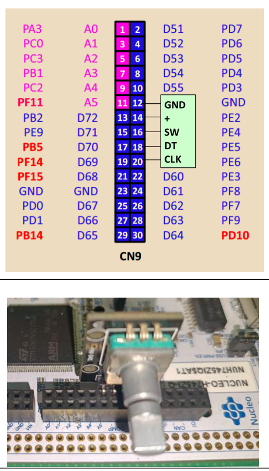
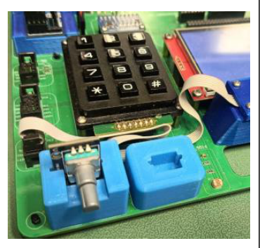
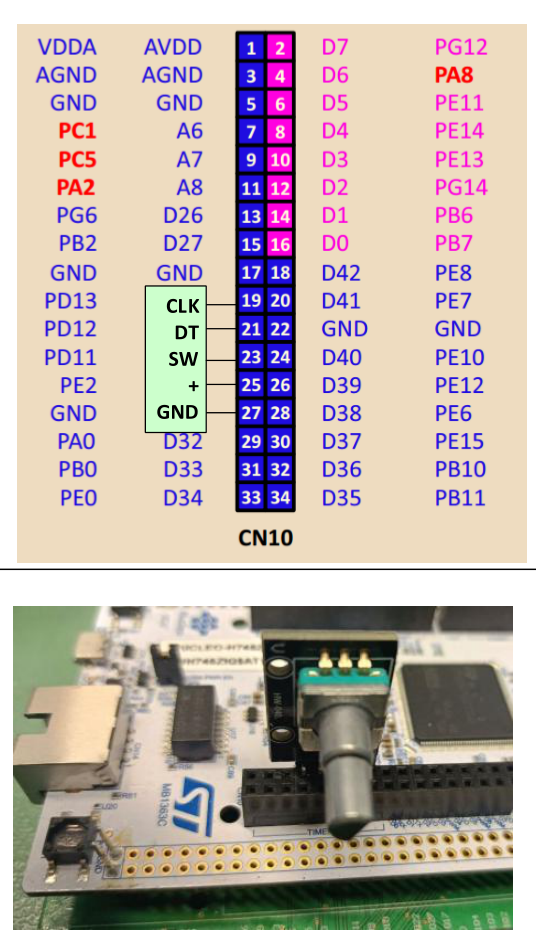

Программа обработки [[glossary/rotary-encoder\|энкодера]] в режиме прерываний.

1. Подключите энкодер в соответствии с вариантом.

## Вариант 1 — разъём CN9 отладочной платы

*Рисунок 9 – Вариант 1: подключение энкодера к разъёму CN9 отладочной платы ST Nucleo H745ZI-Q.*

Подключение показано на рисунке 9. Энкодер занимает чётные контакты разъёма: GND — контакт 12, «+» — контакт 14 (PE2), SW — контакт 16 (PE4), DT — контакт 18 (PE5), CLK — контакт 20 (PE6).

## Вариант 2 — разъём «ENCODER KY-040» на материнской плате

*Рисунок 10 – Вариант 2: энкодер на материнской плате учебного стенда.*

Энкодер уже установлен на материнской плате стенда (рисунок 10). Сигналы SW, DT и CLK подключены напрямую к портам ввода-вывода микроконтроллера: SW — PG12, DT — PG14, CLK — PG8.

## Вариант 3 — разъём CN10 отладочной платы

*Рисунок 11 – Вариант 3: подключение энкодера к разъёму CN10 отладочной платы ST Nucleo H745ZI-Q.*

Подключение показано на рисунке 11. Энкодер занимает нечётные контакты разъёма: CLK — контакт 19 (PD13), DT — контакт 21 (PD12), SW — контакт 23 (PD11), «+» — контакт 25 (PE2), GND — контакт 27.

> [!note] Вывод «+» в вариантах 1 и 3
> В вариантах 1 и 3 вывод «+» энкодера подключён не к шине питания, а к выводу PE2 микроконтроллера. Чтобы подтягивающие резисторы энкодера получили питание, вывод PE2 нужно настроить как цифровой выход и установить на нём высокий уровень.

2. Схема энкодера KY-040 приведена на рисунке 6, *в)*. Однако наличие резисторов R1, R2 и R3 следует проверить визуально на печатной плате конкретного энкодера и учитывать фактическую схему при разработке программы.

3. Разработайте программу с учётом следующих требований и рекомендаций.

## Функциональные требования

1) Программа хранит переменную-счётчик, равную нулю в момент запуска.
2) При повороте энкодера по часовой стрелке (против часовой стрелки) на N шагов программа увеличивает (уменьшает) значение счётчика на N и выводит его в терминал.
3) При нажатии на кнопку энкодера программа сбрасывает счётчик в ноль и выводит его значение в терминал.
4) Программа защищена от [[glossary/debounce\|дребезга контактов]] программными средствами.

## Рекомендации к программному решению

1) Используйте функции библиотеки [[glossary/hal-ll\|LL]] или библиотеки [[glossary/cmsis\|CMSIS]].
2) На каждом шаге переключайте зелёный светодиод — это удобно при отладке.
3) Для вывода в терминал используйте библиотеку [[glossary/vterm\|vterm]].
4) Для защиты от дребезга удобно взять библиотеку `mytimer` из предыдущей лабораторной работы.

4. Дополнительные баллы ставятся за качество обработки сигнала энкодера, а также за аккуратность и качество кода.
