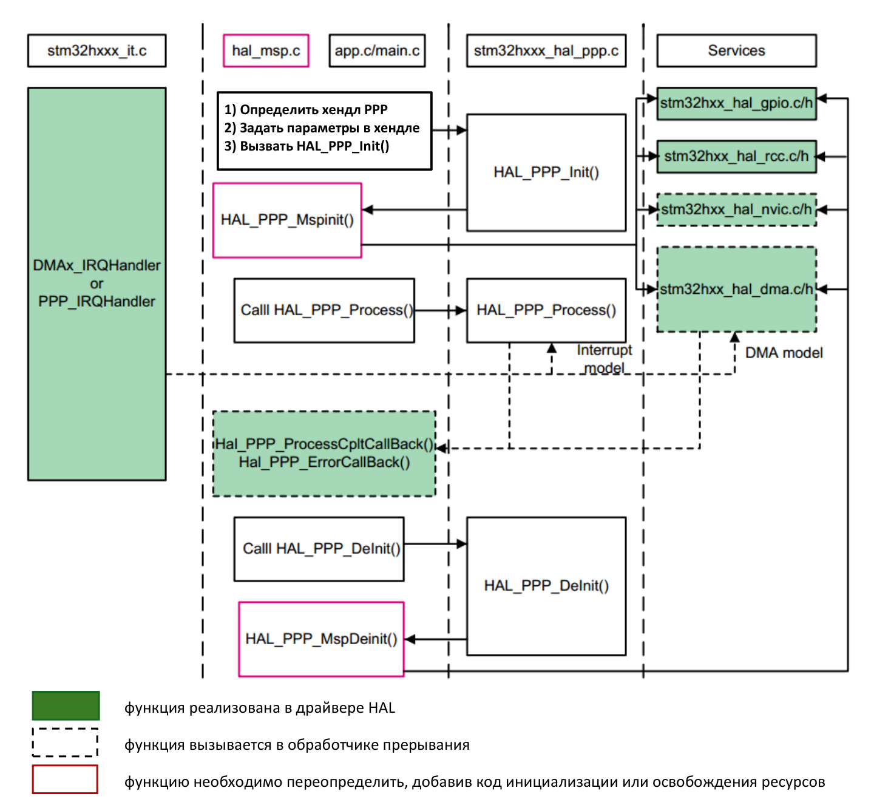
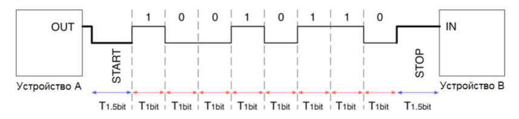

## Часть 1. Библиотека HAL

Документация на библиотеки HAL и LL приведена в UM2217 [1], а также в самих заголовочных файлах — в виде комментариев. При работе с файлами библиотек удобно пользоваться окном **Outline**: оно даёт обзор содержимого файла и позволяет быстро переходить по нему.

![[glossary/hal-ll#^def-hal-ll]]

Библиотека HAL представляет собой набор драйверов. Драйверу соответствует либо определённый тип устройства («драйвер A → устройство типа A», например HAL GPIO Driver), либо определённый тип устройства в конкретном функциональном режиме («драйвер B1 → устройство типа B в режиме 1», «драйвер B2 → устройство типа B в режиме 2» — например HAL UART Driver и HAL USART Driver).

Основные свойства библиотеки HAL перечислены ниже.

1. HAL опирается на библиотеку [[glossary/cmsis\|CMSIS]] Core. Версии этих библиотек должны быть согласованы; в пакете STM32Cube они поставляются согласованными.
2. HAL обеспечивает переносимость кода между сериями микроконтроллеров STM32 (generic drivers), а также поддерживает расширенные функции, которые присутствуют только в отдельных микроконтроллерах (extended drivers).
3. HAL поддерживает три модели работы устройств: режим опроса (polling mode), режим прерываний (interrupt mode) и режим прямого доступа к памяти (DMA mode).

   ![[glossary/dma#^def-dma]]

4. HAL позволяет использовать в одной программе сразу несколько устройств одного типа (свойство multi-instance).
5. Функции HAL реентерабельны и содержат механизм блокировки разделяемых объектов (object locking mechanism). Это означает, что их можно вызывать из параллельных потоков выполнения — например из основной программы и из обработчика прерывания.
6. Для своей работы библиотека использует системный таймер [[glossary/systick\|SysTick]] в режиме генерации исключений с периодом 1 мс.
7. Для всех блокирующих функций предусмотрен параметр предельного времени ожидания — таймаут.

Библиотека HAL состоит из файлов, перечисленных в таблице.

| Файл | Назначение |
| --- | --- |
| `stm32h7xx_hal.h` | Общий заголовочный файл: подключает заголовочные файлы используемых драйверов. |
| `stm32h7xx_hal.c` | Инициализация библиотеки, функция задержки на базе SysTick. |
| `stm32h7xx_hal_def.h` | Общие ресурсы HAL: макросы, структуры и прочее. |
| `stm32h7xx_hal_conf_template.h`<br>`stm32h7xx_hal_conf.h` | Шаблон для копирования и правки в проекте.<br>Конфигурация библиотеки HAL. |
| `stm32h7xx_hal_msp_template.c`<br>`stm32h7xx_hal_msp.c` | Шаблон для копирования и правки в проекте.<br>Инициализация ресурсов микроконтроллера. |
| `stm32h7xx_hal_ppp.c`<br>`stm32h7xx_hal_ppp.h` | Драйвер периферийного устройства PPP с функциями, общими для всех микроконтроллеров семейства STM32. |
| `stm32h7xx_hal_ppp_ex.c`<br>`stm32h7xx_hal_ppp_ex.h` | Расширение драйвера устройства PPP для отдельной серии или отдельных изделий (part number) STM32 либо обновлённый программный интерфейс. |

Здесь и далее PPP — сокращённое наименование периферийного устройства, например TIM или UART.

## Часть 2. Общие структуры данных, макросы и функции HAL

Каждый экземпляр устройства представлен в библиотеке HAL дескриптором — структурой типа `PPP_HandleTypeDef`. Далее такой дескриптор называется «хендлом». Хендл содержит и параметры конфигурации устройства, и дополнительные данные, которые драйвер использует во время работы.

Для устройств GPIO, SYSTICK, NVIC, PWR, RCC и FLASH хендлы не применяются: вместо них в функции передаются указатели на структуры регистров, определённые в CMSIS.

К общим для всех драйверов ресурсам библиотеки HAL относятся:

1. Перечисление `HAL_StatusTypeDef` с кодами статуса выполнения функции. Практически все функции библиотеки возвращают код этого типа:

   ```c
   typedef enum {
       HAL_OK      = 0x00,
       HAL_ERROR   = 0x01,
       HAL_BUSY    = 0x02,
       HAL_TIMEOUT = 0x03
   } HAL_StatusTypeDef;
   ```

2. Перечисление `HAL_LockTypeDef` для хранения статуса захвата разделяемого ресурса. Соответствующая переменная хранится в дескрипторе устройства и используется функциями библиотеки.
3. Макроопределение `HAL_MAX_DELAY`. Если передать эту константу в параметре «таймаут», блокирующая функция будет ждать завершения операции бесконечно.
4. Макроопределения `SET` (= 1) и `RESET` (= 0) — для указания состояния флагов.
5. Макрос `__HAL_LINKDMA()` — для связи устройства с [[glossary/dma\|DMA]].

В следующей таблице приведены важные макросы, предназначенные для включения и отключения устройств и связанных с ними прерываний.

| Макрос | Назначение |
| --- | --- |
| `__HAL_PPP_ENABLE(__HANDLE__)`<br>`__HAL_PPP_DISABLE(__HANDLE__)` | Включение и отключение устройства. |
| `__HAL_PPP_GET_FLAG(__HANDLE__, __FLAG__)`<br>`__HAL_PPP_CLEAR_FLAG(__HANDLE__, __FLAG__)` | Проверка установки указанного флага состояния в устройстве.<br>Сброс указанного флага. |
| `__HAL_PPP_ENABLE_IT(__HANDLE__, __INTERRUPT__)`<br>`__HAL_PPP_DISABLE_IT(__HANDLE__, __INTERRUPT__)`<br>`__HAL_PPP_GET_IT_SOURCE(__HANDLE__, __INTERRUPT__)` | Включение, отключение и проверка текущего режима генерации указанного прерывания устройством. |
| `__HAL_PPP_GET_IT(__HANDLE__, __INTERRUPT__)`<br>`__HAL_PPP_CLEAR_IT(__HANDLE__, __INTERRUPT__)` | Проверка по флагу в устройстве факта возникновения указанного прерывания.<br>Сброс указанного флага прерывания. |
| `__HAL_PPP_XXXX(__HANDLE__, __PARAM__)` | Прочие вспомогательные операции. |

В драйвере `stm32h7xx_hal_rcc.h` есть набор макросов для управления тактированием устройств.

| Макрос | Назначение |
| --- | --- |
| `__HAL_RCC_PPP_CLK_ENABLE()`<br>`__HAL_RCC_PPP_CLK_DISABLE()`<br>`__HAL_RCC_PPP_IS_CLK_ENABLED()` | Включение, отключение и проверка текущего режима тактирования устройства PPP. |
| `__HAL_RCC_PPP_FORCE_RESET()`<br>`__HAL_RCC_PPP_RELEASE_RESET()` | Управление сигналом сброса устройства PPP. |
| `__HAL_RCC_PPP_CLK_SLEEP_ENABLE()`<br>`__HAL_RCC_PPP_CLK_SLEEP_DISABLE()` | Включение и отключение тактирования устройства PPP в режиме сна процессора. |

Остальные соглашения об именах в библиотеке таковы.

- Для инициализации и деинициализации устройства служат функции `HAL_PPP_Init()` и `HAL_PPP_DeInit()`. Они принимают заполненную структуру инициализации либо хендл устройства, который эту структуру содержит.
- Для получения состояния и кодов ошибок, возникших при работе с устройством, служат функции `HAL_PPP_GetState()` и `HAL_PPP_GetError()`.
- Функции ввода-вывода называются `HAL_PPP_Read()` и `HAL_PPP_Write()` либо `HAL_PPP_Transmit()` и `HAL_PPP_Receive()`.

Перечень всех функций драйвера можно найти в его заголовочном файле или в документации [1]. Наиболее полезны разделы документации «How to use this driver»: в них есть сведения, которых в заголовочных файлах нет.

## Часть 3. Модель приложения HAL

Минимальный набор файлов приложения на основе HAL приведён в таблице.

| Файл | Назначение и содержание |
| --- | --- |
| `system_stm32h7xx.c` | Функция `SystemInit()`, запускаемая перед вызовом `main()`. |
| `startup_stm32h7xx.s` | Обработчик исключения `Reset` и [[glossary/isr-vector\|таблица векторов прерываний]]. |
| `stm32h7xx_flash.ld` | [[glossary/linker-script\|Скрипт компоновщика]]. |
| `stm32h7xx_hal_msp.c` | Коллбек-функции инициализации и деинициализации ресурсов микроконтроллера, используемых приложением. |
| `stm32h7xx_hal_conf.h` | Конфигурация библиотеки HAL. |
| `stm32h7xx_it.c`, `stm32h7xx_it.h` | Обработчики исключений и прерываний. Функция `HAL_IncTick()` должна вызываться с периодом 1 мс — например в `SysTick_Handler()`. Каждый используемый обработчик `PPP_IRQHandler()` должен вызывать `HAL_PPP_IRQHandler()`. |
| `main.c` | Основная логика программы и типовые операции: функция `main()`, вызов `HAL_Init()`, обработка нарушенной проверки `assert_param()`. В шаблонах ST для этого переопределяют `assert_failed()`, а в проектах настоящего курса макрос `assert_param()` выведен на `__assert_func()` стандартной библиотеки — см. [[lab06/02-main#Часть 2. Конфигурация библиотеки HAL\|часть 2]]. |
| `main.h` | Общие заголовочные файлы, глобальные объявления, макроопределения и константы программы. |

Чтобы воспользоваться функциями библиотеки HAL, достаточно подключить один заголовочный файл:

```c
#include "stm32h7xx_hal.h"
```

При этом будут включены заголовочные файлы тех драйверов HAL, которые разрешены в файле конфигурации `stm32h7xx_hal_conf.h`. Заголовочные файлы библиотеки LL автоматически не подключаются.

Библиотека HAL использует механизм вызова функций «по умолчанию»: такие функции объявлены со [[glossary/weak-symbol\|слабым]] атрибутом `weak` и переопределяются в коде программы. Кроме того, в модели HAL применяются функции обратного вызова (коллбек-функции): пользователь библиотеки определяет функцию, а библиотека вызывает её в нужный момент, и тем самым задаётся поведение программы.

На этом механизме построен и слой [[glossary/hal-msp\|MSP]] — низкоуровневая инициализация ресурсов микроконтроллера.

![[glossary/hal-msp#^def-hal-msp]]

На рисунке 1 представлена обобщённая схема вызовов функций в приложении на базе библиотеки HAL при работе с некоторым устройством PPP.



*Рисунок 1 – Модель приложения HAL.*

## Часть 4. Основы интерфейса UART

UART — универсальный асинхронный последовательный интерфейс. Отдельной линии тактирования в нём нет, поэтому приёмник и передатчик должны заранее договориться о скорости передачи. Измеряется она в бодах — символах в секунду; при двухуровневом кодировании, которое применяется в UART, одному символу соответствует один бит, поэтому скорость 9600 бод означает 9600 бит/с, а длительность одного бита (бод-интервал) составляет 1/9600 секунды. Диаграмма передачи по интерфейсу UART представлена на рисунке 2. Пассивное состояние, в котором передача не выполняется, представлено высоким уровнем.



*Рисунок 2 – Диаграмма передачи в UART.*

Передача кадра начинается со START-бита — низкого уровня. Обнаружив спадающий фронт, приёмник отсчитывает половину бод-интервала и попадает в середину START-бита, а дальше считывает биты данных через каждый бод-интервал; таким образом, первый бит данных считывается через 1,5 бод-интервала после спадающего фронта — этот отсчёт и показан на рисунке 2. Младший значащий бит передаётся первым. После битов данных может быть передан необязательный бит чётности — он служит для контроля ошибок на стороне приёмника. Заканчивается кадр STOP-битом — высоким уровнем длительностью один бод-интервал (в зависимости от настройки — 0,5; 1; 1,5 или 2 бод-интервала).

Удобно передавать по 8 бит данных, организуя таким образом поток байтов.

Приёмник считывает бит не однократно, а несколько раз за бод-интервал — это называется избыточной выборкой (oversampling). В микроконтроллерах STM32 кратность выборки задаётся полем `OverSampling` и равна 16 или 8: чем она выше, тем устойчивее приём к помехам и расхождению тактовых частот, но тем меньше максимальная достижимая скорость обмена.

## Часть 5. Работа с UART в блокирующем режиме опроса

В микроконтроллерах STM32 за обмен по интерфейсу UART отвечает контроллер USART/UART (universal synchronous/asynchronous receiver transmitter).

![[glossary/usart#^def-usart]]

Чтобы воспользоваться контроллером, нужно включить его тактирование на шине и выполнить инициализацию, задав такие параметры обмена, как скорость передачи, число бит и другие. Для этого предназначена функция

```c
HAL_StatusTypeDef HAL_UART_Init(UART_HandleTypeDef *huart);
```

Если работать с контроллером напрямую, то для приёма очередного байта нужно дождаться появления флага `RXNE` в регистре `USART->ISR` и прочитать регистр данных `USART->RDR`, а для передачи — дождаться флага `TXE` и записать байт в регистр `USART->TDR`. При работе с драйвером HAL прямой доступ к регистрам устройства из приложения не требуется: ожидание флагов, чтение и запись регистров выполняются внутри функций `HAL_UART_Receive()` и `HAL_UART_Transmit()`, предназначенных для работы в режиме опроса.

Для приёма последовательности байтов предназначена функция

```c
HAL_StatusTypeDef HAL_UART_Receive(UART_HandleTypeDef *huart, uint8_t *pData,
                                   uint16_t Size, uint32_t Timeout);
```

с параметрами:

- `huart` — указатель на хендл типа `UART_HandleTypeDef`;
- `pData` — указатель на массив размером не менее `Size` байт, в который будут помещены принятые данные;
- `Size` — число байт, которое требуется принять;
- `Timeout` — предельное время ожидания в миллисекундах.

Функция блокирует выполнение программы до завершения приёма `Size` байт данных. Если весь массив принят успешно, она возвращает `HAL_OK`; если приём не завершился за отведённое время, функция прерывает выполнение и возвращает `HAL_TIMEOUT`.

Для передачи данных в блокирующем режиме предусмотрена функция

```c
HAL_StatusTypeDef HAL_UART_Transmit(UART_HandleTypeDef *huart, uint8_t *pData,
                                    uint16_t Size, uint32_t Timeout);
```

Назначение параметров и работа `HAL_UART_Transmit()` аналогичны `HAL_UART_Receive()` с той разницей, что вместо приёма выполняется передача данных из `pData`.

При работе с драйверами HAL часто приходится учитывать нюансы, которые в документации не описаны. Вот почему важно уметь читать и понимать исходные коды библиотеки, написанные с использованием CMSIS. Рассмотрим такую ситуацию.

Контроллер USART обнаруживает различные события, в том числе ошибки приёма и передачи данных. Регистр `USART->ISR` доступен только для чтения и содержит флаги наступления событий: единица означает, что событие наступило. Регистр `USART->ICR` доступен для записи и содержит битовые поля для сброса флагов событий, а регистры `USART->CR1`…`USART->CR3` — биты, которые разрешают или запрещают генерацию прерывания контроллера USART при возникновении соответствующего события.

Так вот, в блокирующем режиме функции `HAL_UART_Receive()` и `HAL_UART_Transmit()` не используют обработчик прерываний UART, даже если это прерывание демаскировано. Если в процессе приёма или передачи возникнет ошибка, прерывание обработано не будет и коллбек-функция `HAL_UART_ErrorCallback()` не будет вызвана.

Особенно внимательным надо быть к ошибке переполнения (overrun error, ORE). Она возникает, когда в UART поступили очередные данные, а предыдущие ещё не были считаны приложением из регистра `RDR`. Возникнуть такая ошибка может в любой момент, когда программа не находится в блокирующей функции, — например между инициализацией устройства и вызовом `HAL_UART_Receive()`.

При возникновении ошибки ORE контроллер останавливает приём данных до сброса этого флага. Если флаг не сбросить, то последующий вызов `HAL_UART_Receive()` будет блокироваться всегда, несмотря на то что передающая сторона продолжает передавать данные.

Чтобы этого не произошло, нужно либо позаботиться о сбросе флага ORE — для этого есть макрос `__HAL_UART_CLEAR_OREFLAG()`, — либо вовсе отключить регистрацию ошибки ORE при конфигурации приёмопередатчика. Во втором случае в структуре `AdvancedInit` дескриптора UART полю `AdvFeatureInit` присваивают `UART_ADVFEATURE_RXOVERRUNDISABLE_INIT`, а полю `OverrunDisable` — `UART_ADVFEATURE_OVERRUN_DISABLE`.

## Часть 6. Работа с UART в режиме прерываний

Каждое периферийное устройство USART микроконтроллера STM32 генерирует прерывания по событиям, связанным с ходом приёма и передачи данных. События делятся на две группы.

События передачи:

- «передача завершена» (TC, Transmission Complete);
- «готов к отправке» (CTS, Clear To Send);
- «регистр выходных данных пуст, готов для записи» (TXE, Transmit Data Register Empty).

События приёма:

- «обнаружение незанятой линии» (IDLE, Idle Line Detection);
- «ошибка переполнения» (ORE, Overrun Error);
- «регистр входных данных не пуст, готов к чтению» (RXNE, Receive Data Register Not Empty);
- «ошибка контроля чётности» (PE, Parity Error);
- «обнаружение разрыва линии связи» (LBD, LIN Break Detection);
- «флаг шума» (NE, Noise Flag);
- «ошибка кадрирования» (FE, Framing Error).

Микроконтроллеры STM32 спроектированы так, что все события одного устройства UART связаны с одним прерыванием контроллера [[glossary/nvic\|NVIC]]. Какое именно событие вызвало прерывание, определяют по флагам регистра `ISR` (interrupt and status register), а сбрасывают флаги через регистр `ICR` (interrupt flag clear register). При типовом применении функций библиотеки HAL работа с регистрами и флагами контроллера USART выполняется внутри функций драйвера.

Чтобы работать с USART в режиме прерываний, необходимо разрешить прерывание `USARTx_IRQn` и вызвать внутри обработчика `USARTx_IRQHandler()` обработчик библиотеки HAL `HAL_UART_IRQHandler()` — он выполнит все действия, связанные с прерываниями от устройства UART.

Для приёма и передачи данных в режиме прерываний используются функции `HAL_UART_Receive_IT()` и `HAL_UART_Transmit_IT()`. Они не ожидают завершения передачи каждого байта, а лишь настраивают хендл и контроллер UART на приём (передачу) массива данных и возвращают код результата. Приём и передача очередного байта выполняются в функции `HAL_UART_IRQHandler()`, которую вызывает [[glossary/isr\|обработчик прерывания]] при возникновении событий RXNE, TXE и других.

Функция

```c
HAL_StatusTypeDef HAL_UART_Receive_IT(UART_HandleTypeDef *huart, uint8_t *pData,
                                      uint16_t Size);
```

принимает параметры:

- `huart` — указатель на хендл UART;
- `pData` — указатель на массив длиной не менее `Size` для сохранения принятых данных;
- `Size` — число байт, которое требуется принять.

После вызова `HAL_UART_Receive_IT()` устройство и хендл UART переходят в состояние «занят». Следующий приём возможен только после того, как текущая процедура завершится и дескриптор вернётся в состояние «готов».

Когда приём запрошенного количества байт завершится, будет вызвана коллбек-функция

```c
void HAL_UART_RxCpltCallback(UART_HandleTypeDef *huart);
```

Её следует переопределить и обработать в ней принятые данные в соответствии с задуманной логикой работы программы.

Для обработки ошибок, которые могут возникнуть при приёме или передаче данных, следует переопределить коллбек-функцию

```c
void HAL_UART_ErrorCallback(UART_HandleTypeDef *huart);
```

## Часть 7. Работа с UART в режиме DMA

Для работы с контроллером USART в режиме [[glossary/dma\|DMA]] дополнительно используется драйвер DMA (см. разделы [23 HAL DMA Generic Driver](docs/um2217-stm32h7-ll-drivers.pdf#page=338) и [24 HAL DMA Extension Driver](docs/um2217-stm32h7-ll-drivers.pdf#page=362) документа UM2217) с множеством функций — `HAL_DMA_Start()`, `HAL_DMA_PollForTransfer()` и другими.

Впрочем, чтобы работать с USART в режиме DMA, достаточно применить лишь одну функцию — `HAL_DMA_Init()` для инициализации DMA-потока. Вызов остальных функций управления DMA берёт на себя драйвер HAL UART.

Хендл UART хранит поля `hdmarx` и `hdmatx` с дескрипторами DMA-потоков для приёма и для передачи данных. Проинициализированный дескриптор потока связывается с полем хендла UART макросом `__HAL_LINKDMA()`.

Кроме того, для работы в режиме DMA необходимо разрешить прерывание используемого DMA-потока и вызвать в его обработчике функцию `HAL_DMA_IRQHandler()`. Также необходимо разрешить прерывание приёмопередатчика UART и вызвать в его обработчике функцию `HAL_UART_IRQHandler()`.

Пример настройки передачи данных в режиме DMA приведён в программе хоккугенератора, которая разбирается в [[lab06/02-main\|основной части]] настоящей работы.

Для приёма данных в режиме DMA предназначена функция

```c
HAL_StatusTypeDef HAL_UART_Receive_DMA(UART_HandleTypeDef *huart, uint8_t *pData,
                                       uint16_t Size);
```

Она имеет те же параметры, что и `HAL_UART_Receive_IT()`.

После вызова `HAL_UART_Receive_DMA()` дескриптор UART переводится в состояние «занят». Следующий приём возможен только после завершения текущей процедуры и возвращения дескриптора в состояние «готов».

Когда приём запрошенного количества байт завершится, будет вызвана уже знакомая коллбек-функция `HAL_UART_RxCpltCallback()`. Кроме того, разработчик может определить коллбек-функцию, которая вызывается в момент, когда принята половина запрошенных данных:

```c
void HAL_UART_RxHalfCpltCallback(UART_HandleTypeDef *huart);
```

Для обработки ошибок, которые могут возникнуть при приёме или передаче данных, следует, как и в режиме прерываний, переопределить коллбек-функцию `HAL_UART_ErrorCallback()`.
