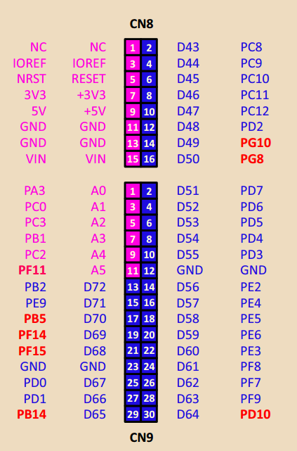

## Часть 1. Создание учебного проекта

> [!note] Можно не создавать проект вручную
> Все перечисленные ниже файлы уже собраны в шаблоне `template_project_HAL_CM7CM4` из архива [[lab06/index#Файлы к работе\|файлов к работе]]. Если взять шаблон за основу, достаточно скопировать его в свою рабочую папку и перейти к [[lab06/02-main#Часть 2. Конфигурация библиотеки HAL\|части 2]]. Шаги ниже нужны тем, кто хочет собрать проект с нуля и разобраться, из чего он состоит.

1. Создайте папку с названием проекта и откройте её в [[glossary/vscode\|VS Code]].

2. Создайте в проекте папки `lib`, `include`, `system`, `src/bootloader`, `src/cm4app` и `src/cm7app`.

3. Скопируйте в папку `system` [[glossary/linker-script\|скрипты компоновщика]]:

   - `stm32h745xx_sram1_CM7.ld`, `stm32h745xx_flash_CM7.ld` и `stm32h745xx_flash_CM4.ld` — из каталога `C:\PlatformIO\packages\framework-cmsis-stm32h7\Source\Templates\gcc\linker`;
   - `STM32H745ZITX_M7_FLASH.ld` — из каталога `C:\PlatformIO\packages\tool-ldscripts-ststm32\stm32h7`.

   Корень пути зависит от того, куда установлен [[glossary/platformio\|PlatformIO]]; в учебном классе это `C:\PioVScPort\platformio`.

4. Удалите в скопированных файлах директивы `(READONLY)`: используемая версия [[glossary/linker\|компоновщика]] их не поддерживает.

5. Скопируйте в папку `system` [[glossary/startup-file\|startup-файл]] `startup_stm32h745xx.s` и [[glossary/system-file\|system-файл]] `system_stm32h7xx_dualcore_bootcm7_cm4gated.c` из проекта предыдущей лабораторной работы.

6. Создайте файл `platformio.ini` с содержимым листинга 1 и укажите в параметре `description` свою группу, фамилию и номер лабораторной работы.

**Листинг 1: platformio.ini**

```ini title="platformio.ini" showLineNumbers
[platformio]
description = "template project with stm32cube"
default_envs = cm7app_in_ram

; глобальные и общие параметры
[env]
platform = ststm32
board = nucleo_h745zi_q
framework = stm32cube
board_build.stm32cube.custom_system_setup = yes  ; свои startup- и system-файлы из папки system
board_build.stm32cube.custom_config_header = yes ; свой stm32h7xx_hal_conf.h
monitor_speed = 115200
test_speed = 115200
test_filter = target/*
test_framework = custom ; использовать test_custom_runner.py из папки test
check_tool = cppcheck
check_flags = cppcheck:--enable=all --suppress=unusedFunction
build_type = debug
debug_init_cmds = target extended-remote $DEBUG_PORT
                $LOAD_CMDS
                $INIT_BREAK
build_flags = -std=c11 -Wall -Wextra
    -D PWR_DIRECT_SMPS_SUPPLY -D HSE_VALUE=8000000 -D USE_FULL_ASSERT

; приложение для Cortex-M7, запуск из AXI-SRAM, исходные коды в src/cm7app/*
[env:cm7app_in_ram]
build_src_filter = +<cm7app/*.c> +<$PROJECT_DIR/system/*>
check_src_filters = +<src/cm7app/*.c>
board_build.ldscript = $PROJECT_DIR/system/stm32h745xx_sram1_CM7.ld
build_flags = ${env.build_flags} -D CORE_CM7 -D VECT_TAB_SRAM -D USER_VECT_TAB_ADDRESS
upload_protocol = custom ; загрузка не во FLASH, а в AXI-SRAM
; upload_command записывается одной строкой, без переносов
upload_command = openocd -f interface/stlink.cfg -f target/stm32h7x_dual_bank.cfg -c "init; halt; load_image .pio/build/cm7app_in_ram/firmware.bin 0x24000000; verify_image .pio/build/cm7app_in_ram/firmware.bin 0x24000000; reset; exit"

; приложение для Cortex-M7, запуск из FLASH BANK-1, исходные коды в src/cm7app/*
[env:cm7app_in_flash]
build_src_filter = +<cm7app/*.c> +<$PROJECT_DIR/system/*>
check_src_filters = +<src/cm7app/*.c>
board_build.ldscript = $PROJECT_DIR/system/STM32H745ZITX_M7_FLASH.ld
build_flags = ${env.build_flags} -D CORE_CM7

; приложение для Cortex-M4, запуск из FLASH BANK-2, исходные коды в src/cm4app/*
[env:cm4app_in_flash]
build_src_filter = +<cm4app/*.c> +<$PROJECT_DIR/system/*>
check_src_filters = +<src/cm4app/*.c>
board_build.ldscript = $PROJECT_DIR/system/stm32h745xx_flash_CM4.ld
build_flags = ${env.build_flags} -D CORE_CM4

; загрузчик, запуск из FLASH BANK-1; умеет запускать приложение из AXI-SRAM и ядро Cortex-M4
[env:bootloader]
framework = cmsis
board_build.cmsis.startup_file = broken_path
board_build.cmsis.system_file = broken_path
build_src_filter = +<bootloader/*.c> +<$PROJECT_DIR/system/*>
check_src_filters = +<src/bootloader/*.c>
board_build.ldscript = $PROJECT_DIR/system/stm32h745xx_flash_CM7.ld
build_flags = ${env.build_flags} -D CORE_CM7
```

7. Скопируйте в папку `lib` библиотеки, разработанные в предыдущих лабораторных работах, — но без библиотеки LL: её файлы фреймворк `stm32cube` добавляет в сборку сам.

8. Поместите код [[glossary/bootloader\|загрузчика]] в файл `src/bootloader/bootloader.c`, скопировав листинг из [[lab06/07-appendix-bootloader\|приложения 1]].

9. Добавьте в проект библиотеку `lib/nuc745_utils` с кодом из [[lab06/08-appendix-hal-helpers\|приложения 2]]. В ней собраны вспомогательные функции: аварийное завершение программы и преобразование кодов возврата библиотеки HAL в строки.

10. В [[glossary/command-palette\|палитре команд]] выполните команду **Developer: Reload Window**, чтобы плагин PlatformIO подхватил текущую папку.

## Часть 2. Конфигурация библиотеки HAL

1. Изучите конфигурацию проекта — файл `platformio.ini`.

   1.1. Окружение сборки `cm4app_in_flash` предназначено для компиляции программы для процессорного ядра Cortex-M4. Файлы с исходным кодом этой программы должны размещаться в папке `src/cm4app`.

   1.2. Окружения `cm7app_in_ram` и `cm7app_in_flash` собирают программу для ядра Cortex-M7; её исходные файлы должны размещаться в папке `src/cm7app`.

   1.3. Обратите внимание на параметр `framework`: указан не `cmsis`, как в предыдущих работах, а `stm32cube`. Фреймворк `stm32cube` автоматически добавляет в сборку библиотеки HAL и LL.

   1.4. Для каждого окружения указан свой скрипт компоновщика.

2. Файл `stm32h7xx_hal_conf.h` служит для конфигурации библиотеки HAL — в нём включаются и отключаются отдельные модули (драйверы). PlatformIO автоматически добавляет в сборку копию шаблона `stm32h7xx_hal_conf_template.h`, в котором включены все модули библиотек HAL и LL. Однако отключение неиспользуемых модулей сократит время сборки и позволит получать более точные подсказки при написании кода.

   Добавьте в проект собственный файл конфигурации:

   2.1. Убедитесь, что в глобальном окружении сборки `[env]` задан параметр `board_build.stm32cube.custom_config_header = yes`.

   2.2. Скопируйте файл `stm32h7xx_hal_conf_template.h` из каталога `C:\PlatformIO\packages\framework-stm32cubeh7\Drivers\STM32H7xx_HAL_Driver\Inc` в папку `include` проекта и переименуйте его в `stm32h7xx_hal_conf.h`.

   2.3. Откройте `stm32h7xx_hal_conf.h` и закомментируйте в секции **Module Section** все модули, кроме `HAL_MODULE_ENABLED` и тех, которые понадобятся при решении поставленной задачи:

<div class="mkvs-retype">

```c
#define HAL_MODULE_ENABLED
#define HAL_CORTEX_MODULE_ENABLED
#define HAL_DMA_MODULE_ENABLED
#define HAL_EXTI_MODULE_ENABLED
#define HAL_GPIO_MODULE_ENABLED
#define HAL_RCC_MODULE_ENABLED
#define HAL_TIM_MODULE_ENABLED
#define HAL_UART_MODULE_ENABLED
#define HAL_USART_MODULE_ENABLED
```

</div>

   2.4. В конце файла `stm32h7xx_hal_conf.h`, перед завершающей директивой `#endif`, замените блок определения макроса `assert_param` на подключение собственного файла:

<div class="mkvs-retype">

```c
#include "stm32_assert.h"
```

</div>

3. Создайте файл `include/stm32_assert.h` с содержимым листинга 2. Этот же файл требуется и заголовочным файлам библиотеки LL, поэтому определение макроса `assert_param` выносится в него, а не остаётся в конфигурации HAL.

**Листинг 2: include/stm32_assert.h**

```c title="include/stm32_assert.h" showLineNumbers
#pragma once

#ifdef USE_FULL_ASSERT
#include <assert.h>
#define assert_param(expr) \
    ((expr) ? (void)0U : __assert_func(__FILE__, __LINE__, __ASSERT_FUNC, #expr))
#else
#define assert_param(expr) ((void)0U)
#endif /* USE_FULL_ASSERT */
```

4. Убедитесь, что в глобальном окружении `[env]` задан флаг компиляции `-D USE_FULL_ASSERT`. Без него проверки параметров, встроенные в функции HAL и LL, будут выключены.

   Нарушение проверки приводит к вызову функции `__assert_func()` — она определена в библиотеке `lib/nuc745_utils` и выводит в терминал имя файла, номер строки и текст невыполненного условия, после чего останавливает программу.

## Часть 3. Хоккугенератор

1. Программа-хоккугенератор выполняется на ядре Cortex-M4 микроконтроллера [[glossary/stm32h745\|STM32H745ZI-Q]] и непрерывно передаёт в последовательный асинхронный интерфейс UART5 трёхстрочные хокку в символьном виде, в кодировке UTF-8.

   Формат выдачи одного хокку такой:

   ```text
   #{номер хокку XX}|{строка 1}|{строка 2}|{строка 3}
   ```

   Например:

   ```text
   #06|Тишина кругом.|Проникают в сердце скал|Голоса цикад.
   ```

   Выдача хокку в интерфейс UART выполняется на фиксированной скорости 9600 бод, без проверки чётности и с одним стоповым битом.

2. Хоккугенератору принадлежат следующие ресурсы:

   - ядро Cortex-M4;
   - красный светодиод — индикация работы и ошибки;
   - UART5-TX (вывод PC12);
   - контроллер [[glossary/dma\|DMA2]].

3. Создайте файл `src/cm4app/cm4_main.h` с общими заголовочными файлами и определениями.

**Листинг 3: src/cm4app/cm4_main.h**

```c title="src/cm4app/cm4_main.h" showLineNumbers
#pragma once

#include <stm32h7xx_hal.h>
#include <led.h>

#define SIGNAL_LED led_red

extern UART_HandleTypeDef huart;

void error_handler(void);
```

4. Создайте файл `src/cm4app/cm4_main.c` и поместите в него код листинга 4.

**Листинг 4: src/cm4app/cm4_main.c**

```c title="src/cm4app/cm4_main.c" showLineNumbers
#include "cm4_main.h"

UART_HandleTypeDef huart;

static char hokkus[] =
    u8"#01|Старый пруд.|Прыгнула в воду лягушка.|Всплеск в тишине."
    u8"#02|Хорошо по воде брести|Через тихий летний ручей|С сандалиями в руке."
    u8"#03|О, с какой тоской|Птица из клетки глядит|На полёт мотылька!"
    u8"#04|Вода так холодна!|Уснуть не может чайка,|Качаясь на волне."
    u8"#05|Сочла кукушка|Мгновения летних дней|И улетела."
    u8"#06|Тишина кругом.|Проникают в сердце скал|Голоса цикад."
    u8"#07|Убил паука,|И так одиноко стало|В холоде ночи."
    u8"#08|Чужих меж нами нет!|Мы все друг другу братья|Под вишнями в цвету."
    u8"#09|Отсечь слова.|Ненужное отбросить.|Радостно вздохнуть."
    u8"#10|На полпути.|Не остановится|Цветков паденье!"
    u8"#11|Снег всё сыплет|И сыплет,|Если на него смотреть."
    u8"#12|Зимняя ночь.|Закипает уха|Из озёрной рыбы."
    u8"#13|Лист сакуры…|Такой же формы вырезаю|Из листка бумаги.";

void error_handler(void) {
    while (1) {
        led_on(SIGNAL_LED);
    }
}

static void uart_init(void) {
    huart.Instance = UART5;
    huart.Init.BaudRate = 9600;
    huart.Init.WordLength = UART_WORDLENGTH_8B;
    huart.Init.StopBits = UART_STOPBITS_1;
    huart.Init.Parity = UART_PARITY_NONE;
    huart.Init.HwFlowCtl = UART_HWCONTROL_NONE;
    huart.Init.Mode = UART_MODE_TX;
    huart.Init.OverSampling = UART_OVERSAMPLING_16;
    if (HAL_UART_Init(&huart) != HAL_OK) {  // вызывает HAL_UART_MspInit()
        error_handler();
    }
}

int main(void) {
    HAL_Init();  // вызывает HAL_MspInit()
    uart_init();
    if (HAL_UART_Transmit_DMA(&huart, (uint8_t *)hokkus, (uint16_t)(sizeof(hokkus) - 1)) != HAL_OK) {
        error_handler();
    }
    while (1) {
    }
}

/* ***************************** Коллбек-функции **************************** */

void HAL_UART_TxCpltCallback(UART_HandleTypeDef *uart) {
    (void)uart;
    led_toggle(SIGNAL_LED);  // вызывается из ISR, поэтому здесь нельзя задерживаться
}

void HAL_UART_ErrorCallback(UART_HandleTypeDef *uart) {
    (void)uart;
    error_handler();
}
```

5. Изучите код и алгоритм работы программы.

   5.1. Файл `cm4_main.h` служит для глобальных определений и констант, которые могут использоваться в остальных единицах компиляции программы.

   5.2. В файле `cm4_main.c` в глобальной области видимости определены массив символов `hokkus` с текстом хокку и хендл `huart` типа `UART_HandleTypeDef`.

   5.3. Функция `main()` начинается с вызова `HAL_Init()`. Эта функция должна быть вызвана раньше любой другой функции библиотеки HAL и выполняет инициализацию библиотеки: настраивает системный таймер [[glossary/systick\|SysTick]] и задаёт политику [[glossary/priority-grouping\|группировки приоритетов]] контроллера прерываний (16 вытесняемых приоритетов). В завершение `HAL_Init()` вызывает коллбек-функцию `HAL_MspInit()`, которую разработчик может переопределить для глобальной инициализации ресурсов микроконтроллера.

   5.4. Следующий шаг после инициализации библиотеки — вызов функции инициализации устройства `uart_init()`.

   Конфигурация устройства UART выполняется заполнением полей структуры `Init` дескриптора `huart`. После установки нужных значений дескриптор передаётся в функцию `HAL_UART_Init()`, которая, в свою очередь, вызывает коллбек-функцию `HAL_UART_MspInit()`. Для успешной инициализации UART эту функцию необходимо переопределить, выполнив в ней настройку тактирования UART, портов ввода-вывода и других требуемых ресурсов.

   5.5. Затем в `main()` вызывается функция `HAL_UART_Transmit_DMA()` — она передаёт массив с хокку в UART в режиме [[glossary/dma\|DMA]]. Поток DMA настроен на циклический режим, поэтому по завершении передачи массива контроллер DMA автоматически перезагрузит собственные счётчик размера данных и адреса источника и приёмника и начнёт новый цикл передачи.

   5.6. Вызов `HAL_UART_Transmit_DMA()` неблокирующий: передача выполняется в фоновом режиме. Поэтому `main()` завершается пустым [[glossary/superloop\|суперциклом]].

   5.7. Ошибки передачи и факт завершения цикла передачи отслеживаются специально предусмотренными коллбек-функциями `HAL_UART_ErrorCallback()` и `HAL_UART_TxCpltCallback()`. Здесь они переопределены для сигнализации светодиодом: при возникновении ошибки красный светодиод остаётся постоянно включённым, а в рабочем режиме переключается после каждого завершённого цикла передачи. Обе функции вызываются из [[glossary/isr\|обработчика прерывания]], поэтому выполнять в них длительные операции — в том числе задержки — нельзя.

6. Приложение HAL должно содержать msp-файл с определением функций обратного вызова для низкоуровневой инициализации ресурсов. Создайте файл `src/cm4app/cm4_msp.c` с кодом листинга 5.

**Листинг 5: src/cm4app/cm4_msp.c**

```c title="src/cm4app/cm4_msp.c" showLineNumbers
#include "cm4_main.h"

void HAL_MspInit(void) {
    led_enable(SIGNAL_LED);
}

void HAL_UART_MspInit(UART_HandleTypeDef *uart) {
    if (uart->Instance == UART5) {
        // UART5 (передатчик): PC12 (AF8) -> UART5_TX, PD2 (AF8) -> UART5_RX

        // Конфигурация тактирования
        __HAL_RCC_UART5_CLK_ENABLE();
        __HAL_RCC_GPIOC_CLK_ENABLE();
        __HAL_RCC_DMA2_CLK_ENABLE();
        __HAL_RCC_USART234578_CONFIG(RCC_USART234578CLKSOURCE_HSI);  // источник kernel clock

        // Конфигурация вывода TX
        GPIO_InitTypeDef gpio_init = {.Pin = GPIO_PIN_12,
                                      .Mode = GPIO_MODE_AF_PP,
                                      .Pull = GPIO_PULLUP,
                                      .Speed = GPIO_SPEED_FREQ_LOW,
                                      .Alternate = GPIO_AF8_UART5};
        HAL_GPIO_Init(GPIOC, &gpio_init);

        // Конфигурация потока DMA2 на передачу
        static DMA_HandleTypeDef hdma_tx = {0};
        hdma_tx.Instance = DMA2_Stream0;
        hdma_tx.Init.Request = DMA_REQUEST_UART5_TX;
        hdma_tx.Init.Direction = DMA_MEMORY_TO_PERIPH;
        hdma_tx.Init.PeriphInc = DMA_PINC_DISABLE;
        hdma_tx.Init.MemInc = DMA_MINC_ENABLE;
        hdma_tx.Init.PeriphDataAlignment = DMA_PDATAALIGN_BYTE;
        hdma_tx.Init.MemDataAlignment = DMA_MDATAALIGN_BYTE;
        hdma_tx.Init.Mode = DMA_CIRCULAR;
        hdma_tx.Init.Priority = DMA_PRIORITY_LOW;
        hdma_tx.Init.FIFOMode = DMA_FIFOMODE_DISABLE;

        if (HAL_DMA_Init(&hdma_tx) != HAL_OK) {
            error_handler();
        }
        __HAL_LINKDMA(uart, hdmatx, hdma_tx);

        // Приоритеты и разрешение прерываний
        HAL_NVIC_SetPriority(DMA2_Stream0_IRQn, 1, 0);
        HAL_NVIC_EnableIRQ(DMA2_Stream0_IRQn);
        HAL_NVIC_SetPriority(UART5_IRQn, 1, 0);
        HAL_NVIC_EnableIRQ(UART5_IRQn);
    }
}
```

7. Изучите код файла `cm4_msp.c`.

   7.1. В функции `HAL_MspInit()` выполняется инициализация используемых светодиодов.

   7.2. В функции `HAL_UART_MspInit()` выполняется низкоуровневая инициализация UART5 для передачи данных в режиме DMA.

   Включается тактирование всех задействованных периферийных блоков: [[glossary/gpio\|GPIO]], DMA2 и самого UART. Для этого в библиотеке HAL предусмотрены макросы вида `__HAL_RCC_PPP_CLK_ENABLE()`, где PPP — название устройства.

   Ряд устройств, в том числе UART, тактируются от двух источников: сигнал шины тактирует регистры устройства, а отдельный сигнал kernel clock — его функциональную часть, от которой и зависит скорость обмена. Для выбора источника kernel clock в библиотеке HAL предусмотрены макросы вида `__HAL_RCC_PPP_CONFIG()`.

   7.3. Выводы, используемые под UART, должны быть переведены в режим альтернативной функции с соответствующим номером. Номера альтернативных функций для портов ввода-вывода приведены в таблицах 9–19 [даташита микроконтроллера](docs/ds12923-stm32h745zi.pdf#page=87).

   7.4. При использовании DMA необходимо создать и инициализировать дескриптор потока DMA и связать его с дескриптором UART специальным макросом `__HAL_LINKDMA()`. Обратите внимание, что дескриптор потока объявлен как `static`: драйвер сохраняет указатель на него и обращается к нему всё время работы программы, поэтому локальная автоматическая переменная здесь не годится.

   7.5. При работе с UART в режиме DMA задаются приоритеты и разрешаются прерывания и соответствующего потока DMA, и самого приёмопередатчика UART.

8. Согласно UM2217 обработчики прерываний должны быть определены в отдельном файле. Создайте файл `src/cm4app/cm4_it.c` и поместите в него код листинга 6.

**Листинг 6: src/cm4app/cm4_it.c**

```c title="src/cm4app/cm4_it.c" showLineNumbers
#include "cm4_main.h"

void SysTick_Handler(void) { HAL_IncTick(); }

void DMA2_Stream0_IRQHandler(void) { HAL_DMA_IRQHandler(huart.hdmatx); }

void UART5_IRQHandler(void) { HAL_UART_IRQHandler(&huart); }

void HardFault_Handler(void) { error_handler(); }
```

9. Изучите код листинга 6.

   9.1. В обработчике прерываний системного таймера `SysTick_Handler()` вызывается функция `HAL_IncTick()`. Настройка системного таймера на генерацию прерываний с периодом 1 мс выполняется в `HAL_Init()`. Вызов `HAL_IncTick()` необходим для работы функции `HAL_Delay()` и многих других функций библиотеки, использующих таймер.

   9.2. Все остальные обработчики прерываний в HAL-приложении должны вызывать соответствующие функции драйвера — они называются `HAL_PPP_IRQHandler()`, где PPP — имя устройства (драйвера).

   9.3. Имя обработчика должно в точности совпадать с именем в [[glossary/isr-vector\|таблице векторов прерываний]] из startup-файла. Для пятого приёмопередатчика это `UART5_IRQHandler()`, а не `USART5_IRQHandler()`: при опечатке компоновщик молча оставит в таблице заглушку `Default_Handler`, и обработчик просто не получит управления.

10. Соберите и запустите программу.

    10.1. В VS Code выберите окружение сборки `cm4app_in_flash`, выполните сборку проекта и загрузите программу в микроконтроллер.

    После загрузки хоккугенератор работать не начнёт: после сброса микроконтроллера ядро Cortex-M4 находится в режиме ожидания (gated).

    10.2. Выберите окружение сборки `bootloader`, выполните сборку и загрузите загрузчик в микроконтроллер. Откройте [[glossary/serial-monitor\|Serial Monitor]] и введите команду **2 (Run CM4)**. Наблюдайте переключение красного светодиода после каждого цикла передачи.

## Часть 4. Хоккуанализатор

1. Второе устройство — хоккуанализатор — принимает и обрабатывает данные хоккугенератора. Программа хоккуанализатора выполняется на ядре Cortex-M7 и принимает хокку по интерфейсу USART2 в описанном выше формате.

2. Связь и разделение ресурсов между программами.

   2.1. Для сопряжения устройств по интерфейсу UART понадобится всего одна линия — перемычка, соединяющая UART5-TX (вывод PC12) и USART2-RX (вывод PD6). Схема соединения показана на рисунке 3.



*Рисунок 3 – Соединение UART5-TX (вывод PC12) и USART2-RX (вывод PD6) на отладочной плате ST Nucleo H745ZI-Q.*

   2.2. Если перемычки на отладочной плате нет, установите её, предварительно отключив плату от компьютера.

3. Хоккуанализатору принадлежат следующие ресурсы:

   - ядро Cortex-M7;
   - [[glossary/usart\|USART3]] — вывод через [[glossary/st-link\|ST-Link]] для печати хокку, сообщений об ошибках и взаимодействия с пользователем через терминал;
   - жёлтый и зелёный светодиоды — индикация;
   - USART2-RX (вывод PD6) и прочие ресурсы.

4. Программу хоккуанализатора предстоит написать самостоятельно — в [[lab06/03-task-1\|практических заданиях]].
