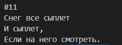

Программа приёма хокку в блокирующем режиме.

Используя библиотеку [[glossary/hal-ll\|HAL]], разработайте первый вариант хоккуанализатора — приложения для ядра Cortex-M7.

1. Сразу же после инициализации библиотеки HAL программа должна запускать ядро Cortex-M4 (хоккугенератор):

<div class="mkvs-retype">

```c
HAL_RCCEx_EnableBootCore(RCC_BOOT_C2);
```

</div>

2. После того как [[glossary/bootloader\|загрузчик]] запустил приложение из [[glossary/axi-sram\|AXI-SRAM]], прерывания остаются глобально запрещёнными. Поэтому следующим шагом разрешите их вызовом `__enable_irq()`.

3. Далее программа переходит в «режим 1»: выводит в терминал приглашение и ожидает нажатия любой клавиши.

<div class="mkvs-retype">

```c
puts(u8"Нажмите любую клавишу для запуска...");
getchar();
```

</div>

4. Получив символ, программа переходит в «режим 2»: непрерывно принимает данные от хоккугенератора в блокирующем режиме и выводит принимаемые хокку в терминал.

   Разделитель `|` выводить не нужно; между хокку следует добавлять пустую строку (см. рисунок 4). Вывод должен начинаться с начала хокку, а не с его середины.



*Рисунок 4 – Образец вывода программы.*

> [!note] Важное примечание
> Чтобы сократить время на отладку решения в классе, для вывода в терминал возможных ошибок выполнения HAL-функций рекомендуется пользоваться функциями из `hal_helpers.h` (см. [[lab06/08-appendix-hal-helpers\|приложение 2]]).
