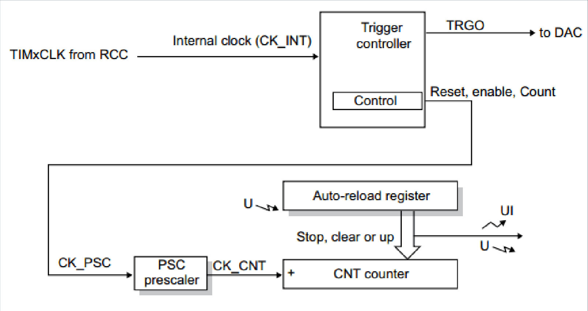
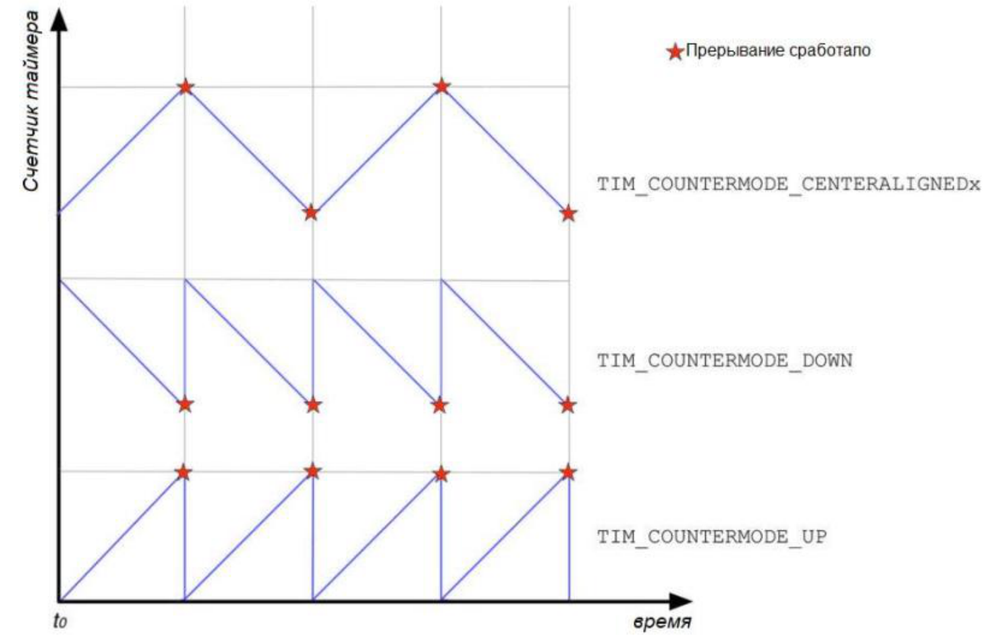
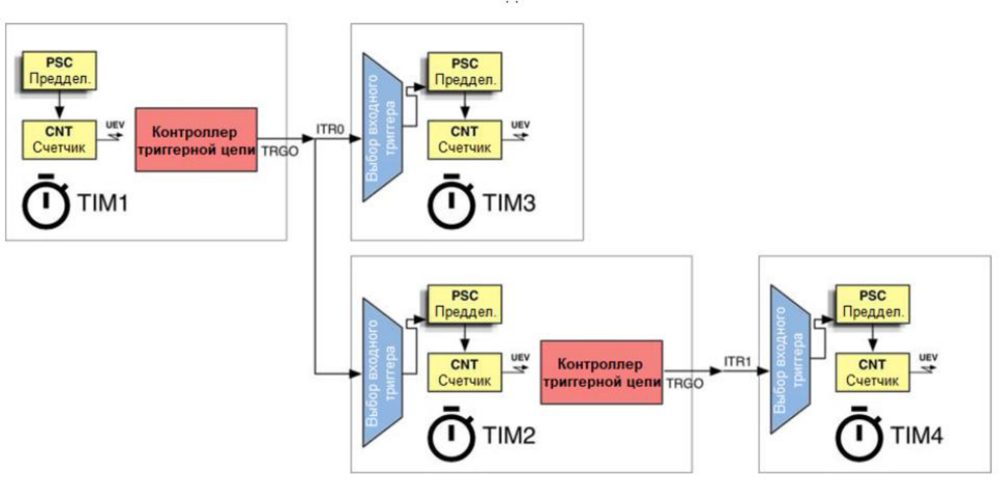
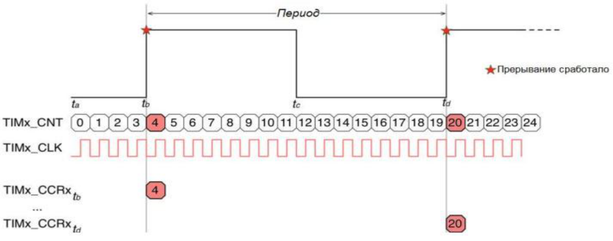
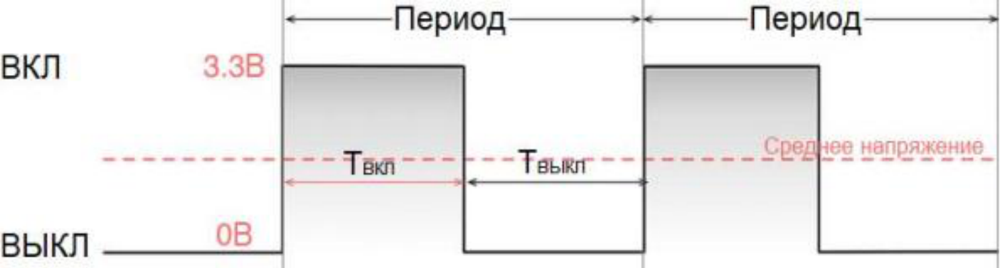
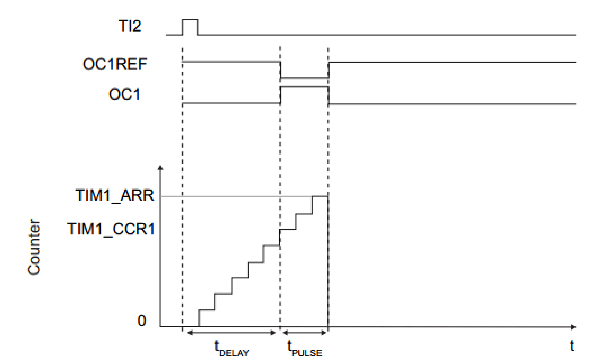
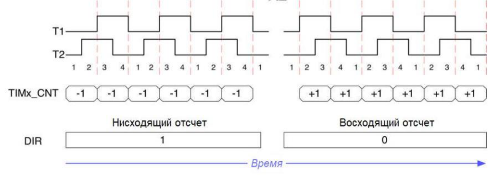
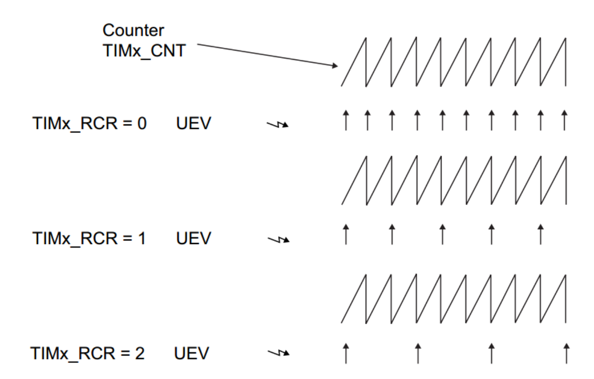

## Часть 1. Аппаратные таймеры в STM32

![[glossary/hardware-timer#^def-hardware-timer]]

Микроконтроллеры STM32 содержат таймеры трёх видов: базовые (basic timers), общего назначения (general-purpose) и продвинутые (advanced-control). Таймеры общего назначения включают в себя все возможности базовых и добавляют к ним свои; продвинутые таймеры точно так же расширяют таймеры общего назначения. Все три вида умеют работать с контроллером [[glossary/dma\|DMA]].

![[glossary/dma#^def-dma]]

> [!note] Специальные таймеры
> Кроме перечисленных трёх видов, в семействах микроконтроллеров STM32 встречаются специальные таймеры: таймеры пониженного энергопотребления LPTIM и таймер высокого разрешения HRTIM.

Работа таймера не зависит от работы процессора. Например, когда процессор приостановлен во время отладки, таймер продолжает считать — и к моменту возобновления программы успевает несколько раз переполниться. Чтобы этого не происходило, поведение таймеров в режиме отладки настраивают макросами библиотеки HAL.

| Макрос | Назначение |
| --- | --- |
| `__HAL_RCC_DBGMCU_CLK_ENABLE()` | Включить тактирование отладочного модуля DBGMCU. |
| `__HAL_DBGMCU_FREEZE_TIMx()` | Останавливать таймер `TIMx` на время остановки процессора в отладке. |
| `__HAL_DBGMCU_UNFREEZE_TIMx()` | Продолжать счёт в таймере `TIMx` во время остановки процессора в отладке. |

Программный интерфейс библиотеки [[glossary/hal-ll\|HAL]] повторяет аппаратную иерархию таймеров: набор доступных функций и структур зависит от вида таймера и от режима работы — опроса, прерываний или DMA.

Кроме функций, HAL предоставляет макросы для низкоуровневой работы с таймером на уровне флагов регистров:

- `__HAL_RCC_TIMx_CLK_ENABLE()` — включение тактирования таймера;
- `__HAL_TIM_ENABLE()` и `__HAL_TIM_DISABLE()` — включение и отключение работы таймера;
- `__HAL_TIM_GET_FLAG()` и `__HAL_TIM_CLEAR_FLAG()` — проверка и сброс флагов прерываний;
- `__HAL_TIM_CLEAR_IT()` — сброс бита ожидания обработки прерывания таймера (pending bit).

## Часть 2. Базовые таймеры

Базовые таймеры — самый простой вид таймеров: они предназначены только для генерации временных отсчётов и, в отличие от остальных, не имеют выводов ввода-вывода. Структура базового таймера показана на рисунке 1.

События временных отсчётов можно обработать в [[glossary/isr\|обработчике прерывания]], использовать как источник запросов к контроллеру DMA, как триггер для цифро-аналогового преобразователя (ЦАП) либо как сигнал синхронизации для других таймеров.

*Рисунок 1 – Структура базового таймера STM32.*

Работа базового таймера устроена так.

1. Для работы таймера необходим тактовый сигнал `CK_INT`. Базовый таймер тактируется внутренним источником, сигнал которого поступает от блока [[glossary/rcc\|RCC]].

2. Каждый таймер имеет предделитель (prescaler) — число, хранимое в регистре `TIMx_PSC`. После включения таймера установкой флага `CEN` в регистре `TIMx_CR1` сигнал `CK_INT` (он же `CK_PSC`) поступает на вход предделителя и преобразуется в сигнал `CK_CNT`, который тактирует счётчик таймера.

3. Счётчик таймера хранится в 16-разрядном регистре `TIMx_CNT`.

4. Каждый таймер имеет значение перезагрузки, называемое также периодом таймера (period). Оно хранится в 16-разрядном регистре `TIMx_ARR`.

5. По фронту сигнала `CK_CNT` счётчик таймера увеличивается на единицу. Когда значение счётчика достигает значения регистра перезагрузки `TIMx_ARR`, возникает событие переполнения и выполняются следующие действия:

   - счётчик таймера `TIMx_CNT` сбрасывается в ноль;
   - генерируется событие обновления `UE` (update event);
   - регистры `TIMx_ARR` и `TIMx_PSC` обновляются своими предзагруженными значениями;
   - если разрешено прерывание по обновлению (флаг `UIE` в регистре `TIMx_DIER`), устанавливается флаг `UIF` и генерируется сигнал прерывания;
   - если разрешён запрос DMA (флаг `UDE` в регистре `TIMx_DIER`), генерируется сигнал запроса к контроллеру DMA.

> [!note] Важное примечание
> Выше приведено поведение, которое используется в большинстве применений базового таймера. Флагами регистров управления таймером его можно изменить.

Частота возникновения события обновления `UE` базового таймера вычисляется по формуле

$$
f_{UE} = \frac{f_{CK\_INT}}{(PSC + 1)\,(ARR + 1)},
$$

где $f_{CK\_INT}$ — частота тактового сигнала таймера, $PSC$ — значение регистра `TIMx_PSC`, $ARR$ — значение регистра `TIMx_ARR`. Единицы в знаменателе появляются потому, что счёт ведётся с нуля: предделитель с нулевым `PSC` делит на единицу, а счётчик с нулевым `ARR` переполняется на каждом такте.

При работе с базовыми таймерами в библиотеке HAL используются следующие функции:

- `HAL_TIM_Base_Init()` — инициализация таймера;
- `HAL_TIM_Base_Start()`, `HAL_TIM_Base_Start_IT()` и `HAL_TIM_Base_Start_DMA()` — запуск таймера соответственно в режиме опроса, прерываний и DMA.

## Часть 3. Таймеры общего назначения

### 1. Возможности таймеров общего назначения

1.1. Счётчик таймера общего назначения может быть как 16-разрядным (TIM3, TIM4), так и 32-разрядным (TIM2, TIM5).

1.2. Таймеры общего назначения поддерживают несколько режимов работы счётчика: прямой счёт (upcounting), обратный счёт (downcounting) и счёт с выравниванием по центру (center-aligned). Режимы показаны на рисунке 2.

*Рисунок 2 – Режимы работы счётчика таймеров общего назначения.*

1.3. С таймером общего назначения могут быть связаны до пяти выводов микроконтроллера. Вывод `ETR` (external trigger input) служит для внешнего тактирования таймера, а выводы каналов (`CH1`, `CH2` и далее) — для внешнего запуска или тактирования, а также для работы таймера в следующих режимах:

- режим захвата входного сигнала (input capture mode);
- режим сравнения-вывода (output compare mode);
- режим широтно-импульсной модуляции (PWM mode);
- режим однократного импульса (one pulse mode).

1.4. Таймер общего назначения может иметь до четырёх каналов. С каждым каналом связан регистр захвата/сравнения `TIMx_CCRn` той же разрядности, что и счётчик.

> [!note] Обозначение номера канала
> Здесь и далее в названиях регистров и флагов вместо `n` следует подставлять номер соответствующего канала таймера — от 1 до 4.

1.5. Кроме того, в таймеры общего назначения встроена аппаратная логика для обработки сигналов [[glossary/rotary-encoder\|энкодера]] и датчиков Холла.

### 2. Синхронизация таймеров

2.1. Таймер общего назначения может работать как независимый, ведущий или ведомый. Сигнал синхронизации, который формирует ведущий таймер, называется `TRGO`. По внутренним линиям микроконтроллера он коммутируется на один из внутренних входов `ITRx` ведомого таймера; для ведомого таймера этот сигнал называется сигналом триггерного входа `TRGI`.

2.2. Внутренние линии синхронизации таймеров приведены в таблицах «TIMx internal trigger connection» (таблицы 353, 358, 361 и 366 документа [RM0399](docs/rm0399-stm32h745.pdf)).

2.3. Программно активируя внутренние линии `TRGO` — `TRGI`, из таймеров можно построить иерархические структуры (рисунок 3).

*Рисунок 3 – Пример синхронизации таймеров.*

2.4. Возможные конфигурации синхронизации по выходу (`TRGO`) приведены в таблице.

| Режим синхронизации по выходу | Условие генерации сигнала |
| --- | --- |
| По включению `TIM_TRGO_ENABLE` | Сигнал `TRGO` генерируется при включении ведущего таймера. Режим удобен для одновременного запуска нескольких таймеров и для задания временного окна, в котором работает ведомый таймер. |
| По обновлению счётчика `TIM_TRGO_UPDATE` | Сигнал `TRGO` генерируется по событию обновления `UE` ведущего таймера. |
| По событию сравнения `TIM_TRGO_OC1` | Триггерный выход формирует положительный импульс при установке флага `CC1IF` — то есть при совпадении счётчика со значением регистра сравнения первого канала. |
| По сигналу канала `TIM_TRGO_OCxREF` | На триггерный выход подаётся сигнал `OCxREF` канала `x` — тот же самый сигнал, который управляет выводом этого канала. |

2.5. Режимы синхронизации по входу приведены в следующей таблице.

| Режим синхронизации по входу | Действие по сигналу |
| --- | --- |
| Режим сброса `TIM_SLAVEMODE_RESET` | Нарастающий фронт `TRGI` переинициализирует счётчик и генерирует обновление регистров. |
| Стробируемый режим `TIM_SLAVEMODE_GATED` | Тактирование счётчика разрешено при высоком уровне сигнала `TRGI` и останавливается — без сброса счётчика — при низком. |
| Режим триггера `TIM_SLAVEMODE_TRIGGER` | Счётчик запускается по нарастающему фронту сигнала `TRGI`. Сигнал управляет только запуском счёта, но не останавливает его. |
| Режим внешнего тактирования `TIM_SLAVEMODE_EXTERNAL1` | Нарастающие фронты `TRGI` тактируют счётчик. |

### 3. Режим захвата входного сигнала

![[glossary/input-capture#^def-input-capture]]

3.1. Режим захвата устанавливается для каждого из четырёх каналов таймера отдельно, и захват выполняется независимо по каждому каналу.

3.2. Входной сигнал поступает на входной каскад канала, который содержит детектор фронта (edge detector) и входной фильтр (input filter) — фильтр служит для борьбы с [[glossary/debounce\|дребезгом]] и помехами во входном сигнале. Выход детектора фронта поступает в мультиплексор источников (`IC1`, `IC2` и так далее), который позволяет переназначить связь между выводами микроконтроллера и каналами таймера. Кроме того, у канала есть собственный предделитель: он позволяет выполнять захват не по каждому событию, а по каждому `N`-му.

3.3. В момент захвата счётчик таймера копируется в регистр захвата/сравнения `TIMx_CCRn`, выставляется флаг `CCnIF` и, если это разрешено, генерируются прерывание и запрос DMA. Генерация прерывания и запроса управляется флагами `CCnIE` и `CCnDE` соответственно.

3.4. Режим захвата предназначен для измерения периода и длительности сигнала — так, как показано на рисунке 4.

*Рисунок 4 – Измерение периода сигнала в режиме захвата.*

Измеряемый интервал получается из разности двух соседних захваченных значений:

$$
\Delta_{CNT} = \begin{cases} CNT_1 - CNT_0, & CNT_1 \ge CNT_0, \\ (ARR + 1 - CNT_0) + CNT_1, & CNT_1 < CNT_0. \end{cases}
$$

Вторая строка описывает случай, когда между захватами счётчик успел переполниться. Если `ARR` равен максимальному значению счётчика (65535 для 16-разрядного таймера), обе строки сводятся к одной: разность, вычисленная в 16-разрядной арифметике, сама учитывает переполнение.

Период входного сигнала выражается через эту разность так:

$$
T = \Delta_{CNT}\cdot\frac{PSC + 1}{f_{CK\_INT}}\cdot k,
$$

где $k = 1$ при захвате по одному фронту и $k = 2$ при захвате по обоим фронтам — во втором случае соседние захваты отстоят друг от друга на половину периода. Если включён предделитель канала и захват выполняется по каждому `N`-му событию, полученное значение нужно дополнительно разделить на `N`.

### 4. Режим сравнения-вывода (output compare mode)

![[glossary/output-compare#^def-output-compare]]

4.1. Когда значение регистра захвата/сравнения канала `TIMx_CCRn` совпадает со значением счётчика `TIMx_CNT`, выполняются следующие действия:

- устанавливается флаг `CCnIF`;
- генерируются прерывание и запрос DMA, если установлены соответствующие биты разрешения в регистре `TIMx_DIER`;
- сигнал на выводе канала изменяется в соответствии с выбранным режимом и заданной полярностью.

4.2. Режимы управления выходным каналом приведены в таблице.

| Режим сравнения-вывода | Действие при совпадении счётчика с регистром сравнения |
| --- | --- |
| Временной отсчёт `TIM_OCMODE_TIMING` | Вывод канала не изменяется. |
| Активация `TIM_OCMODE_ACTIVE` | Вывод канала переводится в активное состояние (по умолчанию — высокий уровень). |
| Деактивация `TIM_OCMODE_INACTIVE` | Вывод канала переводится в неактивное состояние (по умолчанию — низкий уровень). |
| Переключение `TIM_OCMODE_TOGGLE` | Состояние вывода канала инвертируется. |
| Принудительное значение `TIM_OCMODE_FORCED_ACTIVE` `TIM_OCMODE_FORCED_INACTIVE` | Вывод канала принудительно удерживается в активном или неактивном состоянии независимо от значения счётчика. |

### 5. Режим широтно-импульсной модуляции (PWM mode)

![[glossary/pwm#^def-pwm]]

5.1. Пример ШИМ-сигнала приведён на рисунке 5.

*Рисунок 5 – Сигнал ШИМ с коэффициентом заполнения 50 %.*

5.2. К основным параметрам ШИМ-сигнала относятся период (или обратная ему частота) и длительность импульса, а также коэффициент заполнения, который вычисляется по формуле

$$
D = \frac{T_{ON}}{T}\cdot 100\ \%,
$$

где $T_{ON}$ — длительность импульса, $T$ — период сигнала.

5.3. ШИМ-сигнал имеет множество применений в цифровой электронике. Например, фильтрацией ШИМ-сигнала строят простейший цифро-аналоговый преобразователь: изменяя коэффициент заполнения, регулируют выходное напряжение. В связке с силовыми транзисторами ШИМ позволяет управлять мощной нагрузкой — яркостью светодиодов, скоростью вращения двигателя, нагревателем.

5.4. Таймер в режиме ШИМ формирует на выходе канала ШИМ-сигнал и позволяет динамически менять его параметры прямо во время работы.

5.5. Принцип работы таймера в режиме ШИМ тот же, что и в режиме сравнения-вывода. Период сигнала задаётся регистром перезагрузки `TIMx_ARR` (параметр `Period`), длительность импульса — регистром сравнения `TIMx_CCRn` (параметр `Pulse`). Форма выходного сигнала зависит от выбранного режима ШИМ.

| Режим ШИМ | Состояние канала |
| --- | --- |
| `TIM_OCMODE_PWM1` | При прямом счёте канал активен, пока `CNT` < `CCRn`, и неактивен в остальное время. При обратном счёте канал неактивен, пока `CNT` > `CCRn`, и активен в остальное время. |
| `TIM_OCMODE_PWM2` | При прямом счёте канал неактивен, пока `CNT` < `CCRn`, и активен в остальное время. При обратном счёте канал активен, пока `CNT` > `CCRn`, и неактивен в остальное время. |

Из таблицы видно, что режимы отличаются только полярностью: при одном и том же значении `CCRn` коэффициент заполнения в режиме `PWM2` дополняет коэффициент заполнения в режиме `PWM1` до 100 %. В частности, значение `CCRn` = 0 даёт в режиме `PWM1` постоянный неактивный уровень, а в режиме `PWM2` — постоянный активный. Этим свойством пользуются в основной части работы.

### 6. Режим однократного импульса (one pulse mode)

6.1. Режим однократного импульса использует первые два канала таймера: сигнал, поступающий на один канал, запускает формирование однократного импульса на другом канале после программно заданной задержки.

6.2. Таймер в режиме One Pulse конфигурируется так же, как в режиме ШИМ, но счётчик запускается внешним импульсом и останавливается при первом же событии обновления. Работа таймера в этом режиме показана на рисунке 6.

*Рисунок 6 – Работа таймера в режиме One Pulse.*

6.3. Задержка и длительность выходного импульса рассчитываются по формулам

$$
t_{DELAY} = CCR\cdot\frac{PSC + 1}{f_{CK\_INT}},\qquad t_{PULSE} = (ARR - CCR)\cdot\frac{PSC + 1}{f_{CK\_INT}}.
$$

### 7. Режим энкодера

7.1. Когда таймер работает в режиме энкодера, значение счётчика `TIMx_CNT` увеличивается или уменьшается по фронтам сигналов на входных каналах. Направление счёта определяется взаимным порядком этих фронтов и отражается флагом `DIR` в регистре `TIMx_CR1`.

7.2. Существуют два режима захвата. В режиме X2 счётчик изменяется по каждому фронту только одного канала — `T1` или `T2`. В режиме X4 счётчик обновляется по каждому фронту обоих каналов, то есть даёт вчетверо больше отсчётов на один оборот.

*Рисунок 7 – Пример работы таймера в режиме энкодера X2.*

## Часть 4. Продвинутые таймеры

1. Продвинутыми (advanced-control timers) являются два 16-разрядных таймера — TIM1 и TIM8.

2. В отличие от таймеров общего назначения, продвинутые таймеры могут иметь до шести каналов, а также дополнительные комплементарные выводы.

3. Продвинутый таймер имеет счётчик повторений, который хранится в регистре `TIMx_RCR`. Счётчик повторений позволяет сократить количество событий обновления `UE`: событие генерируется не на каждом переполнении счётчика, а через заданное их число (рисунок 8).

*Рисунок 8 – Генерация события обновления при разных значениях счётчика повторений.*

4. Продвинутые таймеры имеют два вывода аварийного отключения (break input). Эта функция защищает силовые ключи, которыми управляют ШИМ-сигналы продвинутого таймера: на выводы break подаются сигналы отказа силовых каскадов и трёхфазных инверторов. При активации цепь отключает выводы каналов таймера и переводит их в заранее заданное безопасное состояние.
