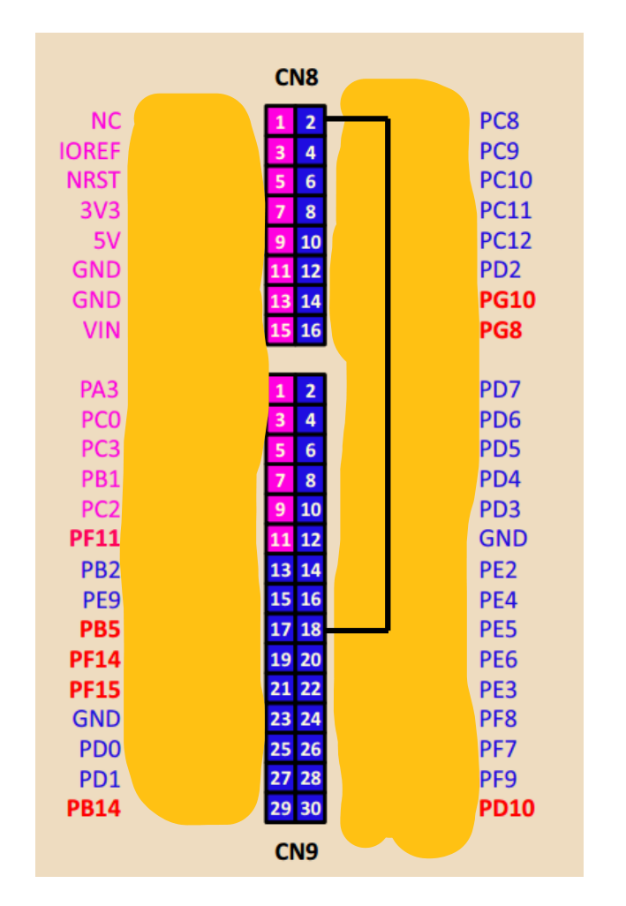
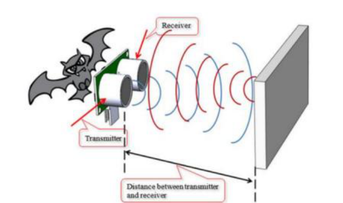
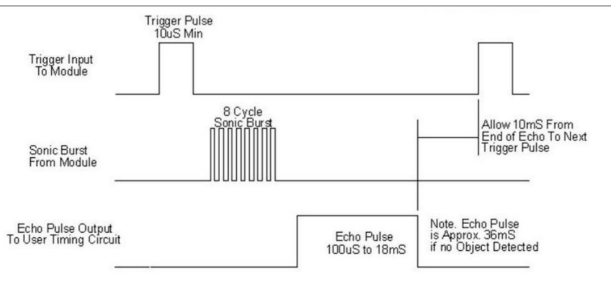

## Часть 1. Создание проекта с библиотекой HAL

1. Создайте проект для отладочной платы [[glossary/nucleo-h745\|ST Nucleo H745ZI-Q]] и подключите фреймворк `stm32cube`. Это можно сделать двумя способами.

   **Способ 1.** Взять за основу проект из ЛР6: сделать его копию и удалить исходные коды приложений из папок `src/cm4app` и `src/cm7app`.

   **Способ 2.** Использовать шаблон `template_project_HAL_CM7` из архива [[lab07/index#Файлы к работе\|файлов к работе]].

> [!note] Как создаётся такой проект
> Создание проекта с нуля и конфигурация библиотеки [[glossary/hal-ll\|HAL]] подробно разобраны в [[lab06/02-main\|основной части ЛР6]]. Настройки, сделанные там, в шаблоне уже выполнены: подключён фреймворк `stm32cube`, добавлены свои [[glossary/linker-script\|скрипты компоновщика]] и собственный файл конфигурации `stm32h7xx_hal_conf.h`, в котором включены нужные модули HAL — `CORTEX`, `DMA`, `EXTI`, `GPIO`, `RCC`, `TIM`, `UART` и `USART`.

2. Вся программа этой работы выполняется на ядре Cortex-M7, поэтому окружения `cm4app_in_flash` и папка `src/cm4app` не понадобятся.

3. Удалите из папки `src/cm7app` файлы заготовки — `main.c`, `main.h`, `hal_it.c` и `hal_msp.c`. Вместо них в ходе работы будут созданы собственные файлы. Если оставить `hal_it.c`, в проекте окажутся два обработчика `SysTick_Handler()`, и [[glossary/linker\|компоновщик]] сообщит о повторном определении символа.

4. Соберите пустой проект и убедитесь, что сборка проходит без ошибок и предупреждений.

## Часть 2. Генерация импульса с помощью таймера

1. Решим задачу формирования одиночного импульса длительностью 3 секунды на выводах микроконтроллера PB0 (зелёный светодиод) и PC8. Оба вывода подключаются внутри микроконтроллера к каналу 3 таймера TIM3. Запуск импульса будем производить по нажатию кнопки USER (B1).

2. Воспользуемся режимом [[glossary/pwm\|ШИМ]]. В качестве периода ШИМ выберем требуемую длительность импульса и запустим таймер с коэффициентом заполнения 100 %: выход канала будет удерживаться в активном состоянии весь период. Обработав прерывание о завершении импульса, остановим таймер — и генерация сигнала на этом закончится.

> [!note] Вопрос для размышления
> Какие ещё режимы таймера можно использовать для решения задачи генерации импульса фиксированной длительности?

3. Сначала создадим вспомогательный модуль, который настраивает [[glossary/exti\|контроллер EXTI]] на вызов обработчика по нажатию кнопки. Добавьте в папку `src/cm7app` файлы листингов 1 и 2 и изучите их код.

**Листинг 1: src/cm7app/key_button.h**

```c title="src/cm7app/key_button.h" showLineNumbers
#pragma once

#include <stm32h7xx_hal.h>

/* Обработка нажатия кнопки по внешнему прерыванию.
   Чтобы воспользоваться этим модулем, необходимо:
   1) задать параметры кнопки макроопределениями в этом файле;
   2) вызвать в обработчике соответствующей линии EXTI функцию
      HAL_GPIO_EXTI_IRQHandler(KEY_BUTTON_PIN);
   3) переопределить weak-функцию HAL_GPIO_EXTI_Callback()
      и вызвать в ней обработчик нажатия кнопки. */

#define KEY_BUTTON_PIN        GPIO_PIN_13
#define KEY_BUTTON_PORT       GPIOC
#define KEY_BUTTON_CLK_ENABLE __HAL_RCC_GPIOC_CLK_ENABLE
#define KEY_BUTTON_IRQn       EXTI15_10_IRQn
#define KEY_BUTTON_IRQHandler EXTI15_10_IRQHandler

/** Конфигурация вывода кнопки и линии EXTI */
void Key_Button_EXTI_Init(void);
```

**Листинг 2: src/cm7app/key_button.c**

```c title="src/cm7app/key_button.c" showLineNumbers
#include "key_button.h"

void Key_Button_EXTI_Init(void) {
    KEY_BUTTON_CLK_ENABLE();

    GPIO_InitTypeDef GPIO_InitStruct = {0};
    GPIO_InitStruct.Pin = KEY_BUTTON_PIN;
    GPIO_InitStruct.Mode = GPIO_MODE_IT_RISING;
    GPIO_InitStruct.Pull = GPIO_PULLDOWN;
    HAL_GPIO_Init(KEY_BUTTON_PORT, &GPIO_InitStruct);

    HAL_NVIC_SetPriority(KEY_BUTTON_IRQn, 0, 0);
    HAL_NVIC_EnableIRQ(KEY_BUTTON_IRQn);
}
```

Нетрудно заметить, что этот модуль похож на примитивную библиотеку: он конфигурируется статически, во время компиляции, и поддерживает всего одну сущность — сигнал одной кнопки. Этим он и отличается от драйверов библиотеки HAL, которые поддерживают произвольное число сущностей и настраиваются во время выполнения.

4. Отдельный модуль обработки ошибок создавать не нужно: всё необходимое уже есть в библиотеке `lib/nuc745_utils` из шаблона проекта. Нам понадобятся функция аварийного завершения `error_state()` и макрос `ASSERT_HAL_SATUS()`, который проверяет код возврата функции HAL и, если он отличен от `HAL_OK`, выводит в терминал имя файла, номер строки и расшифровку кода, после чего останавливает программу. Полные листинги библиотеки приведены в [[lab06/08-appendix-hal-helpers\|приложении 2 к ЛР6]].

5. Добавьте в проект файлы с функциями инициализации, запуска, остановки и деинициализации таймера, который будет генерировать импульс.

**Листинг 3: src/cm7app/tim_pulse.h**

```c title="src/cm7app/tim_pulse.h" showLineNumbers
#pragma once

#include <stm32h7xx_hal.h>

// Конфигурация таймера
#define TIMp                TIM3
#define TIMp_CHANNEL        TIM_CHANNEL_3
#define TIMp_PRESCALER      (64000 - 1) /* счётчик тикает с частотой 1 кГц */
#define TIMp_PERIOD         (3000 - 1)  /* событие UE каждые 3 с */
#define TIMp_CLK_ENABLE     __HAL_RCC_TIM3_CLK_ENABLE
#define TIMp_IRQn           TIM3_IRQn
#define TIMp_IRQHandler     TIM3_IRQHandler

// Вывод PB0 — зелёный светодиод
#define TIMp_CH_PORT        GPIOB
#define TIMp_CH_PIN         GPIO_PIN_0
#define TIMp_CH_CLK_ENABLE  __HAL_RCC_GPIOB_CLK_ENABLE
#define TIMp_CH_GPIO_AF     GPIO_AF2_TIM3

// Дополнительный вывод PC8
#define TIMp_ECH_PORT       GPIOC
#define TIMp_ECH_PIN        GPIO_PIN_8
#define TIMp_ECH_CLK_ENABLE __HAL_RCC_GPIOC_CLK_ENABLE
#define TIMp_ECH_GPIO_AF    GPIO_AF2_TIM3

extern TIM_HandleTypeDef hTimPulse;

/** Инициализация таймера для генерации ШИМ в режиме прерываний */
void Tim_Pulse_Init(void);

/** Запуск таймера */
void Tim_Pulse_Start(void);

/** Остановка таймера */
void Tim_Pulse_Stop(void);

/** Деинициализация таймера */
void Tim_Pulse_DeInit(void);
```

**Листинг 4: src/cm7app/tim_pulse.c**

```c title="src/cm7app/tim_pulse.c" showLineNumbers
#include "tim_pulse.h"
#include <hal_helpers.h>

TIM_HandleTypeDef hTimPulse;

void Tim_Pulse_Init(void) {
    // Базовая конфигурация таймера
    hTimPulse.Instance = TIMp;
    hTimPulse.Init.Prescaler = TIMp_PRESCALER;
    hTimPulse.Init.Period = TIMp_PERIOD;
    hTimPulse.Init.ClockDivision = TIM_CLOCKDIVISION_DIV1;
    hTimPulse.Init.CounterMode = TIM_COUNTERMODE_UP;
    ASSERT_HAL_SATUS(HAL_TIM_PWM_Init(&hTimPulse));  // вызывает HAL_TIM_PWM_MspInit()

    // Конфигурация канала таймера
    TIM_OC_InitTypeDef sOCConfig = {0};
    sOCConfig.OCMode = TIM_OCMODE_PWM2;
    sOCConfig.OCPolarity = TIM_OCPOLARITY_HIGH;
    sOCConfig.Pulse = 0;  // в режиме PWM2 нулевой Pulse даёт D = 100 %
    ASSERT_HAL_SATUS(HAL_TIM_PWM_ConfigChannel(&hTimPulse, &sOCConfig, TIMp_CHANNEL));
}

void Tim_Pulse_Start(void) {
    if (HAL_TIM_GetChannelState(&hTimPulse, TIMp_CHANNEL) == HAL_TIM_CHANNEL_STATE_READY) {
        ASSERT_HAL_SATUS(HAL_TIM_PWM_Start_IT(&hTimPulse, TIMp_CHANNEL));
    }
}

void Tim_Pulse_Stop(void) {
    ASSERT_HAL_SATUS(HAL_TIM_PWM_Stop_IT(&hTimPulse, TIMp_CHANNEL));
}

void Tim_Pulse_DeInit(void) {
    ASSERT_HAL_SATUS(HAL_TIM_PWM_DeInit(&hTimPulse));  // вызывает HAL_TIM_PWM_MspDeInit()
}

/**** Функции обратного вызова библиотеки HAL *******************************/
/* Переопределённые ниже функции обрабатывают любой таймер в режиме ШИМ и
   обычно помещаются в отдельный файл *_msp.c. В нашей программе такой таймер
   всего один, поэтому они размещены здесь. */

void HAL_TIM_PWM_MspInit(TIM_HandleTypeDef* htim) {
    if (htim != &hTimPulse) {
        return;
    }

    // Тактирование таймера и портов
    TIMp_CLK_ENABLE();
    TIMp_CH_CLK_ENABLE();
    TIMp_ECH_CLK_ENABLE();

    // Вывод на зелёный светодиод
    GPIO_InitTypeDef GPIO_InitStruct = {0};
    GPIO_InitStruct.Pin = TIMp_CH_PIN;
    GPIO_InitStruct.Mode = GPIO_MODE_AF_PP;
    GPIO_InitStruct.Pull = GPIO_PULLDOWN;
    GPIO_InitStruct.Speed = GPIO_SPEED_FREQ_LOW;
    GPIO_InitStruct.Alternate = TIMp_CH_GPIO_AF;
    HAL_GPIO_Init(TIMp_CH_PORT, &GPIO_InitStruct);

    // Дополнительный вывод PC8
    GPIO_InitStruct.Pin = TIMp_ECH_PIN;
    GPIO_InitStruct.Alternate = TIMp_ECH_GPIO_AF;
    HAL_GPIO_Init(TIMp_ECH_PORT, &GPIO_InitStruct);

    // Прерывание таймера
    HAL_NVIC_SetPriority(TIMp_IRQn, 2, 0);
    HAL_NVIC_EnableIRQ(TIMp_IRQn);
}

void HAL_TIM_PWM_MspDeInit(TIM_HandleTypeDef* htim) {
    if (htim == &hTimPulse) {
        HAL_NVIC_DisableIRQ(TIMp_IRQn);
        HAL_GPIO_DeInit(TIMp_CH_PORT, TIMp_CH_PIN);
        HAL_GPIO_DeInit(TIMp_ECH_PORT, TIMp_ECH_PIN);
    }
}
```

6. Разберите код таймера.

   6.1. Инициализация таймера состоит из двух этапов. Сначала вызывается `HAL_TIM_PWM_Init()`, которая, в свою очередь, вызывает `HAL_TIM_PWM_MspInit()`. В последней конфигурируются выводы [[glossary/gpio\|GPIO]] в режим альтернативной функции — так они подключаются к каналу таймера, — а также демаскируется прерывание таймера и задаётся его приоритет.

   ![[glossary/hal-msp#^def-hal-msp]]

   6.2. Возможность подключения того или иного вывода к определённому каналу таймера задокументирована в таблицах альтернативных функций даташита [DS12923](docs/ds12923-stm32h745zi.pdf#page=87).

   6.3. На втором этапе функцией `HAL_TIM_PWM_ConfigChannel()` настраиваются канал таймера и параметры ШИМ. Выбран режим `TIM_OCMODE_PWM2` с нулевым значением `Pulse`: в этом режиме канал неактивен, пока `CNT` < `CCR3`, а поскольку `CCR3` равен нулю, канал активен весь период. Именно это и даёт коэффициент заполнения 100 %.

   6.4. Таймер запускается в режиме прерываний функцией `HAL_TIM_PWM_Start_IT()`, останавливается — парной ей `HAL_TIM_PWM_Stop_IT()`. Перед запуском проверяется состояние канала: если импульс уже формируется, повторное нажатие кнопки его не прервёт.

   6.5. Обратите внимание, что макроопределения в файлах `key_button.h` и `tim_pulse.h` содержат «адреса» всех ресурсов, необходимых модулю. Такой подход распространён при написании программ для микроконтроллеров: он позволяет быстро адаптировать код при смене ресурса — например, заменить таймер TIM3 на TIM4, поправив несколько строк в одном файле.

7. Добавьте в проект остальные файлы, реализующие основную логику программы.

**Листинг 5: src/cm7app/main.h**

```c title="src/cm7app/main.h" showLineNumbers
#pragma once

#include <stm32h7xx_hal.h>
#include <error_state.h>
#include <hal_helpers.h>
#include <led.h>
#include <vterm.h>

#include "key_button.h"
#include "tim_pulse.h"

#define VTERM_SPEED 115200
```

**Листинг 6: src/cm7app/main.c**

```c title="src/cm7app/main.c" showLineNumbers
#include "main.h"

#include <stdio.h>

int main(void) {
    __enable_irq();
    ASSERT_HAL_SATUS(HAL_Init());  // вызывает HAL_MspInit()
    printf("\r\nStart...\r\n");

    Key_Button_EXTI_Init();
    Tim_Pulse_Init();

    printf("Press B1 to generate a 3 s pulse on PB0 (green LED) and PC8\r\n");
    while (1) {
        // вся дальнейшая работа выполняется в обработчиках прерываний
    }
}

/**** Функции обратного вызова библиотеки HAL *******************************/

void HAL_MspInit(void) {
    HAL_NVIC_SetPriorityGrouping(NVIC_PRIORITYGROUP_4);
    led_enable(led_all);
    led_off(led_all);
    vterm_init(VTERM_SPEED);
}

void HAL_GPIO_EXTI_Callback(uint16_t GPIO_Pin) {
    if (GPIO_Pin == KEY_BUTTON_PIN) {
        Tim_Pulse_Start();
    }
}

void HAL_TIM_PWM_PulseFinishedCallback(TIM_HandleTypeDef* htim) {
    if (htim == &hTimPulse) {
        Tim_Pulse_Stop();
    }
}

void HAL_TIM_ErrorCallback(TIM_HandleTypeDef* htim) {
    (void)htim;
    error_state("HAL_TIM_ErrorCallback");
}
```

**Листинг 7: src/cm7app/it.c**

```c title="src/cm7app/it.c" showLineNumbers
#include "main.h"

void SysTick_Handler(void) {
    HAL_IncTick();
}

void HardFault_Handler(void) {
    error_state(__func__);
}

void KEY_BUTTON_IRQHandler(void) {
    HAL_GPIO_EXTI_IRQHandler(KEY_BUTTON_PIN);
}

void TIMp_IRQHandler(void) {
    HAL_TIM_IRQHandler(&hTimPulse);
}
```

8. Разберите код основной программы.

   8.1. Файл `main.h` содержит общие константы, макроопределения и подключение заголовочных файлов; он включается в `main.c` и `it.c`. В `it.c` собраны обработчики всех задействованных прерываний, а функции обработки ошибок берутся из библиотеки `nuc745_utils`.

   8.2. В файле `main.c` определена функция `HAL_MspInit()`, которая инициализирует общие ресурсы программы — светодиодные индикаторы и вывод в терминал. Библиотека HAL вызывает её из `HAL_Init()`, поэтому первое сообщение выводится уже после инициализации HAL, а не до неё. Единого Msp-файла в проекте нет: Msp-функции размещены рядом с модулями, к которым относятся.

   8.3. Там же задаётся [[glossary/priority-grouping\|группировка приоритетов]] `NVIC_PRIORITYGROUP_4` — четыре разряда приоритета вытеснения и ни одного разряда субприоритета. Только при такой группировке приоритеты, заданные в модулях (0 у кнопки, 2 у таймера), действительно различаются: при группировке `NVIC_PRIORITYGROUP_0` разрядов вытеснения не остаётся вовсе и все прерывания оказываются равноправными.

   8.4. В функции `main()` вызываются функции инициализации библиотеки HAL, обработчика кнопки и таймера. Дальнейшая логика работы реализована в переопределённых функциях обратного вызова:

   - `HAL_GPIO_EXTI_Callback()` — вызывается по прерыванию EXTI, в нашем случае по нажатию кнопки USER; запускает таймер;
   - `HAL_TIM_PWM_PulseFinishedCallback()` — вызывается по завершении периода ШИМ-сигнала; останавливает таймер;
   - `HAL_TIM_ErrorCallback()` — вызывается при появлении флагов ошибок таймера.

9. Запустите программу и убедитесь, что по нажатию кнопки зелёный светодиод загорается на три секунды и гаснет.

## Часть 3. Измерение импульса с помощью таймера

1. Доработаем программу так, чтобы длительность сформированного импульса измерялась другим таймером. Для этого соединим вывод PC8, на котором формируется импульс, с выводом PE5 — он может быть подключён к первому каналу таймера TIM15.

2. Отключите отладочную плату от компьютера и установите перемычку согласно рисунку 9.



*Рисунок 9 – Соединение вывода PC8 (канал TIM3:3) с выводом PE5 (канал TIM15:1) на отладочной плате ST Nucleo H745ZI-Q.*

3. Добавьте в папку `src/cm7app` файлы `tim_measure.h` и `tim_measure.c`, в которых измерение импульса реализовано с помощью таймера и контроллера [[glossary/dma\|DMA]].

**Листинг 8: src/cm7app/tim_measure.h**

```c title="src/cm7app/tim_measure.h" showLineNumbers
#pragma once

#include <stm32h7xx_hal.h>

// Конфигурация таймера
#define TIMm                    TIM15
#define TIMm_CHANNEL            TIM_CHANNEL_1
#define TIMm_PRESCALER          (64000 - 1) /* счётчик тикает с частотой 1 кГц */
#define TIMm_PERIOD             (65535)     /* счёт во всю разрядность счётчика */
#define TIMm_CLK_ENABLE         __HAL_RCC_TIM15_CLK_ENABLE
#define TIMm_IRQn               TIM15_IRQn
#define TIMm_IRQHandler         TIM15_IRQHandler

// Конфигурация DMA
#define TIMm_DMA_STREAM         DMA2_Stream1
#define TIMm_DMA_CLK_ENABLE     __HAL_RCC_DMA2_CLK_ENABLE
#define TIMm_DMA_IRQn           DMA2_Stream1_IRQn
#define TIMm_DMA_IRQHandler     DMA2_Stream1_IRQHandler
#define TIMm_DMA_ID             TIM_DMA_ID_CC1
#define TIMm_DMA_REQUEST        DMA_REQUEST_TIM15_CH1
#define TIMm_DMA_ACTIVE_CHANNEL HAL_TIM_ACTIVE_CHANNEL_1

// Входной вывод PE5
#define TIMm_CH_PORT            GPIOE
#define TIMm_CH_PIN             GPIO_PIN_5
#define TIMm_CH_CLK_ENABLE      __HAL_RCC_GPIOE_CLK_ENABLE
#define TIMm_CH_GPIO_AF         GPIO_AF4_TIM15

extern TIM_HandleTypeDef hTimMeasure;

/** Инициализация таймера в режиме захвата входного сигнала */
void Tim_Measure_Init(void);

/** Запуск измерения в режиме DMA */
void Tim_Measure_Start(void);

/** Остановка измерения */
void Tim_Measure_Stop(void);

/** Обработчик события захвата; вызывается из HAL_TIM_IC_CaptureCallback() */
void Tim_Measure_IC_Callback(TIM_HandleTypeDef* htim);

/** Возвращает длительность измеренного импульса в миллисекундах */
uint16_t Tim_Measure_GetDiff(void);

/** Ожидание завершения измерения. Возвращает 1, если импульс был измерен.
    Повторный вызов после успешного измерения вернёт 0 */
int Tim_Measure_Wait_Once(uint32_t timeout);

/** Деинициализация таймера */
void Tim_Measure_DeInit(void);
```

**Листинг 9: src/cm7app/tim_measure.c**

```c title="src/cm7app/tim_measure.c" showLineNumbers
#include "tim_measure.h"
#include <hal_helpers.h>

TIM_HandleTypeDef hTimMeasure;

static volatile int capture_done = 0;

/* Буфер DMA: в него попадают значения счётчика, захваченные по двум
   фронтам измеряемого импульса */
static volatile uint16_t captures[2] __attribute__((aligned(4)));

void Tim_Measure_Init(void) {
    // Базовая конфигурация таймера
    hTimMeasure.Instance = TIMm;
    hTimMeasure.Init.Prescaler = TIMm_PRESCALER;
    hTimMeasure.Init.Period = TIMm_PERIOD;
    hTimMeasure.Init.ClockDivision = TIM_CLOCKDIVISION_DIV1;
    hTimMeasure.Init.CounterMode = TIM_COUNTERMODE_UP;
    ASSERT_HAL_SATUS(HAL_TIM_IC_Init(&hTimMeasure));  // вызывает HAL_TIM_IC_MspInit()

    // Конфигурация входного канала: захват по обоим фронтам сигнала
    TIM_IC_InitTypeDef sICConfig = {0};
    sICConfig.ICPolarity = TIM_INPUTCHANNELPOLARITY_BOTHEDGE;
    sICConfig.ICSelection = TIM_ICSELECTION_DIRECTTI;
    sICConfig.ICPrescaler = TIM_ICPSC_DIV1;
    sICConfig.ICFilter = 0;
    ASSERT_HAL_SATUS(HAL_TIM_IC_ConfigChannel(&hTimMeasure, &sICConfig, TIMm_CHANNEL));
}

void Tim_Measure_DeInit(void) {
    ASSERT_HAL_SATUS(HAL_TIM_IC_DeInit(&hTimMeasure));
}

void Tim_Measure_Start(void) {
    capture_done = 0;
    ASSERT_HAL_SATUS(HAL_TIM_IC_Start_DMA(&hTimMeasure, TIMm_CHANNEL, (uint32_t*)captures, 2));
}

void Tim_Measure_Stop(void) {
    ASSERT_HAL_SATUS(HAL_TIM_IC_Stop_DMA(&hTimMeasure, TIMm_CHANNEL));
}

uint16_t Tim_Measure_GetDiff(void) {
    /* Разность 16-разрядных значений верна и в том случае, когда счётчик
       между захватами успел переполниться */
    return (uint16_t)(captures[1] - captures[0]);
}

void Tim_Measure_IC_Callback(TIM_HandleTypeDef* htim) {
    if (htim == &hTimMeasure && htim->Channel == TIMm_DMA_ACTIVE_CHANNEL) {
        capture_done = 1;
    }
}

int Tim_Measure_Wait_Once(uint32_t timeout) {
    uint32_t start = HAL_GetTick();
    while (!capture_done && (HAL_GetTick() - start) < timeout) {
        // ожидание захвата обоих фронтов импульса
    }
    if (!capture_done) {
        return 0;
    }
    capture_done = 0;
    return 1;
}

/**** Функции обратного вызова библиотеки HAL *******************************/
/* Переопределённые ниже функции обрабатывают любой таймер в режиме захвата и
   обычно помещаются в отдельный файл *_msp.c. В нашей программе такой таймер
   всего один, поэтому они размещены здесь. */

void HAL_TIM_IC_MspInit(TIM_HandleTypeDef* htim) {
    if (htim != &hTimMeasure) {
        return;
    }

    // Тактирование таймера, порта и контроллера DMA
    TIMm_CLK_ENABLE();
    TIMm_CH_CLK_ENABLE();
    TIMm_DMA_CLK_ENABLE();

    // Вывод микроконтроллера подключается к каналу таймера
    GPIO_InitTypeDef GPIO_InitStruct = {0};
    GPIO_InitStruct.Pin = TIMm_CH_PIN;
    GPIO_InitStruct.Mode = GPIO_MODE_AF_PP;
    GPIO_InitStruct.Pull = GPIO_PULLDOWN;
    GPIO_InitStruct.Speed = GPIO_SPEED_FREQ_LOW;
    GPIO_InitStruct.Alternate = TIMm_CH_GPIO_AF;
    HAL_GPIO_Init(TIMm_CH_PORT, &GPIO_InitStruct);

    // Поток DMA: из регистра захвата в память, по два 16-разрядных значения
    static DMA_HandleTypeDef hdma_tim;
    hdma_tim.Instance = TIMm_DMA_STREAM;
    hdma_tim.Init.Request = TIMm_DMA_REQUEST;
    hdma_tim.Init.Direction = DMA_PERIPH_TO_MEMORY;
    hdma_tim.Init.PeriphInc = DMA_PINC_DISABLE;
    hdma_tim.Init.MemInc = DMA_MINC_ENABLE;
    hdma_tim.Init.PeriphDataAlignment = DMA_PDATAALIGN_HALFWORD;
    hdma_tim.Init.MemDataAlignment = DMA_MDATAALIGN_HALFWORD;
    hdma_tim.Init.Mode = DMA_CIRCULAR;
    hdma_tim.Init.Priority = DMA_PRIORITY_LOW;
    hdma_tim.Init.FIFOMode = DMA_FIFOMODE_DISABLE;
    hdma_tim.Init.FIFOThreshold = DMA_FIFO_THRESHOLD_1QUARTERFULL;
    hdma_tim.Init.MemBurst = DMA_MBURST_SINGLE;
    hdma_tim.Init.PeriphBurst = DMA_PBURST_SINGLE;

    /* Дескриптор потока DMA связывается с дескриптором таймера: драйвер
       обращается к потоку через массив hdma[] дескриптора устройства */
    __HAL_LINKDMA(htim, hdma[TIMm_DMA_ID], hdma_tim);
    ASSERT_HAL_SATUS(HAL_DMA_Init(htim->hdma[TIMm_DMA_ID]));

    HAL_NVIC_SetPriority(TIMm_IRQn, 2, 0);
    HAL_NVIC_EnableIRQ(TIMm_IRQn);
    HAL_NVIC_SetPriority(TIMm_DMA_IRQn, 3, 0);
    HAL_NVIC_EnableIRQ(TIMm_DMA_IRQn);
}

void HAL_TIM_IC_MspDeInit(TIM_HandleTypeDef* htim) {
    if (htim == &hTimMeasure) {
        HAL_NVIC_DisableIRQ(TIMm_DMA_IRQn);
        HAL_NVIC_DisableIRQ(TIMm_IRQn);
        HAL_DMA_DeInit(htim->hdma[TIMm_DMA_ID]);
        HAL_GPIO_DeInit(TIMm_CH_PORT, TIMm_CH_PIN);
    }
}
```

4. Подключите новый модуль в файле `main.h`:

<div class="mkvs-retype">

```c
#include "tim_measure.h"
```

</div>

5. Добавьте в файл `it.c` обработчики прерываний нового таймера и потока DMA:

<div class="mkvs-retype">

```c
void TIMm_IRQHandler(void) {
    HAL_TIM_IRQHandler(&hTimMeasure);
}

void TIMm_DMA_IRQHandler(void) {
    HAL_DMA_IRQHandler(hTimMeasure.hdma[TIMm_DMA_ID]);
}
```

</div>

6. Определите в файле `main.c` функцию обратного вызова для события захвата:

<div class="mkvs-retype">

```c
void HAL_TIM_IC_CaptureCallback(TIM_HandleTypeDef* htim) {
    Tim_Measure_IC_Callback(htim);
}
```

</div>

7. Измените функцию `main()` так, чтобы измеренная длительность импульса выводилась в терминал.

```c title="src/cm7app/main.c" showLineNumbers
int main(void) {
    __enable_irq();
    ASSERT_HAL_SATUS(HAL_Init());  // вызывает HAL_MspInit()
    printf("\r\nStart...\r\n");

    Key_Button_EXTI_Init();
    Tim_Pulse_Init();
    Tim_Measure_Init();
    Tim_Measure_Start();

    printf("Press B1 to generate pulse on PC8 and measure it on PE5\r\n");
    while (1) {
        if (Tim_Measure_Wait_Once(1000)) {
            printf("\r\nMeasured pulse time = %u ms\r\n", (unsigned)Tim_Measure_GetDiff());
        } else {
            printf("\r\nwaiting...");
        }
    }
}
```

8. Разберите код измерения.

   8.1. Длительность сигнала измеряется в [[glossary/input-capture\|режиме захвата]], поэтому для конфигурации и запуска таймера используются функции `HAL_TIM_IC_Init()`, `HAL_TIM_IC_ConfigChannel()` и `HAL_TIM_IC_MspInit()`. Работа с таймером ведётся через контроллер DMA, поэтому измерение запускается и останавливается функциями `HAL_TIM_IC_Start_DMA()` и `HAL_TIM_IC_Stop_DMA()`.

   8.2. В функции `HAL_TIM_IC_MspInit()` конфигурируется поток контроллера DMA. По каждому фронту входного сигнала таймер формирует запрос к контроллеру DMA, а тот копирует значение из регистра захвата в буфер `captures`. Поток подключается к таймеру специальным макросом `__HAL_LINKDMA()`. Кроме того, демаскируется прерывание потока DMA — оно и сообщит программе, что оба значения получены.

   8.3. Поток настроен на циклический режим `DMA_CIRCULAR` и длину передачи в два элемента: получив два значения, контроллер DMA начинает заполнять буфер заново. Поэтому измерение работает при каждом нажатии кнопки, а перезапускать поток из программы не требуется.

   8.4. В функции обратного вызова по готовности данных устанавливается флаг `capture_done`. Основной цикл программы проверяет этот флаг и однократно выводит результат каждого нового измерения; функция `Tim_Measure_GetDiff()` вычисляет длительность импульса как разность двух захваченных значений счётчика.

9. Выполните сборку программы и запустите её на микроконтроллере. Откройте [[glossary/serial-monitor\|Serial Monitor]], нажмите кнопку USER (B1) и наблюдайте сообщение об измеренной длительности импульса после того, как зелёный светодиод погаснет.

## Часть 4. Ультразвуковой датчик расстояния HC-SR04

1. Ознакомьтесь с документацией на ультразвуковой датчик расстояния [HC-SR04](docs/hc-sr04-ultrasonic.pdf).

![[glossary/hc-sr04#^def-hc-sr04]]

2. Схема работы датчика показана на рисунках 10 и 11. Чтобы измерить расстояние до объекта, на вход `Trig` датчика необходимо подать импульс длительностью не менее 10 мкс. В ответ на выводе `Echo` датчик сформирует импульс длительностью от 100 мкс до 18 мс. Если препятствия нет, длительность ответного импульса составляет около 36 мс.



*Рисунок 10 – Принцип работы датчика HC-SR04.*



*Рисунок 11 – Временная диаграмма работы датчика HC-SR04.*

3. Расстояние до объекта пропорционально длительности ответного импульса и рассчитывается по формуле

$$
L = \frac{t_{Echo}}{58},
$$

где $L$ — расстояние в сантиметрах, а $t_{Echo}$ — длительность ответного импульса в микросекундах.

Коэффициент 58 получается из скорости звука в воздухе: волна проходит путь до препятствия и обратно, поэтому одному сантиметру расстояния соответствуют примерно 58 микросекунд задержки.
