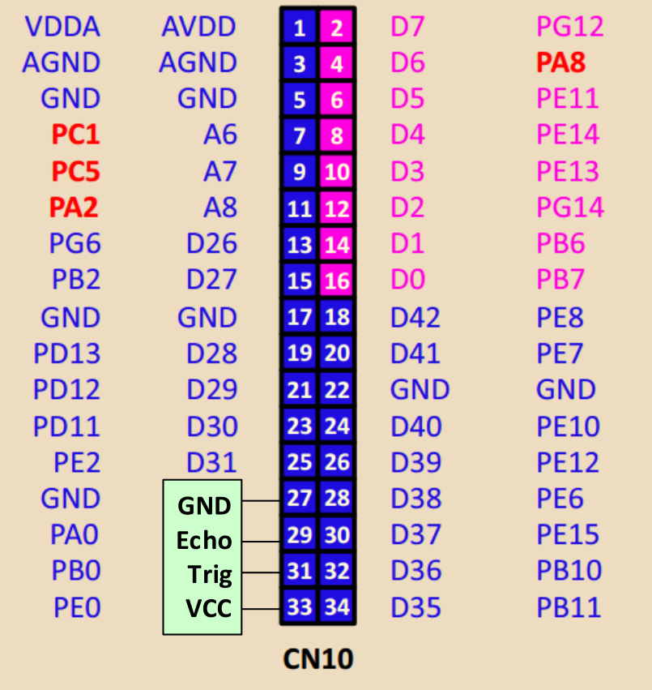
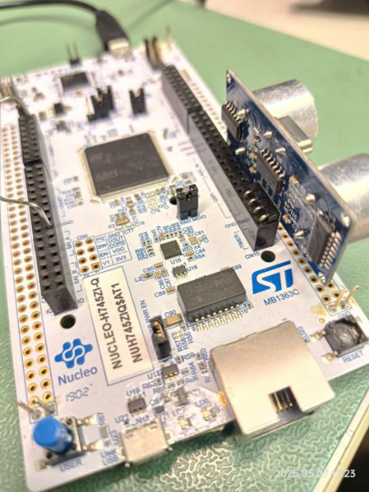
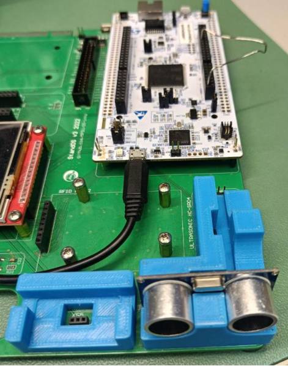

Измерение расстояния с помощью датчика HC-SR04.

В основной части работы один таймер формировал импульс, а другой измерял его длительность. Ровно те же два действия нужны для работы с ультразвуковым дальномером: запускающий импульс на вход `Trig` и измерение длительности ответного импульса на выводе `Echo`. Разница лишь в том, что импульсы теперь идут по проводам к внешнему модулю, а не по дорожке отладочной платы.

1. Выполните подключение датчика HC-SR04 согласно варианту.

   **Вариант 1** — подключение к разъёму CN10 отладочной платы: сигнал `Trig` на вывод PB0 (контакт 31), сигнал `Echo` на вывод PA0 (контакт 29). Земля датчика подключается к контакту 27, а питание — к контакту 33 того же ряда, как показано на рисунке 12.

> [!note] Питание датчика и зелёный светодиод в варианте 1
> Контакт 33 разъёма CN10 — это не шина питания, а вывод PE0 микроконтроллера. Чтобы датчик получил питание, вывод PE0 нужно настроить как цифровой выход и установить на нём высокий уровень — так же, как вывод «+» энкодера в [[lab05/index\|ЛР5]].
>
> Кроме того, `Trig` выводится на PB0, к которому подключён зелёный светодиод LD1: светодиод будет мигать в такт запускающим импульсам. Продумайте, как показать «зелёную» зону расстояния в этих условиях.

*Рисунок 12 – Подключение датчика HC-SR04 к разъёму CN10 (вариант 1).*

*Рисунок 13 – Собранная схема варианта 1.*

   Собранные схемы обоих вариантов показаны на рисунках 13 и 14.

   **Вариант 2** — подключение к разъёму H0 материнской платы стенда: сигнал `Trig` на вывод PD12, сигнал `Echo` на вывод PD14 (рисунок 14).

*Рисунок 14 – Собранная схема варианта 2.*

> [!note] Проверьте альтернативные функции выводов
> Выводы своего варианта нужно связать с каналами таймеров: `Trig` — с каналом в режиме [[glossary/pwm\|ШИМ]] или сравнения-вывода, `Echo` — с каналом в режиме [[glossary/input-capture\|захвата]]. Какому каналу какого таймера соответствует вывод, смотрите в таблицах альтернативных функций даташита [DS12923](docs/ds12923-stm32h745zi.pdf#page=87).

2. Разработайте программу для ядра Cortex-M7 со следующим поведением.

   2.1. После запуска программа непрерывно, с частотой 2 Гц, измеряет текущее расстояние с помощью модуля HC-SR04. Работа с модулем должна выполняться средствами аппаратных таймеров.

   2.2. Расстояние отображается светодиодами:

   | Расстояние | Светодиод |
   | --- | --- |
   | менее 10 см | красный |
   | от 10 до 20 см | жёлтый |
   | более 20 см | зелёный |

   2.3. По нажатию кнопки в терминал выводится текущее расстояние в сантиметрах.

> [!note] Важное примечание
> Запускающий импульс `Trig` длится не менее 10 мкс, а ответный импульс `Echo` — от 100 мкс до 23 мс, а когда препятствия нет — до 38 мс. Подберите предделители таймеров так, чтобы оба интервала укладывались в разрядность счётчиков с приемлемой точностью: частота счёта 1 кГц, взятая в основной части работы, для микросекундных интервалов уже не годится.
