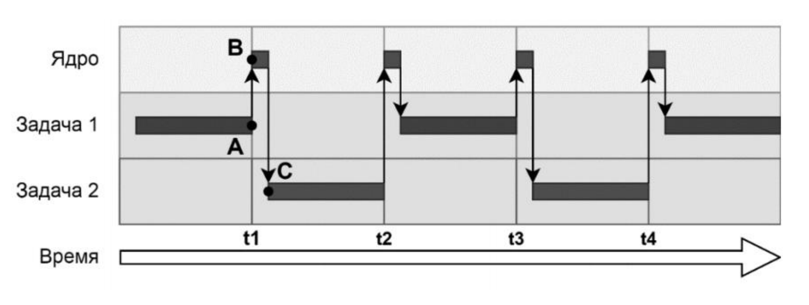
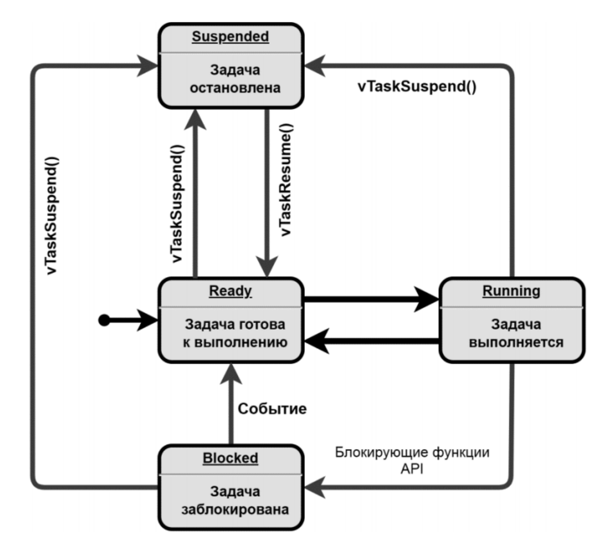

## Часть 1. Стандарт CMSIS-RTOS

![[glossary/rtos#^def-rtos]]

![[glossary/cmsis-rtos#^def-cmsis-rtos]]

Стандарт позволяет заменить используемую операционную систему с минимальными правками в коде, а также перенести существующую программу на другой процессор семейства ARM. Например, при разработке универсальной библиотеки, которой требуется многозадачность, интерфейс CMSIS-RTOS имеет прямой смысл: заранее не известно, какую ОСРВ выберет пользователь библиотеки.

С другой стороны, в CMSIS-RTOS разработчик ограничен базовым набором функций, определённым в стандарте, тогда как оригинальный программный интерфейс ОСРВ обычно предоставляет больше инструментов.

Таким образом, использование CMSIS-RTOS не является обязательным, и ради всех возможностей [[glossary/freertos\|FreeRTOS]] работают напрямую с её функциями. Именно так и сделано в настоящей работе.

> [!note] FreeRTOS в пакете STM32Cube
> Компания ST включила ОСРВ FreeRTOS в пакет STM32Cube вместе с поддержкой работы по стандарту CMSIS-RTOS. Поэтому отдельно скачивать дистрибутив системы не требуется.

## Часть 2. Архитектура FreeRTOS

### 1. Основные свойства ОСРВ FreeRTOS

![[glossary/freertos#^def-freertos]]

Открытая лицензия позволяет изучать и изменять исходный код, а также применять систему в коммерческих проектах. FreeRTOS разрабатывается с учётом требований [[glossary/misra-c\|MISRA C]]:2012, однако поставляется без сертификата соответствия.

Перечислим свойства системы, существенные для встраиваемых применений.

- **Кроссплатформенность.** Поддерживаются процессоры ARM Cortex-M/A/R, AVR, PIC, RISC-V и другие.
- **Скромные требования к ресурсам.** Ядро занимает от 6 КБ памяти программ и 1–2 КБ ОЗУ.
- **Детерминированность.** Время [[glossary/context-switch\|переключения задач]] и время отклика — то есть время запуска обработчика события — можно рассчитать и гарантировать.
- **Готовые средства многозадачности и синхронизации.** Потоки, [[glossary/message-queue\|очереди]], [[glossary/semaphore\|семафоры]], [[glossary/mutex\|мьютексы]] с наследованием приоритета, уведомления, программные таймеры, пулы памяти. Работа с периферийными устройствами при этом остаётся на уровне приложения или системных библиотек — таких как [[glossary/hal-ll\|HAL]].

Существует также расширенная версия системы — FreeRTOS-MPU, изолирующая задачи друг от друга с помощью аппаратного блока защиты памяти MPU.

### 2. Вытесняющий планировщик

![[glossary/preemptive-scheduler#^def-preemptive-scheduler]]

Каждой задаче выделяется квант времени — обычно около 1 мс, — в течение которого она выполняет свою работу, а затем вытесняется планировщиком. Планировщик выбирает следующую задачу из готовых к исполнению. Так операционная система раздаёт равное время всем задачам одного приоритета, создавая впечатление, что действия выполняются одновременно (рисунок 1).

*Рисунок 1 – Вытеснение задач планировщиком.*

![[glossary/context-switch#^def-context-switch]]

![[glossary/tcb#^def-tcb]]

В ОСРВ FreeRTOS нет различия между задачей и потоком — задачу называют также потоком. С точки зрения операционной системы поток может находиться в одном из четырёх состояний, показанных на рисунке 2.

*Рисунок 2 – Состояния потока в ОСРВ FreeRTOS.*

Выполняющийся (Running) поток может перевести себя в состояние «заблокирован» (Blocked), начав тем самым ожидание некоторого события — например, через примитив синхронизации семафор. Другой пример входа в это состояние — функция `vTaskDelay()`, после вызова которой поток остаётся заблокированным заданное время.

В дальнейшем ядро разблокирует поток и переводит его в состояние «готов к выполнению» (Ready) — поток снова доступен планировщику.

Выполняющийся поток может добровольно приостановить свою работу, вызвав функцию `vTaskSuspend()`. Она принимает дескриптор приостанавливаемого потока или `NULL`, если поток приостанавливает сам себя. В этом случае поток переходит в состояние «приостановлен» (Suspended). Возобновляется приостановленный поток функцией `vTaskResume()`.

Порядком выполнения потоков управляет метка приоритета. Приоритет назначается потоку при создании, а изменить его у существующего потока позволяет функция `vTaskPrioritySet()`.

FreeRTOS предоставляет три алгоритма планирования.

1. **Приоритетное вытесняющее планирование с квантованием времени.** Квантование распределяет процессорное время между потоками. Планировщик вытесняет выполняющийся поток, как только готовым к выполнению становится поток с более высоким приоритетом. Если готовы несколько задач с одинаковым приоритетом, планировщик по очереди переводит каждую из них в состояние «выполняется».

2. **Приоритетное вытесняющее планирование без квантования времени.** Перешедший в состояние «выполняется» поток освобождает процессор только добровольно — блокируясь, останавливаясь или уступая, — либо когда готовым становится поток с более высоким приоритетом. Число переключений контекста при этом значительно сокращается, а значит, снижается и их влияние на общую производительность.

3. **Кооперативное планирование.** Переключение потоков происходит только по команде «уступить», вызванной внутри выполняющегося потока, либо по его завершении.

### 3. Управление памятью

FreeRTOS использует динамическую память: забирает и отдаёт память в [[glossary/heap\|кучу]] по мере необходимости.

![[glossary/heap#^def-heap]]

Существует также режим и программный интерфейс, при которых FreeRTOS обходится только статической памятью. Применять их сложнее, поскольку разработчику приходится самостоятельно отводить память под каждый объект системы.

FreeRTOS предлагает пять схем работы с динамической памятью (распределителей, или аллокаторов) и соответствующие им функции выделения и освобождения памяти — `pvPortMalloc()` и `vPortFree()`.

> [!abstract] Сделать запись в конспект
> Ознакомьтесь со схемами распределения памяти `heap_1` — `heap_5` по разделу [2.2 Example Memory Allocation Schemes](docs/mastering-the-freertos-kernel.pdf#page=55) документа [1] и законспектируйте основные отличия этих схем.
