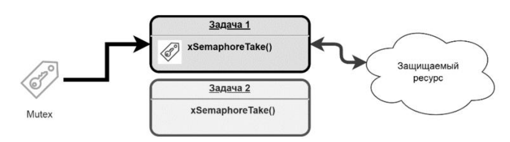
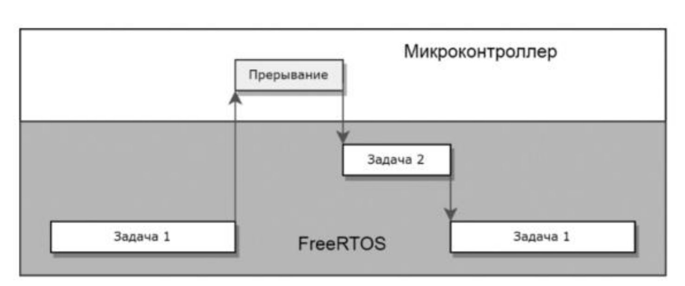
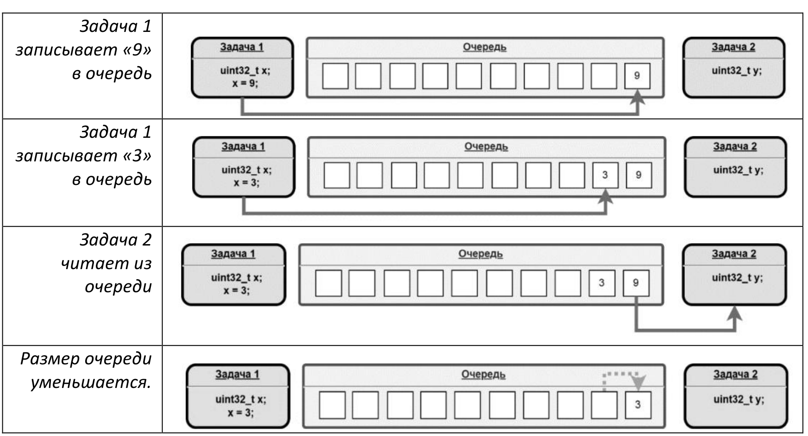

## Часть 1. Создание проекта с FreeRTOS и HAL

1. Создайте проект для отладочной платы [[glossary/nucleo-h745\|ST Nucleo H745ZI-Q]] с библиотекой [[glossary/hal-ll\|HAL]]. За основу возьмите шаблон `template_project_HAL_CM7` из архива [[lab08/index#Файлы к работе\|файлов к работе]]: скопируйте папку шаблона, переименуйте её и откройте в [[glossary/vscode\|VS Code]]. В шаблоне уже подключены библиотека HAL и вспомогательные библиотеки предыдущих работ. Подойдёт и собственный проект ЛР7.

2. Дистрибутив [[glossary/freertos\|FreeRTOS]] отдельно скачивать не нужно: он поставляется в пакете STM32Cube и после установки фреймворка `stm32cube` лежит в каталоге

   ```text
   C:\PioVScPort\platformio\packages\framework-stm32cubeh7\Middlewares\Third_Party\FreeRTOS\Source
   ```

   Папка `portable` дистрибутива содержит платформозависимый код для конкретных компиляторов и процессоров. Такие версии называются портами (от англ. *portable*). Кроме того, в дистрибутиве есть папки `CMSIS_RTOS` и `CMSIS_RTOS_V2` с дополнениями для работы по интерфейсу [[glossary/cmsis-rtos\|CMSIS-RTOS]] и CMSIS-RTOS-V2 — в настоящей работе они не понадобятся.

   2.1. Создайте в папке `lib` проекта директорию `FreeRTOS` и скопируйте в неё содержимое дистрибутива, **кроме** папок `portable`, `CMSIS_RTOS` и `CMSIS_RTOS_V2`.

   2.2. Скопируйте в директорию `lib/FreeRTOS/` файлы `port.c` и `portmacro.h` из папки дистрибутива `portable/GCC/ARM_CM7/r0p1` — это порт для компилятора [[glossary/gcc\|GCC]] и процессора Cortex-M7.

   2.3. Скопируйте в директорию `lib/FreeRTOS/MemMang` файл `heap_4.c` из папки `portable/MemMang` дистрибутива: в работе применяется схема управления динамической памятью `heap_4`.

3. Процессор Cortex-M7 имеет модуль операций с плавающей точкой ([[glossary/fpu\|FPU]]), и порт FreeRTOS для Cortex-M7 его использует. Поэтому в файле `platformio.ini` к параметру `build_flags` нужно добавить два флага компиляции.

| Флаг компиляции | Назначение |
| --- | --- |
| `-mfpu=fpv5-sp-d16` | Задаёт архитектуру модуля FPU — ARM FPv5, применяемую в ядре Cortex-M7, — только для одинарной точности (тип `float`). |
| `-mfloat-abi=softfp` | Задаёт двоичный интерфейс работы с FPU: вычисления выполняет аппаратный модуль, а параметры передаются через регистры общего назначения. |

4. У FreeRTOS есть специальный файл конфигурации `FreeRTOSConfig.h`. Переименуйте файл `lib/FreeRTOS/include/FreeRTOSConfig_template.h` в `FreeRTOSConfig.h` и откройте его для просмотра. В дистрибутиве FreeRTOS из пакета STM32CubeH7 этот файл уже содержит рабочие настройки для микроконтроллеров серии STM32H7.

> [!abstract] Сделать запись в конспект
> Обратите внимание на назначение следующих параметров конфигурации и запишите их в конспект.

| Параметр | Назначение |
| --- | --- |
| `#define configUSE_PREEMPTION 1` | Алгоритм планировщика: 1 — приоритетное вытесняющее планирование с квантованием времени, 0 — кооперативное планирование. |
| `#define configMAX_PRIORITIES (7)` | Число уровней приоритета. В данном случае — от 0 до 6, где 6 соответствует наивысшему приоритету. |
| `#define configLIBRARY_LOWEST_INTERRUPT_PRIORITY 0xf`<br>`#define configPRIO_BITS 4` | Аппаратная конфигурация [[glossary/nvic\|NVIC]]: разрядность поля приоритета и наименьший приоритет прерывания в процессорном ядре. |
| `#define configTOTAL_HEAP_SIZE ((size_t)(15*1024))` | Размер [[glossary/heap\|кучи]], которой распоряжается менеджер динамической памяти. |
| `#define configLIBRARY_MAX_SYSCALL_INTERRUPT_PRIORITY 5` | Наивысший приоритет прерывания, из обработчика которого можно вызывать функции FreeRTOS. Обработчики более приоритетных прерываний функции ОСРВ вызывать не вправе. |
| `#define vPortSVCHandler SVC_Handler`<br>`#define xPortPendSVHandler PendSV_Handler`<br>`#define xPortSysTickHandler SysTick_Handler` | Имена, под которыми обработчики FreeRTOS попадут в [[glossary/isr-vector\|таблицу векторов прерываний]]. Исключения `SVCall`, `PendSV` и [[glossary/systick\|SysTick]] система использует для [[glossary/context-switch\|переключения контекста]] и определяет их обработчики сама. |

> [!note] Параметры по умолчанию
> Некоторые конфигурационные параметры могут в файле `FreeRTOSConfig.h` отсутствовать — тогда они принимают значение по умолчанию. Полный перечень параметров приведён в разделе [7 Kernel Configuration](docs/freertos-reference-manual-v10.pdf#page=323) документа [2].

5. Включите параметр `INCLUDE_vTaskDelayUntil`, установив его значение в 1: эта функция понадобится в демонстрационной программе.

6. FreeRTOS определяет и использует системный таймер SysTick. Но SysTick нужен и библиотеке HAL — как источник базового времени, по которому отсчитываются таймауты в функциях драйверов. Чтобы разрешить эту коллизию, библиотеке HAL отдаётся отдельный аппаратный таймер — TIM2.

7. Создайте файл `src/cm7app/hal_tick_tim2.c` с кодом листинга 1 и изучите его. В файле переопределены [[glossary/weak-symbol\|слабые функции]] библиотеки HAL, которые отвечают за инициализацию и работу её базового таймера: TIM2 настраивается на генерацию прерывания каждую миллисекунду. Сюда же помещён обработчик прерывания таймера.

**Листинг 1: src/cm7app/hal_tick_tim2.c**

```c title="src/cm7app/hal_tick_tim2.c" showLineNumbers
#include <stm32h7xx_hal.h>
#include <string.h>

TIM_HandleTypeDef htim2;

/** @brief Конфигурация TIM2 как источника базового времени библиотеки HAL.
 *  Таймер должен генерировать прерывание каждую миллисекунду
 *  с приоритетом TickPriority.
 *  @note Функция вызывается из HAL_Init() и из HAL_RCC_ClockConfig().
 *  @retval Статус HAL */
HAL_StatusTypeDef HAL_InitTick(uint32_t TickPriority) {
    // Приоритет прерывания таймера
    if (TickPriority >= (1UL << __NVIC_PRIO_BITS)) {
        return HAL_ERROR;
    }
    HAL_NVIC_SetPriority(TIM2_IRQn, TickPriority, 0U);
    HAL_NVIC_EnableIRQ(TIM2_IRQn);
    uwTickPrio = TickPriority;  // библиотека HAL передаст его в следующий вызов

    // Вычисление частоты тактирования таймера
    RCC_ClkInitTypeDef clkconfig = {0};
    uint32_t pFLatency = 0;
    HAL_RCC_GetClockConfig(&clkconfig, &pFLatency);
    uint32_t timer_clock = HAL_RCC_GetPCLK1Freq();
    if (clkconfig.APB1CLKDivider != RCC_HCLK_DIV1) {
        timer_clock *= 2;
    }

    // Инициализация и запуск TIM2
    __HAL_RCC_TIM2_CLK_ENABLE();
    memset(&htim2, 0, sizeof(htim2));
    htim2.Instance = TIM2;
    htim2.Init.Prescaler = timer_clock / 1000000U - 1U;  // счётчик тикает с частотой 1 МГц
    htim2.Init.Period = 1000U - 1U;                      // событие UE каждую миллисекунду
    htim2.Init.ClockDivision = TIM_CLOCKDIVISION_DIV1;
    htim2.Init.CounterMode = TIM_COUNTERMODE_UP;
    if (HAL_TIM_Base_Init(&htim2) != HAL_OK) {
        return HAL_ERROR;
    }
    return HAL_TIM_Base_Start_IT(&htim2);
}

/** Приостановка базового таймера */
void HAL_SuspendTick(void) {
    __HAL_TIM_DISABLE_IT(&htim2, TIM_IT_UPDATE);
}

/** Возобновление базового таймера */
void HAL_ResumeTick(void) {
    __HAL_TIM_ENABLE_IT(&htim2, TIM_IT_UPDATE);
}

/** Обработчик прерывания таймера */
void TIM2_IRQHandler(void) {
    HAL_TIM_IRQHandler(&htim2);
}

/** Вызывается драйвером HAL по событию обновления таймера */
void HAL_TIM_PeriodElapsedCallback(TIM_HandleTypeDef* htim) {
    if (htim->Instance == TIM2) {
        HAL_IncTick();
    }
}
```

8. Удалите из файла `src/cm7app/hal_it.c` обработчик `SysTick_Handler()`. Своего обработчика этого исключения у программы больше нет: счётчик HAL наращивает теперь прерывание TIM2, а сам SysTick принадлежит FreeRTOS, которая определяет его обработчик через макрос `xPortSysTickHandler`. Если оставить обработчик в `hal_it.c`, [[glossary/linker\|компоновщик]] сообщит о повторном определении символа `SysTick_Handler`.

9. Приведите файл `src/cm7app/main.h` к виду листинга 2. Этот файл собирает подключение заголовочных файлов и общие константы программы; он включается во все файлы приложения.

**Листинг 2: src/cm7app/main.h**

```c title="src/cm7app/main.h" showLineNumbers
#pragma once

#include <stm32h7xx_hal.h>
#include <boot_guard.h>
#include <error_state.h>
#include <hal_helpers.h>
#include <led.h>
#include <vterm.h>

#define VTERM_SPEED 115200
```

10. Проверьте сборку проекта и его работу с тривиальным приложением (листинг 3) — должен мигать зелёный светодиод.

**Листинг 3: src/cm7app/main.c**

```c title="src/cm7app/main.c" showLineNumbers
#include "main.h"

#include <FreeRTOS.h>

int main(void) {
    __enable_irq();
    boot_guard();
    vterm_init(VTERM_SPEED);
    led_enable(led_all);
    ASSERT_HAL_STATUS(HAL_Init());  // вызывает HAL_InitTick(), а та запускает TIM2

    while (1) {
        led_toggle(led_green);
        HAL_Delay(500);
    }
}
```

> [!note] Зачем здесь `FreeRTOS.h`
> Ни одной функции ОСРВ эта программа не вызывает, и подключение заголовочного файла ей формально не нужно. Но именно по директивам `#include` менеджер библиотек PlatformIO решает, какие библиотеки из папки `lib` собирать. Без этой строки `lib/FreeRTOS` в сборку не попадёт, и проверить настройку ОСРВ не удастся.

## Часть 2. Драйвер экрана

1. Дальше в работе используется дисплей из состава лабораторного стенда.

![[glossary/ili9488#^def-ili9488]]

Дисплей подключается к микроконтроллеру по интерфейсу [[glossary/spi\|SPI]].

![[glossary/spi#^def-spi]]

2. Добавьте в папку `lib` проекта библиотеку `display` из [[lab08/index#Файлы к работе\|файлов к работе]].

3. Откройте файл `lib/display/display.h` и изучите интерфейс библиотеки. В ней всего две функции — инициализация экрана и вывод закрашенной цветом прямоугольной области. Координаты точек отсчитываются от левого верхнего угла экрана, точка (0, 0).

4. Драйвер работает через модуль HAL SPI, поэтому в файле конфигурации библиотеки HAL `include/stm32h7xx_hal_conf.h` добавьте в секцию **Module Selection** строку:

<div class="mkvs-retype">

```c
#define HAL_SPI_MODULE_ENABLED
```

</div>

5. Для проверки драйвера измените функцию `main()` так, чтобы вместе со светодиодом мигал зелёный квадрат на дисплее, и запустите программу.

**Листинг 4: src/cm7app/main.c**

```c title="src/cm7app/main.c" showLineNumbers
#include "main.h"

#include <FreeRTOS.h>
#include <display.h>

int main(void) {
    __enable_irq();
    boot_guard();
    vterm_init(VTERM_SPEED);
    led_enable(led_all);
    ASSERT_HAL_STATUS(HAL_Init());

    display_init();  // только после инициализации HAL: драйвер вызывает HAL_Delay()

    for (int i = 0;; i++) {
        if (i % 2) {
            led_on(led_green);
            display_rectangle(230, 110, 20, 20, display_color_green);
        } else {
            led_off(led_green);
            display_rectangle(230, 110, 20, 20, display_color_black);
        }
        HAL_Delay(500);
    }
}
```

## Часть 3. Создание потоков

1. Программа на базе FreeRTOS строится в два этапа: сначала создаются потоки, затем запускается планировщик — функцией `vTaskStartScheduler()`. Она берёт на себя диспетчеризацию потоков и управление не возвращает; исключение составляет случай, когда памяти не хватило даже на служебные потоки самой ОСРВ.

> [!warning] Важная информация
> Ради экономии памяти планировщик занимает стек функции `main()` под собственные нужды. Поэтому после вызова `vTaskStartScheduler()` нельзя пользоваться переменными, объявленными в `main()`, а всё, к чему обращаются потоки, должно жить в глобальной области видимости или в куче.

> [!note] Потоки можно создать и позже
> Создание потоков на первом этапе, строго говоря, не обязательно: в системе всегда есть встроенный поток простоя Idle, а остальные потоки могут быть созданы позднее — в том числе в обработчиках прерываний.

2. Задачи создаются функцией `xTaskCreate()`. Её прототип выглядит так:

```c
BaseType_t xTaskCreate(TaskFunction_t pxTaskCode,
                       const char* const pcName,
                       const configSTACK_DEPTH_TYPE usStackDepth,
                       void* const pvParameters,
                       UBaseType_t uxPriority,
                       TaskHandle_t* const pxCreatedTask);
```

- `pxTaskCode` — указатель на функцию, реализующую задачу;
- `pcName` — имя задачи (нужно только при отладке);
- `usStackDepth` — размер стека, выделяемого задаче, в словах (одно слово — 4 байта);
- `pvParameters` — значение, которое будет передано функции задачи как аргумент;
- `uxPriority` — приоритет, с которым будет выполняться задача;
- `pxCreatedTask` — [[glossary/tcb\|дескриптор]] созданной задачи. В дальнейшем по нему на задачу ссылаются при вызовах функций API.

Функция возвращает `pdPASS`, если задача создана, и `pdFAIL`, если создать её не удалось. Вторая ситуация обычно означает, что в куче FreeRTOS не хватило памяти.

> [!note] Об именах функций FreeRTOS
> Имя функции начинается со строчного префикса, обозначающего тип возвращаемого значения (`v` — `void`, `x` — `BaseType_t`, `pv` — указатель на `void`), а дальше с прописной буквы идёт имя модуля, в котором функция определена: `vTaskDelay()`, `xQueueCreate()`, `pvPortMalloc()`.

3. В качестве примера рассмотрим программу из двух потоков. Первый изменяет положение квадрата с частотой 100 Гц, второй отображает квадрат на экране с частотой 30 Гц. Положение и прочие характеристики квадрата описывает структура-дескриптор `Square`.

   Добавьте в проект файл `src/cm7app/square.h` (листинг 5).

**Листинг 5: src/cm7app/square.h**

```c title="src/cm7app/square.h" showLineNumbers
#pragma once

#include <display.h>
#include <stdint.h>

#define SQUARE_EM_SCALE 100L /* 1 юнит = 0,01 пикселя */

/** Квадрат. Его координаты — координаты левого верхнего угла */
typedef struct {
    uint16_t size_px;          ///< длина стороны в пикселях
    display_color_t color;     ///< цвет
    int32_t x_drawn, y_drawn;  ///< координаты, по которым квадрат отрисован, в юнитах
    int32_t x, y;              ///< текущие координаты в юнитах
    int16_t vx_px, vy_px;      ///< вектор скорости, пикселей в секунду
} Square;
```

4. Основная логика приложения размещается в файле `src/cm7app/main.c` — замените его содержимое кодом листинга 6.

**Листинг 6: src/cm7app/main.c**

```c title="src/cm7app/main.c" showLineNumbers
#include "main.h"

#include <FreeRTOS.h>
#include <assert.h>
#include <display.h>
#include <task.h>

#include "square.h"

#define DRAW_FPS   30   // кадров в секунду
#define MOVE_FPS   100  // Гц
#define BACKGROUND display_color_black

/**** Глобальные переменные ************************************************/

// Дескриптор квадрата
Square square = {.size_px = 20,
                 .color = display_color_red,
                 .x = (DISPLAY_WIDTH / 2 - 10) * SQUARE_EM_SCALE,
                 .y = (DISPLAY_HEIGHT / 2 - 10) * SQUARE_EM_SCALE,
                 .vx_px = 100,
                 .vy_px = 40};

// Дескрипторы потоков
TaskHandle_t handle_draw, handle_move;

/**** Функции потоков ******************************************************/

/** Поток отображения квадрата на экране
 *  @param arg указатель на дескриптор квадрата Square */
void thread_draw_square(void* arg) {
    assert(arg && "Дескриптор квадрата должен быть передан в поток");
    volatile Square* rect = arg;
    rect->x_drawn = rect->x;
    rect->y_drawn = rect->y;
    TickType_t time_base = xTaskGetTickCount();  // для точного времени между кадрами
    while (1) {
        if (rect->x_drawn != rect->x || rect->y_drawn != rect->y) {
            // Затереть квадрат на старом месте
            display_rectangle(rect->x_drawn / SQUARE_EM_SCALE, rect->y_drawn / SQUARE_EM_SCALE,
                              rect->size_px, rect->size_px, BACKGROUND);
            // Нарисовать на новом
            display_rectangle(rect->x / SQUARE_EM_SCALE, rect->y / SQUARE_EM_SCALE,
                              rect->size_px, rect->size_px, rect->color);
            rect->x_drawn = rect->x;
            rect->y_drawn = rect->y;
        }
        vTaskDelayUntil(&time_base, pdMS_TO_TICKS(1000 / DRAW_FPS));
    }
    vTaskDelete(NULL);  // функция задачи не должна возвращать управление
}

/** Поток движения квадрата
 *  @param arg указатель на дескриптор квадрата Square */
void thread_move_square(void* arg) {
    assert(arg && "Дескриптор квадрата должен быть передан в поток");
    volatile Square* rect = arg;
    while (1) {
        // Проверка достижения границ экрана
        if ((rect->vx_px > 0 && rect->x < SQUARE_EM_SCALE * (DISPLAY_WIDTH - rect->size_px)) ||
            (rect->vx_px < 0 && rect->x > 0)) {
            rect->x += rect->vx_px * SQUARE_EM_SCALE / MOVE_FPS;
        } else {  // отскок от края экрана
            rect->vx_px = -rect->vx_px;
        }
        if ((rect->vy_px > 0 && rect->y < SQUARE_EM_SCALE * (DISPLAY_HEIGHT - rect->size_px)) ||
            (rect->vy_px < 0 && rect->y > 0)) {
            rect->y += rect->vy_px * SQUARE_EM_SCALE / MOVE_FPS;
        } else {  // отскок от края экрана
            rect->vy_px = -rect->vy_px;
        }
        vTaskDelay(pdMS_TO_TICKS(1000 / MOVE_FPS));  // частота обновления данных — 100 Гц
    }
    vTaskDelete(NULL);  // функция задачи не должна возвращать управление
}

/**** Main *****************************************************************/

int main(void) {
    __enable_irq();
    boot_guard();
    vterm_init(VTERM_SPEED);
    led_enable(led_all);
    ASSERT_HAL_STATUS(HAL_Init());

    // Инициализация драйвера и очистка экрана
    display_init();
    display_rectangle(0, 0, DISPLAY_WIDTH, DISPLAY_HEIGHT, BACKGROUND);

    BaseType_t res;

    // Поток отрисовки квадрата
    res = xTaskCreate(thread_draw_square, "draw", 1024, &square, 1, &handle_draw);
    assert(res == pdPASS);

    // Поток, обновляющий положение квадрата
    res = xTaskCreate(thread_move_square, "move", 1024, &square, 1, &handle_move);
    assert(res == pdPASS);

    vTaskStartScheduler();
    while (1) {
        // сюда управление попадает, только если планировщику не хватило памяти
    }
}
```

5. Запустите программу и понаблюдайте за результатом. По экрану должен двигаться красный квадрат, а за ним время от времени возникать «шлейф».

6. Изучите код программы.

   6.1. Дескрипторы потоков и дескриптор квадрата объявлены в глобальной области видимости и потому не зависят от стека функции `main()`.

   6.2. Координаты в дескрипторе квадрата хранятся в масштабе 100 (сто единиц соответствуют одному пикселю на экране). Это позволяет менять положение квадрата с точностью 0,01 пикселя, оставаясь в целочисленной арифметике.

   6.3. Поток движения каждые 10 мс пересчитывает координаты квадрата в соответствии с заданными в дескрипторе скоростями. В модели реализован отскок: при касании границы экрана направление скорости меняется на противоположное.

   6.4. Поток отображения запоминает, по каким координатам был отрисован квадрат. С частотой 30 Гц он стирает прежнее изображение и рисует квадрат по новым координатам. Поля `x_drawn` и `y_drawn` принадлежат только этому потоку.

   6.5. В заблокированное состояние задача переходит после вызова функции `vTaskDelay()`. Функция доступна, только если в файле `FreeRTOSConfig.h` константа `INCLUDE_vTaskDelay` определена и равна 1. Время блокировки задаётся в «тиках», а переводит миллисекунды в тики макрос `pdMS_TO_TICKS()`.

   6.6. Задача, которая больше не нужна, должна быть явно удалена вызовом `vTaskDelete()`. Функция задачи не вправе просто вернуть управление: возвращаться ей некуда. В листинге вызов стоит после бесконечного цикла и потому не выполняется никогда — он оставлен как страховка на случай, если цикл однажды перестанет быть бесконечным.

7. Самостоятельно изучите документацию на функции `vTaskDelayUntil()` и `xTaskGetTickCount()`. Обе применяются для реализации периодических задач, но задача с `vTaskDelay()` не даёт строго фиксированной частоты выполнения: момент выхода из состояния Blocked отсчитывается от момента вызова `vTaskDelay()`, а тот смещается на время работы самой задачи. Задача, вызывающая `vTaskDelayUntil()`, от этой проблемы избавлена, поскольку опирается на абсолютное время.

## Часть 4. Мьютексы

1. При разработке многопоточных программ особое внимание следует уделять ресурсам, которые используются несколькими потоками.

   Например, в программе части 3 оба потока работают с одним и тем же дескриптором квадрата: поток движения записывает текущие координаты, а поток отображения считывает их, чтобы нарисовать квадрат в нужной позиции. Представим, что поток рисования будет вытеснен потоком движения прямо между чтением `X` и чтением `Y`, — тогда квадрат окажется нарисован по старой координате `X` и новой координате `Y`.

![[glossary/race-condition#^def-race-condition]]

Именно поэтому в программе части 3 виден «шлейф».

2. Доступ к разделяемым ресурсам следует синхронизировать — например, с помощью мьютекса.

![[glossary/mutex#^def-mutex]]

На рисунке 3 задача 1 захватила мьютекс, поскольку первой вызвала функцию `xSemaphoreTake()`. Задача 2 вызвала ту же функцию позже и была заблокирована; она разблокируется после того, как задача 1 освободит мьютекс вызовом `xSemaphoreGive()`.



*Рисунок 3 – Защита разделяемого ресурса мьютексом.*

3. Мьютекс занимает 8 байт памяти в простом режиме и 16 байт в рекурсивном. В рекурсивном режиме поток может захватить мьютекс повторно, но обязан столько же раз его освободить, чтобы мьютекс стал доступен другим потокам.

   Чтобы пользоваться мьютексами, в файле `FreeRTOSConfig.h` нужно определить макрос `configUSE_MUTEXES` и установить его равным 1.

   Схожее с мьютексами назначение имеют макросы `taskENTER_CRITICAL()` и `taskEXIT_CRITICAL()`: они обрамляют критическую секцию кода.

![[glossary/critical-section#^def-critical-section]]

> [!abstract] Сделать запись в конспект
> Найдите в разделе [7.2 Critical Sections and Suspending the Scheduler](docs/mastering-the-freertos-kernel.pdf#page=265) документа [1] сведения о назначении этих макросов и запишите в конспект.

4. Исправьте программу из части 3, защитив доступ к координатам квадрата мьютексом.

   4.1. Подключите в файле `main.c` заголовочный файл:

<div class="mkvs-retype">

```c
#include <semphr.h>
```

</div>

   4.2. Объявите среди глобальных переменных дескриптор мьютекса:

<div class="mkvs-retype">

```c
SemaphoreHandle_t squareMutex = NULL;
```

</div>

   4.3. Создайте мьютекс в функции `main()` перед запуском планировщика:

<div class="mkvs-retype">

```c
squareMutex = xSemaphoreCreateMutex();
assert(squareMutex);
```

</div>

   4.4. Добавьте захват и освобождение мьютекса до и после доступа к координатам квадрата (листинг 7).

**Листинг 7: фрагмент src/cm7app/main.c**

```c title="src/cm7app/main.c" showLineNumbers
/** Поток отображения квадрата на экране
 *  @param arg указатель на дескриптор квадрата Square */
void thread_draw_square(void* arg) {
    assert(arg && "Дескриптор квадрата должен быть передан в поток");
    assert(squareMutex && "Мьютекс должен быть создан");
    volatile Square* rect = arg;
    rect->x_drawn = rect->x;
    rect->y_drawn = rect->y;
    TickType_t time_base = xTaskGetTickCount();  // для точного времени между кадрами
    while (1) {
        if (rect->x_drawn != rect->x || rect->y_drawn != rect->y) {
            // Затереть квадрат на старом месте
            display_rectangle(rect->x_drawn / SQUARE_EM_SCALE, rect->y_drawn / SQUARE_EM_SCALE,
                              rect->size_px, rect->size_px, BACKGROUND);

            xSemaphoreTake(squareMutex, portMAX_DELAY);  // захват мьютекса
            int32_t new_x_px = rect->x / SQUARE_EM_SCALE;
            int32_t new_y_px = rect->y / SQUARE_EM_SCALE;
            rect->x_drawn = rect->x;
            rect->y_drawn = rect->y;
            xSemaphoreGive(squareMutex);  // освобождение мьютекса

            // Нарисовать квадрат на новом месте
            display_rectangle(new_x_px, new_y_px, rect->size_px, rect->size_px, rect->color);
        }
        vTaskDelayUntil(&time_base, pdMS_TO_TICKS(1000 / DRAW_FPS));
    }
    vTaskDelete(NULL);  // функция задачи не должна возвращать управление
}

/** Поток движения квадрата
 *  @param arg указатель на дескриптор квадрата Square */
void thread_move_square(void* arg) {
    assert(arg && "Дескриптор квадрата должен быть передан в поток");
    assert(squareMutex && "Мьютекс должен быть создан");
    volatile Square* rect = arg;
    while (1) {
        xSemaphoreTake(squareMutex, portMAX_DELAY);  // захват мьютекса
        // Проверка достижения границ экрана
        if ((rect->vx_px > 0 && rect->x < SQUARE_EM_SCALE * (DISPLAY_WIDTH - rect->size_px)) ||
            (rect->vx_px < 0 && rect->x > 0)) {
            rect->x += rect->vx_px * SQUARE_EM_SCALE / MOVE_FPS;
        } else {  // отскок от края экрана
            rect->vx_px = -rect->vx_px;
        }
        if ((rect->vy_px > 0 && rect->y < SQUARE_EM_SCALE * (DISPLAY_HEIGHT - rect->size_px)) ||
            (rect->vy_px < 0 && rect->y > 0)) {
            rect->y += rect->vy_px * SQUARE_EM_SCALE / MOVE_FPS;
        } else {  // отскок от края экрана
            rect->vy_px = -rect->vy_px;
        }
        xSemaphoreGive(squareMutex);  // освобождение мьютекса
        vTaskDelay(pdMS_TO_TICKS(1000 / MOVE_FPS));  // частота обновления данных — 100 Гц
    }
    vTaskDelete(NULL);  // функция задачи не должна возвращать управление
}
```

   Обратите внимание: под мьютексом выполняется только чтение пары координат, а вывод на экран остаётся снаружи. Так задача движения не ждёт всё то время, пока драйвер экрана передаёт пиксели по SPI.

5. Запустите доработанную программу и убедитесь, что «шлейф» исчез.

## Часть 5. Семафоры и отложенная обработка прерываний

1. Хорошо спроектированная встраиваемая программа содержит в [[glossary/isr\|обработчике прерывания]] максимально компактный и быстрый код.

   При использовании ОСРВ это особенно важно: какой бы высокий приоритет ни был назначен задачам, они начнут выполняться только тогда, когда процессор закончит обслуживать прерывания.

   Кроме того, код обработчика должен считаться с тем, что задачи и обработчики прерываний обращаются к общим ресурсам — периферийным устройствам и данным — одновременно. Вызывать в обработчике прерывания безопасно только реентерабельные функции.

![[glossary/reentrancy#^def-reentrancy]]

2. При использовании операционной системы во многих случаях целесообразно применять отложенную обработку прерывания.

![[glossary/deferred-interrupt#^def-deferred-interrupt]]

На рисунке 4 показаны возникшее прерывание и задача 2, предназначенная для его обработки. Чтобы обработка началась сразу после выхода из обработчика прерывания, в его коде вызывают макрос `portYIELD_FROM_ISR()` — он запускает переключение контекста.



*Рисунок 4 – Отложенная обработка прерывания.*

Задача-обработчик должна ожидать события, то есть быть заблокированной до момента возникновения прерывания. Для этого используется бинарный семафор.

![[glossary/semaphore#^def-semaphore]]

Для создания бинарного семафора служит функция `xSemaphoreCreateBinary()`, возвращающая дескриптор созданного семафора или `NULL` в случае ошибки. В отличие от мьютекса, здесь одна сторона семафор выдаёт, а другая захватывает. Для захвата используется функция

```c
BaseType_t xSemaphoreTake(SemaphoreHandle_t xSemaphore, TickType_t xTicksToWait);
```

а для выдачи —

```c
BaseType_t xSemaphoreGive(SemaphoreHandle_t xSemaphore);
```

Таким образом, задача-обработчик блокируется на вызове `xSemaphoreTake()` до тех пор, пока обработчик прерывания не вызовет `xSemaphoreGive()`. Однако в обработчике прерывания обычно вызывают специальную функцию выдачи семафора:

```c
BaseType_t xSemaphoreGiveFromISR(SemaphoreHandle_t xSemaphore,
                                 BaseType_t* pxHigherPriorityTaskWoken);
```

В выходной параметр `pxHigherPriorityTaskWoken` записывается `pdTRUE`, если ожидающая семафор задача приоритетнее той, что выполнялась до входа в обработчик, и `pdFALSE` в противном случае. Получив `pdTRUE`, перед выходом из прерывания следует запустить переключение контекста макросом `portYIELD_FROM_ISR()`.

Счётный семафор, в отличие от бинарного, обрабатывает очередь разрешений: он может быть выдан несколько раз — до определённого при его создании предела — и столько же раз захвачен. Счётный семафор тоже годится для отложенной обработки прерываний: например, когда одному обработчику нужно запустить сразу несколько потоков-обработчиков.

3. Доработайте программу так, чтобы по нажатию голубой кнопки B1 обработчик прерывания выдавал бинарный семафор потоку-обработчику, а тот менял цвет квадрата.

   3.1. Добавьте в проект файлы `key_button.h` и `key_button.c` для конфигурации прерывания от кнопки.

**Листинг 8: src/cm7app/key_button.h**

```c title="src/cm7app/key_button.h" showLineNumbers
#pragma once

#include <stm32h7xx_hal.h>

/* Обработка нажатия кнопки по внешнему прерыванию.
   Чтобы воспользоваться этим модулем, необходимо:
   1) задать параметры кнопки макроопределениями в этом файле;
   2) вызвать функцию Key_Button_EXTI_Init(), например из HAL_MspInit();
   3) переопределить weak-функцию HAL_GPIO_EXTI_Callback()
      и вызвать в ней обработчик нажатия кнопки. */

#define KEY_BUTTON_PIN        GPIO_PIN_13
#define KEY_BUTTON_PORT       GPIOC
#define KEY_BUTTON_CLK_ENABLE __HAL_RCC_GPIOC_CLK_ENABLE
#define KEY_BUTTON_IRQn       EXTI15_10_IRQn
#define KEY_BUTTON_IRQHandler EXTI15_10_IRQHandler

/* Обработчик прерывания вызывает функции FreeRTOS, поэтому его приоритет
   должен быть не выше — то есть численно не меньше, — чем значение
   configLIBRARY_MAX_SYSCALL_INTERRUPT_PRIORITY */
#define KEY_BUTTON_IRQ_PRIORITY 6

/** Конфигурация вывода кнопки и линии EXTI */
void Key_Button_EXTI_Init(void);
```

**Листинг 9: src/cm7app/key_button.c**

```c title="src/cm7app/key_button.c" showLineNumbers
#include "key_button.h"

void Key_Button_EXTI_Init(void) {
    KEY_BUTTON_CLK_ENABLE();

    GPIO_InitTypeDef GPIO_InitStruct = {0};
    GPIO_InitStruct.Pin = KEY_BUTTON_PIN;
    GPIO_InitStruct.Mode = GPIO_MODE_IT_RISING;
    GPIO_InitStruct.Pull = GPIO_PULLDOWN;
    HAL_GPIO_Init(KEY_BUTTON_PORT, &GPIO_InitStruct);

    HAL_NVIC_SetPriority(KEY_BUTTON_IRQn, KEY_BUTTON_IRQ_PRIORITY, 0);
    HAL_NVIC_EnableIRQ(KEY_BUTTON_IRQn);
}

void KEY_BUTTON_IRQHandler(void) {
    HAL_GPIO_EXTI_IRQHandler(KEY_BUTTON_PIN);
}
```

   Обратите внимание на приоритет прерывания. Вызывать функции API FreeRTOS разрешено только из обработчиков, приоритет которых не выше `configLIBRARY_MAX_SYSCALL_INTERRUPT_PRIORITY` — иначе вызов придётся на момент, когда ядро закрыло критическую секцию, и внутренние структуры системы окажутся испорчены. Взятое в ЛР7 значение 0 здесь недопустимо.

> [!note] О [[glossary/priority-grouping\|группировке приоритетов]]
> Функция `HAL_Init()` устанавливает группировку `NVIC_PRIORITYGROUP_4` — все четыре разряда приоритета отведены под приоритет вытеснения, разрядов субприоритета не остаётся. Именно этого требует порт FreeRTOS, поэтому менять группировку в программе не нужно.

   3.2. Подключите новый модуль в файле `main.h`:

<div class="mkvs-retype">

```c
#include "key_button.h"
```

</div>

   3.3. Замените содержимое файла `src/cm7app/hal_msp.c` вызовом инициализации кнопки. Библиотека HAL вызывает `HAL_MspInit()` из `HAL_Init()`, поэтому отдельно вызывать её из `main()` не требуется:

<div class="mkvs-retype">

```c
#include "main.h"

void HAL_MspInit(void) {
    Key_Button_EXTI_Init();
}
```

</div>

   3.4. Добавьте в файл `main.c` дескрипторы семафора и потока, обработчик прерывания и поток-обработчик (листинг 10).

**Листинг 10: фрагмент src/cm7app/main.c**

```c title="src/cm7app/main.c" showLineNumbers
/**** Отложенная обработка прерывания **************************************/

TaskHandle_t handle_button;
SemaphoreHandle_t buttonSemaphore = NULL;

/** Вызывается из HAL_GPIO_EXTI_IRQHandler() по прерыванию линии EXTI */
void HAL_GPIO_EXTI_Callback(uint16_t GPIO_Pin) {
    /* Прерывание разрешено раньше, чем создан семафор, поэтому проверяем
       дескриптор: до запуска планировщика обрабатывать нажатие нечем */
    if (GPIO_Pin == KEY_BUTTON_PIN && buttonSemaphore != NULL) {
        BaseType_t xHigherPriorityTaskWoken = pdFALSE;
        xSemaphoreGiveFromISR(buttonSemaphore, &xHigherPriorityTaskWoken);
        portYIELD_FROM_ISR(xHigherPriorityTaskWoken);
    }
}

/** Поток-обработчик нажатия кнопки: меняет цвет квадрата
 *  @param arg указатель на дескриптор квадрата Square */
void thread_button(void* arg) {
    assert(arg && "Дескриптор квадрата должен быть передан в поток");
    assert(buttonSemaphore && "Семафор должен быть создан");
    volatile Square* rect = arg;
    while (1) {
        xSemaphoreTake(buttonSemaphore, portMAX_DELAY);
        rect->color = (rect->color == display_color_red) ? display_color_blue : display_color_red;
    }
    vTaskDelete(NULL);  // функция задачи не должна возвращать управление
}
```

   3.5. Создайте в функции `main()` семафор и поток-обработчик — до вызова планировщика:

<div class="mkvs-retype">

```c
// Бинарный семафор для отложенной обработки прерывания от кнопки
buttonSemaphore = xSemaphoreCreateBinary();
assert(buttonSemaphore);

// Поток-обработчик нажатия кнопки
res = xTaskCreate(thread_button, "button", 128, &square, 1, &handle_button);
assert(res == pdPASS);
```

</div>

   3.6. Запустите доработанную программу и убедитесь, что по нажатию кнопки квадрат меняет цвет с красного на синий и обратно.

## Часть 6. Отладка ошибок памяти

1. Потоку-обработчику кнопки задан минимальный размер стека — 128 слов: код функции потока тривиален, а большой стек расходует доступную память кучи.

   Здесь разработчик сталкивается с системной задачей:

   1) точно определить требуемый размер стека затруднительно;
   2) ресурсы памяти ограничены;
   3) переполнения стека или кучи допустить нельзя.

   Рассмотрим средства контроля этих ошибок, которые предоставляет FreeRTOS. Они же годятся для практической оценки памяти, потребляемой программой.

2. Если задать параметр `configCHECK_FOR_STACK_OVERFLOW` = 1, FreeRTOS будет проверять указатель стека вытесняемого потока на выход за границы при каждом переключении контекста. Обнаружив переполнение, система вызовет функцию обратного вызова

```c
void vApplicationStackOverflowHook(TaskHandle_t xTask, char* pcTaskName);
```

   которую разработчик может переопределить для фиксации и обработки ошибки. Поскольку проверка выполняется при каждом переключении контекста, режим влияет на общую производительность и применять его следует с осторожностью — особенно при высокой частоте тиков.

   Значение `configCHECK_FOR_STACK_OVERFLOW` = 2 включает более строгий контроль: при создании задачи её стек заполняется известным образцом, и система проверяет, не затёрты ли последние байты в конце стека. Так ошибка обнаруживается раньше, чем испортит соседние данные.

3. При анализе и отладке программы полезно оценить, какой объём кучи остаётся свободным. В программном интерфейсе FreeRTOS есть две такие функции. Функция

```c
size_t xPortGetFreeHeapSize(void);
```

   возвращает количество байт, свободных в куче на момент вызова. При использовании схем распределения памяти `heap_4` и `heap_5` доступна также функция

```c
size_t xPortGetMinimumEverFreeHeapSize(void);
```

   которая возвращает наименьшее количество нераспределённых байт, когда-либо остававшихся в куче с начала работы приложения.

4. Если задать параметр `configUSE_MALLOC_FAILED_HOOK` = 1, то при неудачной попытке выделить память из кучи FreeRTOS вызовет функцию обратного вызова

```c
void vApplicationMallocFailedHook(void);
```

   которую разработчик также может переопределить.

## Часть 7. Очереди сообщений

1. Очередь сообщений — третий и последний примитив, который понадобится в работе.

![[glossary/message-queue#^def-message-queue]]

Работа с очередью показана на рисунке 5.



*Рисунок 5 – Запись в очередь и чтение из очереди.*

Когда задача пытается прочитать данные из очереди, она задаёт таймаут ожидания — время, в течение которого она будет находиться в состоянии «заблокирована», если очередь пуста.

У очереди может быть несколько читателей, поэтому на одной очереди могут ожидать сразу несколько задач. Когда данные поступят, разблокирована будет только одна из них — с наивысшим приоритетом.

У очереди может быть и несколько писателей. Задача-писатель блокируется, когда очередь переполнена, и ждёт, пока в ней освободится место.

Очереди можно объединять в группы: тогда задача блокируется в ожидании данных сразу из нескольких очередей группы.

При создании очереди задаются два неизменных параметра — длина очереди (наибольшее число элементов) и размер одного элемента в байтах. Структуру хранимого в очереди сообщения определяет разработчик.

2. Основные функции для работы с очередями.

   2.1. Создание очереди:

```c
QueueHandle_t xQueueCreate(UBaseType_t uxQueueLength, UBaseType_t uxItemSize);
```

   2.2. Запись в очередь:

```c
BaseType_t xQueueSendToFront(QueueHandle_t xQueue, const void* pvItemToQueue,
                             TickType_t xTicksToWait);
BaseType_t xQueueSendToBack(QueueHandle_t xQueue, const void* pvItemToQueue,
                            TickType_t xTicksToWait);

BaseType_t xQueueSendToFrontFromISR(QueueHandle_t xQueue, const void* pvItemToQueue,
                                    BaseType_t* pxHigherPriorityTaskWoken);
BaseType_t xQueueSendToBackFromISR(QueueHandle_t xQueue, const void* pvItemToQueue,
                                   BaseType_t* pxHigherPriorityTaskWoken);
```

   2.3. Чтение из очереди:

```c
BaseType_t xQueueReceive(QueueHandle_t xQueue, void* const pvBuffer, TickType_t xTicksToWait);
```

   2.4. Получение числа сообщений в очереди:

```c
UBaseType_t uxQueueMessagesWaiting(QueueHandle_t xQueue);
```

> [!abstract] Сделать запись в конспект
> Найдите в документах [1] и [2] — разделы [4 Queue Management](docs/mastering-the-freertos-kernel.pdf#page=128) и [3 Queue API](docs/freertos-reference-manual-v10.pdf#page=157) — другие полезные функции для работы с очередями и запишите их в конспект.

3. Добавьте в программу очередь, в которой хранятся команды в виде целых чисел. У этой очереди будут два писателя и один читатель: поток отображения считывает из очереди команду на изменение цвета квадрата, а записывают в неё поток обработки кнопки и новый поток чтения символов из терминала.

   Замените содержимое файла `main.c` кодом листинга 11.

**Листинг 11: src/cm7app/main.c**

```c title="src/cm7app/main.c" showLineNumbers
#include "main.h"

#include <FreeRTOS.h>
#include <assert.h>
#include <display.h>
#include <queue.h>
#include <semphr.h>
#include <task.h>

#include "square.h"

#define DRAW_FPS             30   // кадров в секунду
#define MOVE_FPS             100  // Гц
#define BACKGROUND           display_color_black
#define COMMAND_QUEUE_LENGTH 10

/**** Глобальные переменные ************************************************/

// Дескриптор квадрата
Square square = {.size_px = 20,
                 .color = display_color_red,
                 .x = (DISPLAY_WIDTH / 2 - 10) * SQUARE_EM_SCALE,
                 .y = (DISPLAY_HEIGHT / 2 - 10) * SQUARE_EM_SCALE,
                 .vx_px = 100,
                 .vy_px = 40};

// Дескрипторы потоков
TaskHandle_t handle_draw, handle_move, handle_button, handle_terminal;

// Примитивы синхронизации
SemaphoreHandle_t squareMutex = NULL;
SemaphoreHandle_t buttonSemaphore = NULL;
QueueHandle_t commandQueue = NULL;

/**** Отложенная обработка прерывания **************************************/

/** Вызывается из HAL_GPIO_EXTI_IRQHandler() по прерыванию линии EXTI */
void HAL_GPIO_EXTI_Callback(uint16_t GPIO_Pin) {
    /* Прерывание разрешено раньше, чем создан семафор, поэтому проверяем
       дескриптор: до запуска планировщика обрабатывать нажатие нечем */
    if (GPIO_Pin == KEY_BUTTON_PIN && buttonSemaphore != NULL) {
        BaseType_t xHigherPriorityTaskWoken = pdFALSE;
        xSemaphoreGiveFromISR(buttonSemaphore, &xHigherPriorityTaskWoken);
        portYIELD_FROM_ISR(xHigherPriorityTaskWoken);
    }
}

/** Поток-обработчик нажатия кнопки: возвращает квадрату красный цвет */
void thread_button(void* arg) {
    (void)arg;
    assert(buttonSemaphore && "Семафор должен быть создан");
    assert(commandQueue && "Очередь должна быть создана");
    while (1) {
        xSemaphoreTake(buttonSemaphore, portMAX_DELAY);
        uint8_t command = (uint8_t)display_color_red;
        xQueueReset(commandQueue);  // нажатие кнопки отменяет накопленные команды
        BaseType_t res = xQueueSendToBack(commandQueue, &command, pdMS_TO_TICKS(10));
        assert(res == pdPASS);
    }
    vTaskDelete(NULL);  // функция задачи не должна возвращать управление
}

/**** Функции потоков ******************************************************/

/** Поток чтения символов из терминала */
void thread_terminal(void* arg) {
    (void)arg;
    assert(commandQueue && "Очередь должна быть создана");
    while (1) {
        unsigned char ch;
        do {
            ch = vterm_keypressed();
            if (ch >= '1' && ch <= '5') {
                uint8_t command = (uint8_t)(ch - '0');
                BaseType_t res = xQueueSendToBack(commandQueue, &command, pdMS_TO_TICKS(10));
                assert(res == pdPASS);
            }
        } while (ch != 0);
        vTaskDelay(pdMS_TO_TICKS(5));
    }
    vTaskDelete(NULL);  // функция задачи не должна возвращать управление
}

/** Поток отображения квадрата на экране
 *  @param arg указатель на дескриптор квадрата Square */
void thread_draw_square(void* arg) {
    assert(arg && "Дескриптор квадрата должен быть передан в поток");
    assert(squareMutex && "Мьютекс должен быть создан");
    assert(commandQueue && "Очередь должна быть создана");
    volatile Square* rect = arg;
    rect->x_drawn = rect->x;
    rect->y_drawn = rect->y;
    TickType_t time_base = xTaskGetTickCount();  // для точного времени между кадрами
    while (1) {
        // Применяем все накопившиеся команды: в силе остаётся последняя
        uint8_t command;
        while (xQueueReceive(commandQueue, &command, 0) == pdPASS) {
            rect->color = (display_color_t)command;
        }
        if (rect->x_drawn != rect->x || rect->y_drawn != rect->y) {
            // Затереть квадрат на старом месте
            display_rectangle(rect->x_drawn / SQUARE_EM_SCALE, rect->y_drawn / SQUARE_EM_SCALE,
                              rect->size_px, rect->size_px, BACKGROUND);

            xSemaphoreTake(squareMutex, portMAX_DELAY);  // захват мьютекса
            int32_t new_x_px = rect->x / SQUARE_EM_SCALE;
            int32_t new_y_px = rect->y / SQUARE_EM_SCALE;
            rect->x_drawn = rect->x;
            rect->y_drawn = rect->y;
            xSemaphoreGive(squareMutex);  // освобождение мьютекса

            // Нарисовать квадрат на новом месте
            display_rectangle(new_x_px, new_y_px, rect->size_px, rect->size_px, rect->color);
        }
        vTaskDelayUntil(&time_base, pdMS_TO_TICKS(1000 / DRAW_FPS));
    }
    vTaskDelete(NULL);  // функция задачи не должна возвращать управление
}

/** Поток движения квадрата
 *  @param arg указатель на дескриптор квадрата Square */
void thread_move_square(void* arg) {
    assert(arg && "Дескриптор квадрата должен быть передан в поток");
    assert(squareMutex && "Мьютекс должен быть создан");
    volatile Square* rect = arg;
    while (1) {
        xSemaphoreTake(squareMutex, portMAX_DELAY);  // захват мьютекса
        // Проверка достижения границ экрана
        if ((rect->vx_px > 0 && rect->x < SQUARE_EM_SCALE * (DISPLAY_WIDTH - rect->size_px)) ||
            (rect->vx_px < 0 && rect->x > 0)) {
            rect->x += rect->vx_px * SQUARE_EM_SCALE / MOVE_FPS;
        } else {  // отскок от края экрана
            rect->vx_px = -rect->vx_px;
        }
        if ((rect->vy_px > 0 && rect->y < SQUARE_EM_SCALE * (DISPLAY_HEIGHT - rect->size_px)) ||
            (rect->vy_px < 0 && rect->y > 0)) {
            rect->y += rect->vy_px * SQUARE_EM_SCALE / MOVE_FPS;
        } else {  // отскок от края экрана
            rect->vy_px = -rect->vy_px;
        }
        xSemaphoreGive(squareMutex);  // освобождение мьютекса
        vTaskDelay(pdMS_TO_TICKS(1000 / MOVE_FPS));  // частота обновления данных — 100 Гц
    }
    vTaskDelete(NULL);  // функция задачи не должна возвращать управление
}

/**** Main *****************************************************************/

int main(void) {
    __enable_irq();
    boot_guard();
    vterm_init(VTERM_SPEED);
    led_enable(led_all);
    ASSERT_HAL_STATUS(HAL_Init());  // вызывает HAL_MspInit()

    // Инициализация драйвера и очистка экрана
    display_init();
    display_rectangle(0, 0, DISPLAY_WIDTH, DISPLAY_HEIGHT, BACKGROUND);

    // Мьютекс для доступа к координатам квадрата
    squareMutex = xSemaphoreCreateMutex();
    assert(squareMutex);

    // Бинарный семафор для отложенной обработки прерывания от кнопки
    buttonSemaphore = xSemaphoreCreateBinary();
    assert(buttonSemaphore);

    // Очередь команд смены цвета
    commandQueue = xQueueCreate(COMMAND_QUEUE_LENGTH, sizeof(uint8_t));
    assert(commandQueue);

    BaseType_t res;
    res = xTaskCreate(thread_draw_square, "draw", 512, &square, 1, &handle_draw);
    assert(res == pdPASS);
    res = xTaskCreate(thread_move_square, "move", 512, &square, 1, &handle_move);
    assert(res == pdPASS);
    res = xTaskCreate(thread_button, "button", 128, NULL, 1, &handle_button);
    assert(res == pdPASS);
    res = xTaskCreate(thread_terminal, "terminal", 128, NULL, 1, &handle_terminal);
    assert(res == pdPASS);

    vTaskStartScheduler();
    while (1) {
        // сюда управление попадает, только если планировщику не хватило памяти
    }
}
```

4. Изучите представленный пример работы с очередью и обработки команд.

   4.1. Поток кнопки больше не трогает дескриптор квадрата: он лишь кладёт в очередь команду. Дескриптор квадрата теперь изменяют только два потока, а не три, и мьютекс по-прежнему защищает только координаты.

   4.2. Команда — это номер цвета из перечисления `display_color_t`, поэтому элемент очереди занимает один байт. Символы `1`—`5`, введённые в терминале, превращаются в номера цветов простым вычитанием кода символа `0`.

   4.3. Перед записью своей команды поток кнопки очищает очередь функцией `xQueueReset()`: нажатие кнопки отменяет всё, что было набрано в терминале, но ещё не применено.

   4.4. Поток отображения забирает из очереди все накопившиеся команды разом и оставляет в силе последнюю. Иначе при быстром вводе очередь заполнялась бы быстрее, чем расходуется: за кадр из неё уходила бы одна команда, то есть не больше 30 команд в секунду.

5. Запустите программу на отладочной плате. Убедитесь, что цвет квадрата меняется и при вводе в терминал символов `1`—`5`, и по нажатию голубой кнопки USER (B1) на плате.
